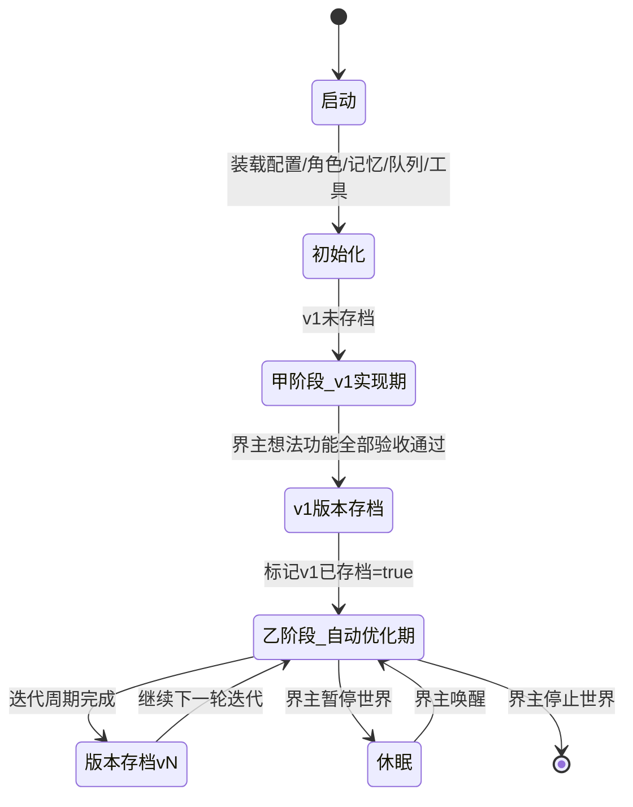
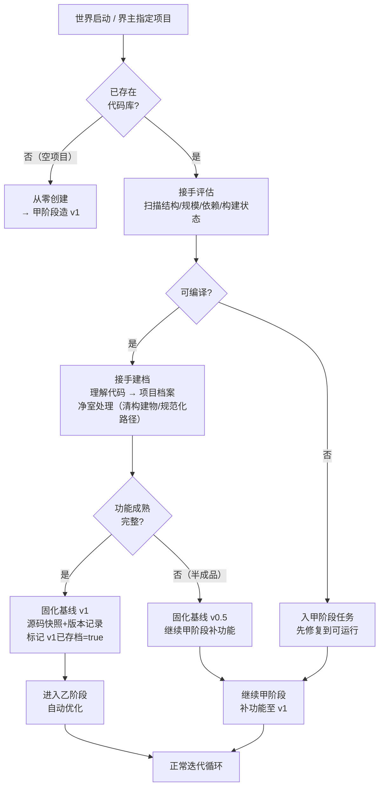
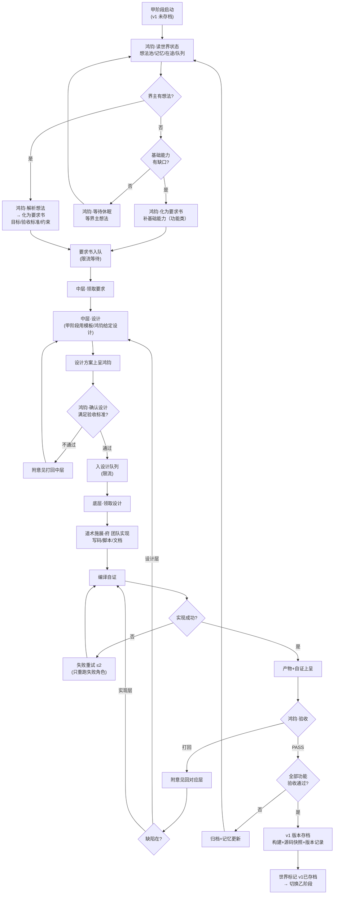
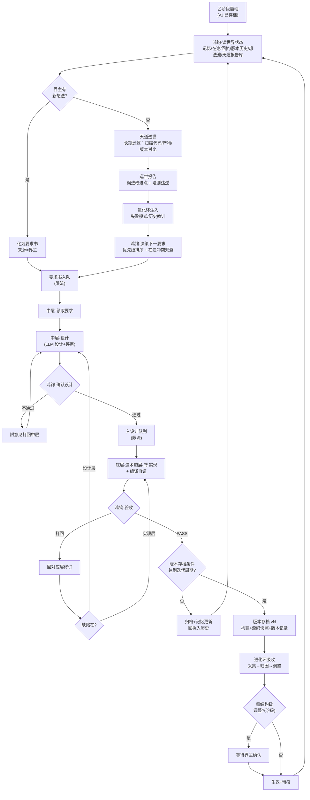
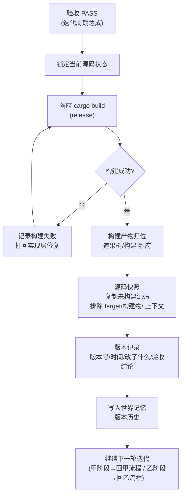
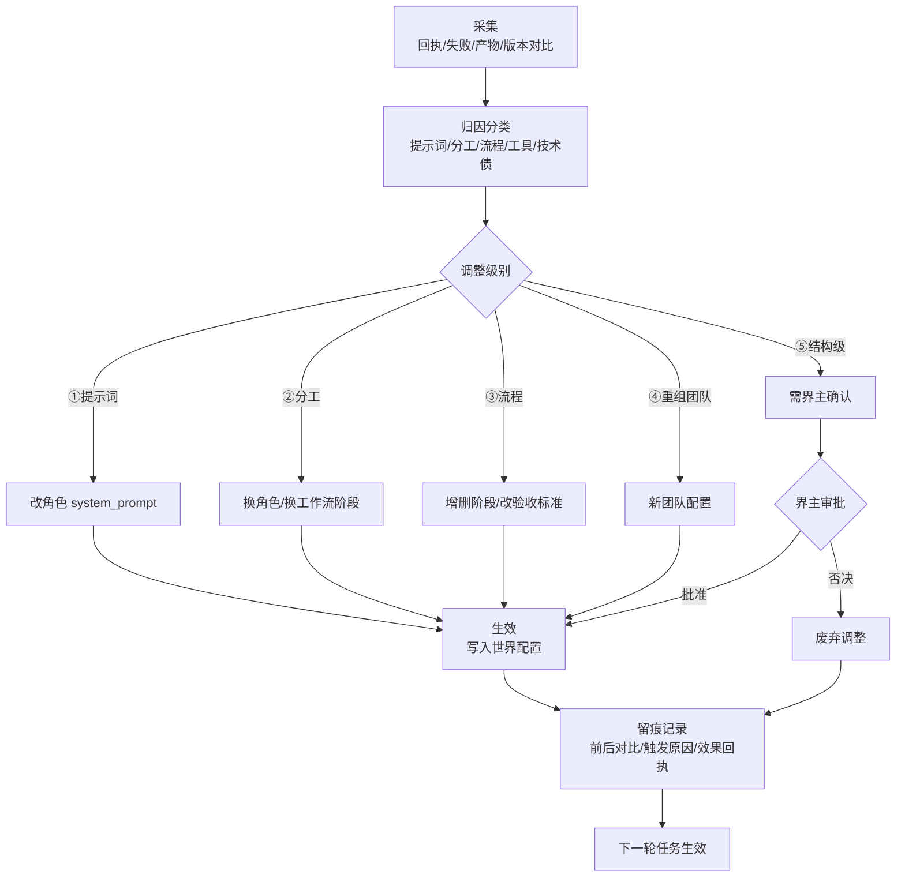

# 多智能体架构设计 — 恒观世界（v0.9）

> 本项目是作为「世界」培养的，不是玩具。世界自己进化、内部自己调整。
> 派遣像真实世界：**界主发布想法 → 鸿钧提要求与验收 → 中层设计 → 底层实现**。
> 迭代像真实世界：**每完成一版 → 构建 → 版本存档（产物+源码快照）→ 继续迭代**。
> **两阶段制：自动优化在 v1 完成后才启动——初期实现功能最重要。**
> 优先级：流程通畅 > 质量 > 体验感 > 功能丰富。

***

## 0. 两阶段制（全局纲领）

| 阶段    | 名称     | 起点         | 目标                | 自动优化（巡世/进化环） |
| ----- | ------ | ---------- | ----------------- | ------------ |
| **甲** | v1 实现期 | 世界创建       | **把第一版功能完整做出来**   | **关闭**       |
| **乙** | 自动优化期  | v1 验收通过并存档 | 持续进化：性能/美观/优化/新能力 | **开启**       |

**切换点唯一**：v1 版本存档完成 → 世界状态标记 `v1已存档=true` → 永久进入乙阶段。

**世界三种进入路径（回答"半路接手"）**：

| 路径       | 场景                      | 动作            | 进入阶段             |
| -------- | ----------------------- | ------------- | ---------------- |
| **从零创建** | 空项目                     | 世界从空白造 v1     | 甲                |
| **半路接手** | 已有代码库（旧项目/他人项目/上一代世界遗产） | 评估→建档→净室→固化基线 | 成熟→直接乙；半成品→先甲补功能 |
| **版本回退** | 世界自己的历史                 | 恢复某版本源码快照     | 按回退目标            |

> 半路接手是真实世界常态：世界不是只能从零养大，它也能**入主一个已有世界**——
> 先读懂它（建档）、先立稳它（净室/修复）、再定基线（固化版本），然后按基线成熟度决定从甲或乙继续。

**甲阶段铁律**：

* 天层不巡世、不自主找优化点；一切力量集中实现界主想法的功能。

* 若界主暂无想法，鸿钧只做两件事：评估基础能力缺口（补基础）、等待界主想法。**绝不提前进入"优化"动作**。

**乙阶段铁律**：

* 天道巡世 + 进化环全开；界主不提需求也持续产出要求流。

* 界主想法 > 天道巡世发现 > 鸿钧自主，同级内按优先级（高/中/低）排序。

***

## 1. 核心理念：世界 = 四层组织 + 两阶段生长

| 层级     | 角色     | 职责                              | 产出                            |
| ------ | ------ | ------------------------------- | ----------------------------- |
| **顶层** | 界主（天意） | 发布需求想法（不干预实现；不提也行）              | 想法                            |
| **天层** | 双神平级   | 天道巡世（发现）/ 鸿钧主政（化要求/派遣/商讨/验收/定档） | 巡世报告 / 要求书 / 确认结论 / 验收结论 / 档案 |
| **中层** | 智慧层    | 把要求翻译成方案                        | 设计方案                          |
| **底层** | 手脚层    | 把方案翻译成产物                        | 代码 / 脚本 / 文档                  |

**铁律**：

* 界主只管"想"；天层不越级做设计/实现；中层不越级实现；底层不越级设计。

* 要求逐层翻译，产物逐层上呈。

* **自动优化只属于乙阶段**（v1 后），甲阶段一切为功能让路。

* **先入稿、再落码**：后续想到的新设计，先并入本稿对应章节再实现；实现须能在本稿溯源。

**版本存档**：每完成一个迭代周期 → 构建 → 版本存档（构建产物 + 未构建源码快照）→ 继续下一轮迭代。世界有可回溯的历史。

***

## 1.5 洪荒角色体系（四层 × 世界观）

世界四层不是抽象概念，而是洪荒诸神的职司。角色即神仙，职司即职责。

```
顶层·界主（天意·人类）—— 发布想法，不干预实现
        │ 想法
        ▼
天层（双神平级）
  ├─ 天道（巡世之神）—— 长期巡逻世界：扫描/观测/发现 → 巡世报告交鸿钧（乙阶段）
  └─ 鸿钧（道祖·主政之神）—— 接收想法/化为要求/派遣/定档案/召集圣人商讨
        │ 要求书               ▲ 审验报告
        ▼                     │
中层·智慧层（设计）
  ├─ 女娲（圣人·造化）        初稿设计
  └─ 四圣（老子/元始/通天/后土） 评审设计（核心逻辑/异常/接口性能/数据流）
        │ 设计方案
        ▼
底层·手脚层（执行 + 审验）
  ├─ 多宝/白泽/龟灵/玄天（大罗金仙）  实现：代码/前端/数据库/监控
  └─ 六准圣（红云/镇元子/鲲鹏/神农/冥河/轩辕） 审验：六维验收，回呈鸿钧
```

> **天层双神平级**：天道与鸿钧平级，同时出现、互不冲突，各司其职——
> **天道巡世**（看见：长期巡逻世界，发现改进点与法则违逆）；
> **鸿钧主政**（落实：接收想法、化为要求、派遣、定档案、召集圣人商讨）。
> 一个管"看见"，一个管"落实"。圣人/准圣/大罗金仙臣属鸿钧调度；天道不指挥，只发现。

### 1.5.0 洪荒位阶·职责铁律（对照洪荒流）

洪荒的实力与职责分层，决定"谁做什么、谁不做什么"：

| 位阶        | 特征                 | 大道        | 在世界的职责                 | 铁律             |
| --------- | ------------------ | --------- | ---------------------- | -------------- |
| 天道（巡世之神）  | 世界之眼               | 观世全道      | **长期巡逻世界**：观测/发现/守护法则  | 与鸿钧平级，不指挥      |
| 鸿钧（道祖）    | 主政之神               | 统御全道      | 接收想法/化要求/派遣/定档案/召集圣人商讨 | 不亲执行           |
| 圣人（女娲+四圣） | 大道既成：**专精而全能**     | 各掌一道，其余亦通 | 设计/评审（定道）              | **不担任执行者**     |
| 准圣（六准圣）   | 半步圣人：道已立未全         | 各精一维      | 审验（回呈鸿钧）               | 只审验不终裁         |
| 大罗金仙（四大罗） | 大道未全：**一道精通、他道逊色** | 各精一道      | 实现（术）                  | **按道分工，不跨道执行** |

**天道与鸿钧平级，同时出现不冲突**：

* **天道** = 巡世之神——长期巡逻世界，观测万物（扫描代码/产物/版本对比），
  发现改进点（性能/美观/优化/新能力）、守护世界法则（违规即报）。巡世所见，交鸿钧落实。

* **鸿钧** = 主政之神——接收界主想法与天道巡世报告，化为要求派遣；
  定档案（版本存档/记忆/历史归档）；召集圣人商讨（设计确认/重大决策/验收）。

* 关系：**平级分工，互不隶属**——天道巡世（看见），鸿钧主政（落实）。
  圣人/准圣/大罗金仙臣属鸿钧调度；天道不指挥，只发现。

**铁律展开**：

1. **圣人不执行**：圣人实力强、有维护世界的职责（定法则/护世界），大道既成而专精全能——
   正因全能，适合"定道"（设计、评审），而不适合亲自下场做"术"（写代码/改文件）。
2. **大罗金仙分道执行**：大罗金仙对自己大道足够精通、其他大道稍微逊色——
   所以只执行自己那条道：多宝炼代码、白泽塑前端、龟灵治数据库、玄天守监控。
   **跨道的事不硬扛**：回呈圣人定夺，或请同门（对应大道的大罗金仙）出马。
3. **准圣审验**：半步圣人，道已立——足以审验"术"的成色，但终裁权在天道（鸿钧）。
4. **天道终裁**：一切决定权在鸿钧。

> 一句话：**圣人定道，大罗行术，准圣验术，鸿钧终裁。**

### 1.5.1 角色总表

| 层级 | 角色    | 道/职司      | 职责                                           | LLM池        | 阶段    |
| -- | ----- | --------- | -------------------------------------------- | ----------- | ----- |
| 顶层 | 界主（人） | 天意        | 发布想法                                         | —           | 全     |
| 天层 | 天道    | 巡世之神·世界之眼 | **长期巡逻世界**：扫描代码/产物/版本对比→巡世报告（发现改进点/法则违逆，交鸿钧） | sage        | **乙** |
| 天层 | 鸿钧    | 道祖·主政之神   | 接收想法/化为要求/派遣/定档案/召集圣人商讨                      | default     | 全     |
| 中层 | 女娲    | 圣人·造化     | 初稿设计                                         | sage        | 全     |
| 中层 | 老子    | 圣人·道德     | 评审核心逻辑/边界/抽象                                 | sage        | 全     |
| 中层 | 元始    | 圣人·秩序     | 评审异常路径/错误处理                                  | sage        | 全     |
| 中层 | 通天    | 圣人·杀伐     | 评审接口/性能/并发                                   | sage        | 全     |
| 中层 | 后土    | 圣人·轮回     | 评审数据流/状态/持久化                                 | sage        | 全     |
| 底层 | 多宝    | 大罗金仙·代码炼化 | 实现：写代码                                       | executor    | 全     |
| 底层 | 白泽    | 大罗金仙·前端   | 实现：前端                                        | executor    | 全     |
| 底层 | 龟灵    | 大罗金仙·数据库  | 实现：数据库                                       | executor    | 全     |
| 底层 | 玄天    | 大罗金仙·监控   | 实现：监控                                        | executor    | 全     |
| 底层 | 红云    | 准圣·业务正确性  | 审验业务正确性（回呈鸿钧）                                | quasi\_sage | 全     |
| 底层 | 镇元子   | 准圣·数据完整性  | 审验数据完整性（回呈鸿钧）                                | quasi\_sage | 全     |
| 底层 | 鲲鹏    | 准圣·性能并发   | 审验性能/并发（回呈鸿钧）                                | quasi\_sage | 全     |
| 底层 | 神农    | 准圣·安全副作用  | 审验安全/副作用（回呈鸿钧）                               | quasi\_sage | 全     |
| 底层 | 冥河    | 准圣·异常兼容   | 审验异常/兼容（回呈鸿钧）                                | quasi\_sage | 全     |
| 底层 | 轩辕    | 准圣·用户体验   | 审验用户体验（回呈鸿钧）                                 | quasi\_sage | 全     |

### 1.5.2 角色与机制对应

| 机制          | 主角色                | 辅助              |
| ----------- | ------------------ | --------------- |
| 想法接收（界主→要求） | 鸿钧                 | —               |
| 巡世（乙阶段）     | **天道（长期巡逻）**       | 巡世报告交鸿钧化为要求     |
| 提要求/派遣      | 鸿钧                 | 接收界主想法 + 天道巡世报告 |
| 设计          | 女娲                 | —               |
| 评审设计        | 老子/元始/通天/后土        | —               |
| 确认设计/召集商讨   | 鸿钧                 | 召圣人商讨后定夺        |
| 实现          | 多宝/白泽/龟灵/玄天        | —               |
| 验收审验        | 红云/镇元子/鲲鹏/神农/冥河/轩辕 | —               |
| 验收终裁        | 鸿钧                 | 依据六准圣报告         |
| 定档案/版本存档    | 鸿钧                 | 验收通过后定档归档       |
| 进化归因/调整     | 鸿钧（决策）             | 女娲（调整设计）        |
| 记忆存取        | 机制（无 LLM 角色）       | —               |

### 1.5.3 天层双神说明（天道 / 鸿钧）

**天道（巡世之神·世界之眼）** —— 乙阶段专职 · 与鸿钧平级

* 定位：世界之眼，**长期巡逻**。持续扫描代码/产物/相邻版本对比，发现候选改进点（性能/美观/优化/新能力）与法则违逆（结构违规/契约不符），产出巡世报告交鸿钧。

* 对应"自主找性能、找美观、找优化点、找新能力"——**发现归天道，落实归鸿钧**。

* 铁律：只发现、不指挥——不做设计、不写代码、不派遣。

* 契约：输出 `巡世报告`（每条：候选目标 + 依据 + 建议类别 + 优先级），不做设计、不写代码。

**鸿钧（道祖·主政之神）** —— 与天道平级

* 接收：界主想法 + 天道巡世报告 → 化为要求书。

* 派遣：要求书/设计书入队，发往中层/底层。

* 定档案：版本存档、验收结论、记忆归档——凡定档，鸿钧落笔。

* 召集圣人商讨：设计确认、重大决策、验收时召圣人评审，商讨后定夺。

* 契约：`要求书` / `派遣令` / `档案条目` / `商讨纪要`。

### 1.5.4 界主可扩展角色（按需新增）

世界是活的——界主可随时增补角色：写一"角色卡"（身份/道/职司/LLM池/契约），录入角色配置表即可生效。新增/废弃角色属结构级进化，需界主确认（见进化环 ⑤级）。

### 1.5.5 鸿钧主控化（界主对话模型）

> 定位：鸿钧从"流程函数"升级为**界主的对话伙伴 + 任务总控**——界主只跟鸿钧说话，圣人大罗准圣是它的后台团队。
> 状态：已入稿 · 2026-08-17 · 界主拍板七条。
> 交互一句话：界主 ◄━ 闲聊/发任务/澄清/追问/并发发新任务 ━► 鸿钧 ─ 召集 ─► 圣人商讨 ─ 上呈 ─► 鸿钧观看 ─ 拆解 ─► 大罗实现 ─ 验收 ─► 准圣 ─ 汇报 ─► 界主。

**界主拍板七条**：

| #  | 拍板     | 内容                                                                             |
| :- | :----- | :----------------------------------------------------------------------------- |
| 1  | 鸿钧定位   | 界主的对话伙伴 + 任务总控；闲聊/发布/澄清/追问/干预都在对话中发生                                           |
| 2  | 圣人商讨分级 | 简单任务单轮（女娲初稿+四圣一次评审）；复杂任务多轮（意见回女娲改稿，最多 2 轮）。复杂判定机械化：涉及路径 ≥3 或跨府 ≥2 或类别=新能力 → 多轮 |
| 3  | 汇报方式   | 关键节点自动汇报一句（澄清完成/商讨开始/设计上呈/开始实现/验收通过/打回/定档）；界主追问可展开详情                           |
| 4  | 任务并发   | 不限制；对话中随时发新任务，每条独立任务线；现有预算/回滚垫/构建锁兜底                                           |
| 5  | 闲聊范围   | 完全自由；鸿钧人格稳定，值得记的进「理解·记忆」格位；闲聊只占对话预算                                            |
| 6  | 消息可见性  | 角色发言全员可见（世界内部透明）；界主发言非@仅鸿钧可见，@点名才直达该角色                                         |
| 7  | 顺手修    | 要求 id 全局递增（现永远"要求-1"，并发后无法追溯）                                                  |

**消息模型**：

```
消息 { 发送者, 文本, @提及: Vec<角色>, 可见: Vec<角色>, 时间戳 }
```

* 界主发言：可见 = {鸿钧} ∪ @提及角色（非@不广播；天意只对主政之神说，点名才让别人听见）

* 角色发言：可见 = 全体角色（世界内部透明工作群，圣人商讨/大罗汇报/准圣回呈全员可追溯）

* 实现：识海承载-府 权限-过滤-阁（角色-过滤-园）扩展消息可见性过滤

**鸿钧对话循环（意图判别）**：每条界主消息经意图判别分流——闲聊（直接回应，可进记忆）/ 发布任务（澄清缺项 → 召集圣人商讨）/ 追问进度详情（从任务线实时状态汇总，真实回执不编造）/ 中途干预（打回/加急/中止任务线）/ 点名@（消息直达该角色）。意图判别实现：LLM 一次调用判意图+提取关键字段，解析失败回退"闲聊"兜底，不阻塞对话。

**任务线生命周期**（每条独立）：

```
澄清完成 → 圣人商讨(分级) → 设计上呈 → 鸿钧观看(通过/打回，打回附意见回圣人)
  → 通过 → 圣人拆解 → 大罗金仙实现 → 准圣六维验收 → 鸿钧终裁
  → 关键节点鸿钧自动汇报 → 定档
```

每条任务线独立预算（32 轮 / 90 万 token）、独立回滚垫分组、构建锁全局串行（现成）、要求 id 全局递增。

**任务线机制与守护模式**（2026-08-17 补，阶段 3）：

* 任务线 = 一次对话发布的任务单元，落盘 `.上下文/状态/任务线.jsonl`：`{id, 要求id, 想法, 状态: 待执行|执行中|已完成|已中止, 结论, 汇报, 时间}`。

* 发布任务：登记任务线（待执行）→ 进程内立即后台执行（spawn 线程）；CLI 进程退出后未消费的任务线仍留盘。

* **「世界 守护」常驻命令**：轮询消费待执行任务线（间隔 2 秒），防 CLI 退出丢任务——界主开一个终端跑守护，世界的"心脏"就跳起来了，对话发布的任务全部异步执行，完成后鸿钧写汇报进对话记录。

* 状态推进原子化：待执行 → 执行中（先到先得，防并发双跑同一任务线）。

* 追问进度显示任务线状态（待执行/执行中/已完成）。

**落位**（不加新府）：

| 新能力      | 落位                                                                               | 复用                  |
| :------- | :------------------------------------------------------------------------------- | :------------------ |
| 鸿钧对话循环   | 天庭治理-府/天层-主控-殿/**鸿钧-对话-阁**（对话-循环-园 + 意图-判别-园 + 汇报-拼装-园）                          | 会话记录/格位、事件流、模型连接    |
| 圣人商讨（分级） | 天庭治理-府/智慧-主控-殿/设计-落笔-阁/**模板-生成-园**（分级设计：简单单轮 = 初稿+四圣一次评审；复杂多轮 = 圣人工作群评审-改稿 ≤2 轮） | 现有 圣人工作群设计、JSON 提取器 |
| 多任务线调度   | 天庭治理-府/驱动-入口-殿/世界-运行-阁（世界运行.rs 改造）                                               | 队列、回滚垫、派发落单         |
| 界主对话入口   | 乾坤/命令操作-府：新增「对话 发言」命令（读命令区，免令牌）                                                  | 现有 CLI 解析/分发        |
| 消息可见性    | 识海承载-府/回想-殿/权限-过滤-阁（角色-过滤-园 扩展）                                                  | 现有角色白名单             |

**新增接口**（详见 §11.8）：`界主发言` / `追问详情` / `任务线_状态` / `中止任务线` / `圣人_商讨`。

**实施阶段**（每阶段可验收）：① 对话层（对话 发言 入口 + 鸿钧对话循环 + 意图判别）→ ② 圣人商讨分级 + 节点汇报 + 追问详情 → ③ 多任务线（不限制并发 + 任务线状态/中止）。

> 先决地基：要求 id 递增（拍板 7，追溯前提）、验收改造（机械事实优先，现在准圣"凭字节猜谜"还烧钱）、项目档案建档（`项目档案=null`，世界不认识自己）。

***

## 2. 完整过程流程图

### 2.0 世界生命周期总状态机



### 2.1 半路接手流程（世界入主已有项目）



### 2.2 甲阶段：v1 实现期完整流程



### 2.3 乙阶段：自动优化期完整流程



### 2.4 版本存档流程（两阶段共用）



### 2.5 进化环流程（仅乙阶段）



### 2.6 ASCII 总览（兜底，防渲染失效）

```
┌───────────────────────────────────────────── 恒观·世界 ─────────────────────────────────────────────┐
│                                                                                                     │
│  顶层·界主 ──► 想法池 ─┐                                                                            │
│                       ▼                                                                            │
│  天层·双神(天道巡世/鸿钧主政) ◄── 记忆/回执/版本历史 ── 进化环(仅乙)                                 │
│    │ 要求书                ▲                                                                        │
│    ▼                       │ 产物上呈                                                              │
│  要求队列(限流) ─► 中层·设计 ──► 设计方案 ──► 鸿钧·确认设计 ──► 设计队列 ──► 底层·道术施展-府 团队       │
│                                                                    │         │                     │
│                                                                    ▼         ▼                     │
│                                                             实现+自证 ──► 鸿钧·验收 ──► 版本存档    │
│                                                                                  │                 │
│                                                            ┌──── 打回 ◄── 缺陷分层 ──┘                 │
│                                                            ▼                                         │
│                                                    甲阶段: 回 v1 流程 / 乙阶段: 回巡世循环             │
└─────────────────────────────────────────────────────────────────────────────────────────────────────┘
```

***

## 3. 天层双神（循环细化）

> 天层两条独立常驻回路，**互不阻塞**：
>
> * **天道回路**（乙阶段才启用）：长期巡逻世界 → 巡世报告。
>
> * **鸿钧回路**（始终运行）：接收/化要求/派遣/商讨/验收/定档。
>   天道只产报告，鸿钧决策落实——天道发现，鸿钧主政。

### 3.1 甲阶段循环（功能优先，无自动优化 · 鸿钧回路）

```
循环（鸿钧）：
  ① 读世界状态（想法池/记忆/在途/队列水位）
  ② 若界主有想法 → 解析 → 化为要求书（功能类）
  ③ 若界主无想法 → 评估基础能力缺口
     · 有缺口 → 化为"补基础"要求书（功能类）
     · 无缺口 → 休眠等待（不巡世、不找优化点）
  ④ 要求书入队（非阻塞）
  ⑤ 确认中层设计（通过才派遣底层）
  ⑥ 验收产物（PASS→归档；打回→回对应层）
  ⑦ 全部功能 PASS → 触发 v1 版本存档 → 切换乙阶段
  ⑧ 落盘 → 回 ①
```

### 3.2 乙阶段循环（自动优化全开 · 天道回路 + 鸿钧回路）

```
循环（天道·独立长期线程）：
  ① 扫描世界（代码/产物/相邻版本对比/法则合规）
  ② 产出巡世报告（候选改进点 + 法则违逆清单）→ 写入天道报告库
  ③ 休眠片刻 → 回 ①（长期巡逻，昼夜不停）

循环（鸿钧·主政）：
  ① 读世界状态（记忆/在途/回执/版本历史/想法池/天道报告库）
  ② 决策下一要求：
     · 界主想法 → 化为要求书（最高优先）
     · 天道巡世报告 + 失败模式 → 化为要求书（性能/美观/优化/新能力/维护）
     · 按 优先级 + 在途冲突规避 排序
  ③ 要求书入队（非阻塞）
  ④ 确认设计/召集圣人商讨（高风险才重点确认，低风险快速放行）
  ⑤ 验收产物（PASS→归档；打回→回对应层）
  ⑥ 迭代周期达成 → 版本存档 vN → 进化环吸收
  ⑦ 落盘 → 回 ①
```

***

## 4. 任务生命周期（两阶段共用主干）

```
界主想法 / 天道巡世(仅乙)
   │
   ▼
要求书（目标/验收标准/约束/类别/优先级）
   │ 派遣（非阻塞）
   ▼
要求队列（限流） → 中层设计 → 设计方案上呈
   │                            │
   │        ◄── 鸿钧确认设计 ────┘
   │         通过？─不通过→ 打回中层重设计
   │         通过
   ▼
设计队列（限流） → 底层实现（道术施展-府）→ 编译自证 → 产物上呈
   │                                                        │
   ▼                                                        │
鸿钧·验收 ◄──────────────────────────────────────────────────┘
   │
   ├── PASS ──► （迭代周期达成?）─是→ 版本存档 → 归档 → 进化环吸收 → 继续
   │                  │
   │                  └否→ 归档+记忆更新 → 继续
   └── 打回 ──► 附意见 → 回 设计层 / 实现层
```

状态机：

```
要求书: 待领 → 设计中 → 待确认 → 已确认 → 待实现 → 实现中 → 已验收(通过/打回) → 版本存档 → 归档
              ▲          │                    ▲                               │
              └─打回─────┘                    └────────── 打回 ────────────────┘
```

### 4.1 模型调用健壮性护栏（MiniMax-M3 thinking 模式）

**背景**：模型连接-府走 OpenAI 兼容接口，MiniMax-M3 的 `thinking` 省略默认开启，回复 content 带 `<think>` 思维链；多轮 function call 必须保留完整 assistant 消息（含 think），否则 HTTP 400。实测曾出现：超长上下文 + 丢 think → 工具参数输出空 → 工具循环空转耗尽 32 轮。

**护栏三层**（模型连接-府 落回-解析-园 / 道术施展-府 工具-循环-园）：

1. **工具参数兜底**：`arguments` 为空串、`{}` 或非法 JSON 的调用不执行，回 `模型回复::参数缺失`，工具循环回传系统反馈引导模型补全参数重发（不破坏历史结构）。
2. **assistant 消息保留 think**：`助手_带工具调用` 携带模型原回复 content（含 `<think>`），多轮循环逐轮带回，防 400 断流。
3. **空输出兜底**：纯文本调用 content 为空/纯空白视为失败返回错误（防静默写空记忆 / 空 JSON 报错）；工具循环收到空文本不算收敛，回传系统消息引导重发，直至真正结论文本或轮数耗尽。
4. **请求体显式配置**：工具请求体显式声明 `temperature=0.2` 与 `thinking={"type":"adaptive"}`（MiniMax-M3 仅接受 adaptive/disabled，enabled 会报 400；adaptive 语义等同默认开启思维链但显式固定），防服务端默认值漂移致工具参数退化（arguments={} 缺必填字段）——源自工具循环对比实验：沙箱 Python 请求体（temperature=0.2）同模型同中文 schema 收敛成功，而真实 Rust 请求体（省略 temperature）首轮即空参。
5. **模型调用请求超时（2026-08-17 实锤）**：`调用模型` / `调用模型带工具` 的 HTTP 请求显式 `.timeout(120s)`——ureq 默认无超时，网络挂起（连接建立无响应）会无限卡死整轮任务。实测：任务线驱动在模型设计阶段挂起 5 分钟无进展、进程 CPU 0.08 静止、事件流停滞；修复后挂起请求 120 秒内报错返回（进入失败重试/打回路径，不再拖尸）。

### 4.2 现状装配机制（执行层读事实，防验收误判）

执行层读现状 = 结构下探（府→殿→阁→园）+ 相关文件的符号摘要（`pub` 符号 + 解释）+ 文件全文，来源为依赖图（`.上下文/依赖图.json`）。两条防线保证「涉及路径 → 现状装配 → 验收裁决」不因依赖图滞后/缺档误判：

1. **依赖图滞后防御**：解析想法后，先用「查涉及文件」（精确匹配涉及路径，无兜底）判空；若涉及路径非空且无匹配，先触发一次代码扫描重建依赖图再继续执行——覆盖「涉及文件是本轮新建、旧依赖图档案不含」的场景，防「产物路径偏离涉及范围」误判打回。

2. **文件级占位档案**：依赖图扫描对无 `pub` 符号的文件（如纯测试文件，`#[test] fn` 不带 `pub`）补一条文件级占位档案（符号名 = 文件名，代码 = 全文）。否则涉及路径按文件查必然落空、回退兜底接线文件，导致产物在真实文件却被判「路径偏离」。

3. **背景渐次披露（元数据层 + 按需读格位）**：抄业界渐进式披露（实测 17 个 Skill 从 30K 降到 1.7K token，省 94%）+ 本地 Python 模拟验证（临时文件夹/机制叠加验证，基线复现真实：22 轮 / 141 万输入 / 现付当量 26.8 万 / 延迟代理 775s）：

   * 初始消息不再全量拼装全部格位投影（旧背景约 9 万字符），改为**元数据层**：每格位仅一行「格位名 + 一句摘要」，首屏上限 **3000 字符**（按字符计数，全局兜底与格位独立上限同口径，含中间档注脚；正文由执行层按需用「读格位」工具拉取）。

   * 会话内微压缩（**已实现**，2026-08-16）：历史旧轮工具结果修剪为前 200 字符前缀（含「按需回读」提示），保留最新段不动，`tool_call_id` 配对不破（MiniMax 校验 tool id 配对，与内容无关）；零 LLM 成本，防旧轮工具结果全文撑爆上下文。

   * 溢出全文落盘（**spill**，2026-08-17）：单条非读文件工具结果超 6000 字符上限时，不再只截断——全文落盘 `.上下文/spill/{轮次}_{序号}_{工具}.txt`，内联保留截断头段 + 「共 N 字符、全文已存 spill、按需 读文件/搜索内容 检索（如定位编译错误 'error'）」定位符。模型需要错误细节时按定位符回读，既省 token 又保真，治「编译日志截断 → 盲改」。

   * 摘要压缩（**每轮可触发**，2026-08-16 修复）：历史超过 15000 字符后，最旧区间折叠为一页摘要（保留尾部 4 轮细粒度）。修复前「本轮回已摘要」全程只触发一次，首次摘要后历史再度膨胀不再压缩，后期每轮 prompt 无限增大、任务 token 预算提前耗尽——投递轮 32 轮烧 94.5 万 token 的根因之一。

   * 预算终止：单任务累计输入 token 封顶 90 万，用尽强制收敛（防 32 轮拖尸）。

   * **参数修正（v3 后实测校准，2026-08-16）**：单轮 token 熔断由 60 万改为 **90 万**（与总预算对齐）。实测中型任务（跨府多文件 + 构建反馈）常态 30+ 轮、累计 60\~63 万 token（P0-1 产物变更判定连投三次均 62 万+ 被 60 万熔断误杀后回滚）——60 万低一档阈值对合法中型任务确定性误杀；熔断仅保留「超总预算」单一语义。另注：熔断后重试无意义（剩余预算为 0 即失败），后续迭代改为「熔断即失败、不重试」，省白烧的教训归因轮。

   * **现状装配总量上限（2026-08-16 校准）**：现状装配总字符封顶 8000（含结构下探）。涉及路径内文件（执行者必须落盘改动、禁止再读）完整定义永远给；其余文件（同阁兄弟等）在预算内给定义，超限只给符号清单 + 「用 读文件 按路径读取」提示。防初提示过大致每轮 prompt token 恒定高企——投递轮实测每轮约 3 万 token 的根因之一。
   * **去架构硬绑定（2026-08-17）**：`补全同阁` 由「按 `-阁` 后缀取目录」泛化为「按目标文件**父目录**取前缀，同目录源码一并纳入」——通用分组启发，任何 Rust 项目分层均成立，不再依赖本项目「阁/园」专名（`提取阁目录` 重构为 `父目录`）。命令接线文件可为从依赖图动态解析的待改项（命令入口文件语义匹配），涉及路径净化里的已知维度清单同理可动态化——均属机制通用化方向，随依赖图/工作区数据驱动，不写死维度名。

   * 收益（同 22 轮任务模拟）：累计输入 141.0 万 → 12.0 万（省 91.5%）；现付当量降 90%+（命中率 0.3\~0.95 全区间稳健）；预填充延迟代理 775s → 66s。

   * 注意：该块只压会话内与背景，不破「36/72 格位」层间记忆与地道增量精炼的既有用途。

4. **命令类任务联动补全**：提审（`要求化.rs::解析想法`）净化涉及路径后按任务形态联动补全——方向含「命令」时自动并入 `依赖图::命令接线文件`（兜底分发.rs / 缓存读取.rs / 入口执行.rs，去重），使命令表/入口进涉及范围与现状装配，防「LLM 只捕 1 个涉及文件 → 现状装配缺命令表 → 验收误判『产物路径偏离涉及范围』」（源自历法命令第一次实测，设计稿 §12 P0-2）。接线文件清单提为 `依赖图` 关联常量，与 `查相关文件` 匹配空兜底共用，避免两处清单漂移。

5. **人类格位临时代偿（格位利用，2026-08-17 比拼实证入稿）**：来源=人类的格位（初心·使命 / 铁律·总纲 / 标准 / 细则·解读 / 架构 / 身份 / 价值观·原则 等，固化=经）在人类尚未录入时，首屏投影里只有格位名+种子、正文为空——实现层 LLM 对「本项目测试写在哪、宏怎么导入、库根导出哪些符号、模块三件套怎么写」等**项目通则**零感知，只能靠通用纪律瞎试（实测：补测试任务 24 轮未收敛，四类编译错误——`debug/warn` 宏不在作用域、`打开存储/状态目录` 找不到、`[记录]` 切片类型大小未知、`&[记录]` vs `&Vec<&记录>` 不匹配——全是"通则缺位"而非"逻辑不会"）。修法：**人类格位在人类未填时，执行前用 LLM 探索项目生成"临时代偿"落格位**（复用 播种归纳 设施：种子→搜集文档+代码印证+依赖图结构树/符号清单→LLM 归纳→写记录，来源=LLM、固化=权、证据=探索实证；人类后续录入覆盖为 经，临时代偿自动让位）。触发：主政读背景前检查人类格位是否为空，空则补一次临时代偿（成功即写格位，跨任务复用；代码变更致证据失效按既有失效机制重采）。**【落位】**：识海承载-府 播种-归纳-园 新增 `临时代偿`（判空+带图谱实证的归纳）；天庭治理-府 世界运行.rs 主政读背景前调用。首屏投影由此携带**真实项目通则**（而非空摘要），执行层落盘纪律从"模板写死的通用条款"升级为"有本项目实例"。

6. **图谱契约投影（图谱利用，2026-08-17 比拼实证入稿）**：现状装配目前在「结构下探 + 涉及文件符号」之外不投影**类型契约**——涉及文件用到的核心类型（如 `记录`、`版本记录`）的定义在别处，依赖图符号档案**有**却未喂；库根导出（`打开存储` / `状态目录` 等在 入口.rs 的 `pub use`）也不在现状里。实现层要么 读文件 补看（耗轮数）、要么凭记忆写错签名（实测四类编译错误之二：函数作用域、类型形态）。修法：现状装配尾部追加 **图谱契约块**：
   - **库根导出签名**：按涉及文件追溯所属府 lib 根（`入口.rs`/`模块.rs` 的 `pub use` 链），投影「本府可导入符号签名清单」（依赖图 `查模块` 按模块名取符号档案签名），让模型知道 打开存储/状态目录/工作区根 在哪、签名什么样，不再猜；
   - **核心类型契约**：涉及文件命中的类型符号（按需求/任务目标关键词匹配依赖图符号），投影其 `签名`+`代码`（完整定义体，照 M4 配方），让模型直接看到 `记录 {内容,证据,时间戳,来源,前记录,失效...}` 的真实字段与形态，不再写悬垂切片；
   - **测试样例参照**：任务类别=补基础/目标是测试时，从依赖图取(同府/同阁)既有 `#[cfg(test)]` 测试模块的签名清单+一个完整样例文件路径，提示「照抄同园/同库最近测试的 模块.rs 三件套 与 #[cfg(test)] 惯例」——实测引擎只差这一步（调研找到了终裁.rs/流式直播园测试样例但未套用），模板点破后收敛率应显著提升。
   - **补测试任务落位判据（2026-08-17 验证补全）**：实测重跑补测试任务，引擎在"内联被测文件 / 新建证道测试殿 / 填空园残留"三者间反复摇摆，还被多个空园残留目录引诱反复往错处写（轮数浪费 + 最终产物未可靠落盘打回）。落位判据固化进契约块，**措辞用本架构示例、本质对任意 Rust 项目通用**：
     1. **补测试优先内联**：涉及路径内已有被测 .rs（如 流式回放.rs）→ 测试直接写在其文件尾 `#[cfg(test)]`（通用等价：被测文件内联，按该 crate 既有测试写法）；禁止新建独立测试文件（新建文件需模块接入 + 接线，与"补测试"本意不符且增出错面）。
     2. **明确禁用残留空目录**：空园残留目录（无源码的空目录，如历史上 昼夜-园/批量-断言-园）不得作为落点——不在涉及路径内的目录一律拒写（涉及路径护栏已是硬约束）；契约块显式点名「勿往空目录/非涉及路径写测试」（通用等价：落点在涉及路径内被测文件或与其同层目录）。
     3. **仅当涉及路径内无 .rs 可内联** 才退而新建（需在该 crate 既有模块接入方式下接线，照测试样例示范）。
   - 契约块封顶并入现状 8000 字符总预算，超限只给签名清单（定义按需 读文件 回读）。**【落位】**：识海承载-府 依赖图 新增 `查库根导出` / `查测试样例` / `补测试落位`（复用 查模块/查文件）；天庭治理-府 世界运行.rs 现状装配尾部调用，追加为「【图谱契约】」块。
   - **空园残留治理（2026-08-17 验证补全）**：空园残留 = 无源码的空目录（历史实现迁移/删除遗留），它们被依赖图**未登记**（不参与编译）却**真实存在于盘面**，会引诱实现层 LLM 误当落点（实测重跑补测试任务往 批量-断言-园 反复写）。治理铁律：**空目录一律删除**；清出的空园残留记录进 项目档案·已知坑 并移除，依赖图/结构树自然不再含（本就不登记）。本轮已清：昼夜-园 / 流式-昼夜-园 / 批量-断言-园 / 流水-验证-阁（空阁），删后编译与测试全绿即证无接线依赖。

### 4.3 执行工具护栏（工具循环 / 沙箱，防卡死与越权）

工具循环的 `运行命令`、`删文件`、未知工具兜底三处，补生产必需护栏（源自工具循环对比实验验证结论）：

1. **运行命令超时**：`运行命令` 必须带超时上限（默认秒数），超时强杀子进程并回超时错误，防命令无限卡死挂起整轮执行。
2. **删文件越权校验**：`删文件` 与 `写文件/改文件` 同走路径越界校验（防 `../` 逃逸工作区），删除前校验、越界拒绝。**【补全：删文件仅限文件、拒绝目录路径（2026-08-17 打回残留实锤）】**——`删文件` 删除前对路径做文件性校验：目录路径一律拒绝（报错「只支持删文件」）。实测打回残留根因：模型 `删文件` 传目录 `.../src`，工具先 `垫.备份(src)`（目录 `is_file()=false` 被记成「曾不存在」），再 `std::fs::remove_file(src)` 在 Windows 抛 os error 5（目录不能被 remove\_file 删除）→ 存档已写入但删除失败；随后打回撤销时对 `src` 条目 `remove_file` 再次 os error 5 → 该任务分组撤销失败、组内其余条目全被跳过 → 整个 `流式-昼夜-园` 半成品目录残留盘面（与「事件-流览-阁」残留同源）。
3. **未知工具候选提示**：未知工具兜底时，返回相近工具名候选列表（按前缀/包含匹配现有工具），引导模型重发，而非只回「未知工具」让模型盲猜。
4. **沙箱备份/回滚单文件容错**：备份或回滚时单文件被占用（如日志重定向/缓存文件被进程持有）或不可达 → warn 跳过该文件、继续其余文件，绝不让单个锁文件使整条命令失败。越界恢复漏网时由 warn + 越界详情暴露，防运行时文件把命令循环卡死数轮。
5. **写文件源码维度白名单（根内越界护栏）**：`写文件` 路径必须落在「源码维度」内——以工作区根下真实存在源码（含 `.rs` / `Cargo.toml` / `模块.rs` 接线）的维度目录为白名单（动态探测，不硬编码维度名）；根级敏感文件（根 `Cargo.toml`、AGENTS.md、设计稿 .md、版本库 .上下文 等）一律拒写。防执行者越界臆造新维度/改根级配置（实测：工具循环曾新建 `太初/星宿-殿` 并把 `"太初"` 注入根 Cargo.toml 导致 workspace 编译失败）。
6. **收尾强制收敛（防写完仍空转烧预算）**：工具循环「探索超预算催写」只治"只读不写"；对"已写完仍在读/搜/打磨"需对称的收尾催结——已写入文件数 > 0 后，若连续 N 轮无**新增文件**（进度按去重路径计，反复改同一文件不算进度），插入系统消息催结：「产物已落盘，直接输出最终结论文本，不要继续探索」；且临近轮数上限（如最后 1/4 轮）时无论是否已写，强制提示"预算将尽，立即输出结论文本"，杜绝 32 轮烧 90 万 token 的拖尸结局。同文件反复改写压两道硬线：同一路径写/改累计 ≥4 次点名警告「疑似打磨空转」，≥7 次直接强制终止循环（实测：模型对同一测试文件反复小改 8 次，每次按条目数计都是"新增写入"绕过催结，最终烧光 90 万 token 熔断失败——「新增写入」判据被"同一文件反复改写"绕过，须以"新增文件"为进度）；已催结后仍连续无新增文件（如 ≥6 轮）未收敛同样强制终止，防只读/命令空转。

***

## 5. 版本存档机制

**触发**：

* 甲阶段：全部功能验收通过 → 存 **v1**。

* 乙阶段：迭代周期达成（累积 N 条已验收要求 或 达到时间/周期）→ 存 **vN**。

* 半路接手：固化基线（成熟项目→v1；半成品→v0.5），写入版本历史。

```
验收 PASS（周期达成）
   │
   ▼
版本-存档-殿
   ├─ ① 锁定源码状态
   ├─ ② 各府 cargo build（release）→ 产物归位 道果树/构建物-府
   ├─ ③ 源码快照：复制「未构建源码」（排除 target/构建物/.上下文）
   │    └─ 版本-库/版本-vN/源码-快照/
   ├─ ④ 版本记录：版本号/时间/改了什么/验收结论/产物清单
   │    └─ 写入世界记忆「版本历史」
   ├─ ⑤ 世界状态标记：`v1已存档=true`（两阶段唯一切换点，未标记永留甲）
   └─ ⑥ 继续下一轮迭代
```

**快照规则**：

* 快照 = 未构建源码（.rs/.toml/.json/.md），排除构建物与运行时数据。

* 版本号自动递增，可回溯、可对比、可回退。

* 构建失败 → 打回实现层修复，**不产生版本**。

**版本递增与增量快照**（v1 之后的通用形态）：

1. 版本号自动递增：读版本历史末条 → 存 `版本-v(N+1)`，绝不覆盖旧版本目录。
2. 增量快照：相对**最近完整基线**（版本库中「源码-快照 文件数最多」的版本目录，即最近一次全量，如 v1）只复制「新增/修改」文件——同名且字节相同的跳过，变动文件按相对路径落 `版本-vN/源码-快照/`；不存在完整基线时退化为全量（即 v1）。注意：**不能用上一版本目录作基**——增量版本目录只存变化文件（不全），以它为基会把未变文件误判为全量变更。回退时按 v1 全量 + 各版本增量顺序回放。
3. 版本记录字段：`改了什么` = 最近验收结论概要 + 增量文件清单（路径·字节），`对比上一版` = 增量件数与文件清单；阶段 = v1 已存档后为乙，否则甲。
4. 世界状态：`v1已存档` 保持 true 不回退，`版本历史` 追加新记录并原子写回。

***

## 6. 数据模型

### 6.1 想法（界主产出）

```json
{
  "id": "想法-<时间戳>-<序号>",
  "内容": "界主原话",
  "时间": 0,
  "状态": "未处理|已化为要求"
}
```

### 6.2 要求书（鸿钧产出）

```json
{
  "id": "要求-<时间戳>-<序号>",
  "来源": "界主|天道巡世|鸿钧自主",
  "想法id": "想法-...（若来自界主）",
  "阶段": "甲|乙",
  "方向": "一句话宏观目标",
  "类别": "功能|性能|美观|优化|维护|新能力|补基础",
  "验收标准": "做到什么程度算通过（可核对）",
  "约束": {"涉及路径": [], "不允许": [], "优先级": "高|中|低"},
  "状态": "待领|设计中|待确认|已确认|待实现|实现中|已验收|已存档",
  "确认意见": null,
  "验收": null,
  "版本": null
}
```

**涉及路径净化**（解析想法后机械过滤，防 LLM 臆造/混入非路径内容）：

1. 统一分隔符（`\` → `/`）并 trim；
2. 含路径特征（含 `/` 或以 `.rs` 结尾）的按路径保留；
3. 不含路径特征的按符号名校验——依赖图档案中存在同名符号才保留，否则丢弃；
4. 段名字符校验允许 汉字/字母/数字/下划线/连字符/空格/句点（句点仅用于文件名 `.rs` 扩展名；独立 `.`/`..` 段仍拒绝）；
5. 净化后为空则给空数组，不编造。
6. **界主路径兜底提取（2026-08-16 补）**：界主想法文本中显式写明的相对路径片段（已知维度首段 + `.../xxx.rs`，机械扫描「维度名 + `/` 起至 `.rs` 止」），无论 LLM 是否提取，解析后一律并入涉及路径（先净化再去重）。界主是最高权威来源，其写明的路径不是「臆造」；修复「想法文本写明路径、模板却禁编造 → 模型返回空数组 → 落点失控」链路缺口（实测：想法写明「流式历法.rs」但涉及路径=\[]，执行者落点偏到流式时刻园）。

***

### 6.3 设计方案（中层产出）

```json
{
  "要求id": "要求-...",
  "设计": "架构/模块/数据流/接口/边界",
  "拆解": [{"目标": "...", "执行层角色": ["duobao"], "工作流": "L2_script"}],
  "自评": "本设计如何满足验收标准"
}
```

### 6.4 验收回执（鸿钧产出）

```json
{
  "要求id": "要求-...",
  "结论": "通过|打回",
  "验收意见": "（打回必填：缺陷在设计层还是实现层）",
  "产物": [{"路径": "...", "类别": "代码", "字节数": 1234}],
  "耗时秒": 123.4
}
```

### 6.5 版本记录（版本-存档产出）

```json
{
  "版本号": "v3",
  "时间": 0,
  "阶段": "乙",
  "改了什么": "本迭代周期已验收要求摘要",
  "源码快照路径": "版本-库/版本-v3/源码-快照",
  "构建产物路径": "道果树/...",
  "验收结论": ["要求-...: 通过"],
  "对比上一版": "关键差异（供巡世）"
}
```

### 6.6 世界状态（全局）

```json
{
  "阶段": "甲|乙",
  "v1已存档": false,
  "进入路径": "从零创建|半路接手|版本回退",
  "长期记忆": "...",  // 已由 36 格位体系替代（融合蓝图 §1），字段保留兼容，恒空
  "界主想法池": [],
  "在途要求": [],
  "验收历史": [],
  "失败模式": [],
  "版本历史": [],
  "巡世候选池": [],
  "项目档案": "（半路接手时生成）"
}
```

### 6.7 项目档案（半路接手产出）

```json
{
  "来源": "已有代码库路径",
  "接手时间": 0,
  "规模": {"rs文件数": 333, "总行数": 123456, "crate数": 5},
  "结构地图": "维度/域/府/殿/阁/园 概览",
  "关键接口": ["跨府引用清单"],
  "构建状态": "可编译|不可编译（原因）",
  "风格约定": "中文标识符/六层规范等",
  "已知坑": ["路径歧义/双空格副本/历史遗留"],
  "成熟度判定": "成熟完整|半成品|损坏需修复",
  "基线版本": "v1|v0.5（固化时写入版本历史）"
}
```

***

## 7. 并发与限流

| 机制   | 设计                            |
| ---- | ----------------------------- |
| 天层   | 鸿钧单线程常驻（意志一致）+ 天道独立线程（乙阶段启用）  |
| 中层设计 | ≤M 并发（默认 1-2）                 |
| 底层实现 | ≤N 并发（默认 2-3）                 |
| 队列   | 要求队列 + 设计队列，磁盘持久化（jsonl），重启不丢 |
| 派遣   | 只写队列，绝不阻塞上层                   |
| 冲突规避 | 在途要求含"涉及路径"→ 提新要求自动避开重叠路径     |
| 版本存档 | 串行执行（同一时刻仅一个版本存档）             |

***

## 8. 世界自进化（进化环，仅乙阶段）

```
采集（每任务/每轮/每版本）
  ├─ 回执：通过/打回/耗时
  ├─ 失败：原因/所在层/次数
  ├─ 产物：路径/类别/体积
  └─ 版本：构建结果/源码快照/对比差异
        │
        ▼
归因（分类）
  ├─ 提示词问题（角色不懂要求）
  ├─ 分工问题（层级配比失衡）
  ├─ 流程问题（缺环节/环节顺序错）
  ├─ 工具问题（缺能力/超时）
  └─ 技术债问题（版本对比发现膨胀/退化）
        │
        ▼
调整（分级，从轻到重）
  ① 调提示词（最常见）  ② 调分工  ③ 调流程  ④ 重组团队  ⑤ 结构级（需界主确认）
        │
        ▼
生效 + 留痕（前后对比/触发原因/效果回执）
```

原则：

* 自进化是常态，但**结构级变化需界主确认**——世界有意志，界主是天意。

* 所有调整留痕，形成世界的"历史书"。

***

## 9. 三府分工（agent\_fu 升级）

| 组件                     | 职责                         | 关系                |
| ---------------------- | -------------------------- | ----------------- |
| `识海承载-府`（shihai\_fu）   | 记忆：编码/存储/检索 + 会话记录 + 三级缓存  | 一切角色读投影 / 回填记忆    |
| `天庭治理-府`（tianting\_fu） | 组织编排：天层/中层/队列/版本存档/进化环     | 调度道术施展-府跑实现       |
| `道术施展-府`（daoshu\_fu）   | 任务执行：角色工作流引擎（agent\_fu 升级） | 每个层级角色按道术执行 L1-L4 |

**解耦**：道术施展-府 不知道组织层存在，只负责"把一个设计方案实现成产物"。

***

## 10. 六层落位（实际落地）

```
鸿蒙（维度 · 地基）
├── 基础设施-域
│   ├── 识海承载-府（shihai_fu）    脑 · 记忆（上下文）
│   │   ├── 识海-铭记-殿     编码：代码扫描 / 语义播种 / 人类录入 / 地道-精炼
│   │   ├── 识海-纳藏-殿     存储：36 格位 / 依赖图 / 会话记录 / 回滚垫
│   │   └── 识海-回想-殿     检索：三档投影 / 角色过滤 / 分级缓存
│   ├── 天庭治理-府（tianting_fu）   组织编排（管组织）
│   │   ├── 类型-定义-殿     核心类型契约（八态状态机 / 世界状态 / 要求书）
│   │   ├── 天层-主控-殿     鸿钧-主政-阁（化要求/确认设计/验收裁决/定档）+ 鸿钧-对话-阁（对话-循环/意图-判别/汇报-拼装）+ 天道-巡世-阁
│   │   ├── 智慧-主控-殿     设计-落笔-阁（模板-生成：分级设计，简单单轮/复杂多轮圣人工作群）
│   │   ├── 队列-调度-殿     队列-存取-阁（落盘 jsonl + 八态状态推进）
│   │   ├── 团队-调度-殿     执行-派遣-阁（拆解项 → 执行任务）
│   │   ├── 版本-存档-殿     存档-落定-阁（源码快照 + 版本记录 + 回退）
│   │   ├── 进化-主控-殿     进化-归因-阁（归因留痕，仅乙阶段）
│   │   └── 驱动-入口-殿     世界-运行-阁（循环-驱动：想法→要求→设计→实现→验收→定档 + 多任务线调度）
│   ├── 道术施展-府（daoshu_fu）     任务执行（管角色如何执行）
│   │   ├── 类型-定义-殿     执行域契约（工作流级别 / 执行角色 / 执行任务）
│   │   ├── 角色-卡册-殿     角色登记落册（登记-落册）
│   │   ├── 工作流-编排-殿   L1-L4 四档步骤定义（分步-驱动）
│   │   ├── 任务-调度-殿     提示渲染 → 工具循环 → 构建自证 → 失败续跑（派发-落单）
│   │   └── 手脚-施展-殿     手脚架工具集：文件读写改删 / 目录浏览 / 内容检索 / 命令沙箱
│   ├── 模型连接-府（moxing_fu）     LLM 调用（配置可注入）
│   │   ├── 类型-定义-殿     OpenAI 兼容消息 / 工具 / 用量契约
│   │   └── 模型-调用-殿     调用-落回-阁（请求 + 落回解析三层护栏）
│   └── 日志记录-府（rizhi_fu）      技术日志（tracing 定制封装，各府经 lib 根调用）
│       ├── 日志-初始化-殿   订阅-构建（兜底）+ 配置-解析
│       ├── 日志-记录-殿     事件 / 跨度 宏透出
│       └── 日志-输出-殿     控制台+文件双写 / 中文渲染
└── 世界配置-域
    └── 配置管理-府（peizhi_fu）     密钥 / 模型配置注入
        ├── 类型-定义-殿     模型配置契约
        └── 密钥-注入-殿     读取-落配-园（.env → 结构化配置）

乾坤（维度 · 呈现-域）
└── 命令操作-府（mingling_fu）       操作台 CLI（bin = 号令）
    ├── 命令-解析-殿         入口 / 参数 / 分发（33 条命令）
    ├── 权限-校验-殿         写命令令牌校验（原子-校验）
    ├── 观览-查询-殿         世界 / 事项 / 流水 / 记忆 四类读命令
    ├── 号令-下达-殿         想法 / 要求 / 设计 / 验收 / 版本 / 记忆 / 巡世 写命令
    └── 输出-呈现-殿         JSON / 文本 输出

证道（维度 · 测试）
└── 鸿蒙-域
    └── 单元测试-府（zhengdao_fu）   六殿镜像被测六府，经被测府 lib 根黑盒验证
```

***

## 11. 接口清单（字段级契约）

> 接口即「天道法则」的落点：凡调用必须遵守字段契约。所有接口为 Rust 中文标识符，
> 落位到 天庭治理-府（tianting\_fu）/ 识海承载-府（shihai\_fu）对应殿/阁/园。跨府引用止步 lib 根（六层纪律）。

### 11.1 世界记忆接口（识海承载-府 · 纳藏-殿）

| 接口         | 入参          | 出参          | 说明       |
| ---------- | ----------- | ----------- | -------- |
| `读世界状态`    | —           | `世界状态`(6.6) | 全量状态快照   |
| `写世界状态`    | `世界状态`      | `bool`      | 原子覆盖，串行化 |
| `想法池_投递`   | `想法`(6.1)   | `bool`      | 界主想法入池   |
| `想法池_取未处理` | —           | `Vec<想法>`   | 鸿钧取未处理想法 |
| `在途要求_增`   | `要求书`       | `bool`      | 派遣时登记在途  |
| `在途要求_清`   | `要求id`      | `bool`      | 验收/废弃时清除 |
| `失败模式_记`   | `失败条目`      | `bool`      | 供进化环归因   |
| `版本历史_记`   | `版本记录`(6.5) | `bool`      | 版本存档落笔   |

### 11.2 鸿钧回路接口（天层-主控-殿）

| 接口       | 入参                | 出参               | 说明                     |
| -------- | ----------------- | ---------------- | ---------------------- |
| `解析想法`   | `想法`              | `要求书`(6.2)       | 目标/验收标准/约束 结构化         |
| `化为要求`   | 来源(界主/天道/自主) + 内容 | `要求书`            | 统一化为要求书                |
| `要求书_入队` | `要求书`             | `bool`           | 非阻塞投递队列                |
| `确认设计`   | `设计方案`(6.3)       | `确认结论(通过/打回+意见)` | 高风险召圣人商讨               |
| `验收裁决`   | `产物清单` + `自证`     | `验收回执`(6.4)      | 先六准圣审验（LLM 分维独立），再鸿钧终裁 |

**验收裁决 · 六准圣分维审验**（LLM，六次独立调用，非一次检查六面）：

1. 机械前置门槛（快，不过直接打回）：编译通过 / 产物非空 / 路径在涉及范围内。
2. 六准圣各审一维，**每位独立一次 LLM 审验**，互不合并：

   * 红云·业务正确性：产物是否达成要求目标与验收标准；

   * 镇元子·数据完整性：落盘/状态/队列数据是否完整一致，无半写/丢失；

   * 鲲鹏·性能并发：是否引入阻塞、死锁、并发污染（target-dir/状态文件争用）；

   * 神农·安全副作用：是否越权改动涉及范围外文件、是否破坏现有功能；

   * 冥河·异常兼容：失败分支/错误处理/边界输入是否兜住；

   * 轩辕·用户体验：界主可见的命令输出/状态呈现是否真实清晰。
3. 六份审验报告回呈鸿钧终裁：6 一致通过 → 通过；6 一致打回 → 打回；**争议 → 鸿钧 LLM 综合判断**（2026-08-17 回写：实现为——打回意见均仅改进建议、非阻断性 → 可通过；存在阻断性打回（接口契约错/编译失败/孤儿文件/涉及文件缺失）→ 必打回；审验型要求且产物为空、要求书允许「已达标则不写文件」、涉及路径文件均存在非空时，「产物缺失」不作为阻断性）。
4. 打回意见标注缺陷层（设计层/实现层）+ 缺陷维度，回对应队列。
5. 机械门槛与 LLM 审验解耦：机械门槛只防「编译失败/空产物/路径越界」三硬伤，语义裁决（含 Cargo.toml 等非 RS 必需文件、现状已达标无需产物）由六准圣判断。
6. 产物清单按路径去重：同一路径多次写入只保留终版，防多版本条目被误判「孤儿文件冲突」。
7. 准圣空产物判定引导：产物清单为空时，要求方向属审验/核查类（含 审验/核对/检查/验证/达标/核查 措辞）、要求书允许「已达标则不写文件」、且涉及路径文件均存在非空 → 判通过（评分 60-85 按核验程度）；要求方向属实现/新增/开发类且无产物 → 判打回；涉及路径文件缺失或空 → 判打回。准圣提示词必须附「涉及路径现状」（文件存在/字节数）供核验，防凭空放行；鸿钧终裁对上述审验型空产物场景不将「产物缺失」视为阻断性。**涉及现状须附「执行前基线字节数 → 当前字节数」对比（执行前基线由派发落单在任务开始前落盘** **`.上下文/状态/执行-基线.json`，2026-08-16 修复）**——防「产物=当前盘面=涉及现状」同字节数被误判「未见增量」打回（实测：流式历法.rs 已加测试，但涉及现状=产物=4781 字节被判「未变」打回）。
8. 审验现实事实注入：每位准圣提示词必须附【现实事实】块，注入执行层已机械验证的硬事实，防准圣以常识假设脑补推翻——「构建与测试均已通过」（未过会直接打回，不进入审验；含 cargo build --workspace --lib 编译与 cargo test --workspace --lib 全量测试，规则 12）、「各 crate 库根由自身 Cargo.toml \[lib] path 决定」（如 乾坤/呈现-域/命令操作-府 根是 入口.rs 而非 lib.rs，不存在 lib.rs 属正常设计）、「模块树按 #\[path] 声明逐级接入（未见 lib.rs 不等于未接入）」。
9. 打回撤销产物（2026-08-16 修）：验收打回 = 产物不可信 → 鸿钧主循环（`世界运行.rs` 运行一轮）优先按**回滚垫**恢复世界写前盘面（版本快照不含未存档改动，按快照恢复会覆盖它们），回滚垫无记录再按「最近定档版本快照」恢复——版本库按 版本-vN 数字降序回溯，取最近一份含该文件的快照覆盖回盘面；全部版本都不含则该文件是本轮新增，直接删除；随后要求状态 已验收 → 待实现（回到实现层待重新实现，八态合法迁移表已预留该边），**不推进已存档、不定档**；打回结论仍落 验收.jsonl 与验收结果格位供追溯。防「打回后不可信产物残留盘面」污染下次实现与版本快照（实测：第二次投递打回后 流式历法.rs 4781 字节残留盘面、未入任何版本，随后被第三次模型在半成品上续写）。**【本轮补全：撤销全部容错（2026-08-17）】**——`回滚垫::撤销全部` 加固三处：① 单组内损坏存档（JSON 解析失败）跳过不弃整组；② 单组撤销失败只记警告、继续其余分组（防一个坏组让整段回滚失效、其余组产物残留）；③ 跨组同路径按「组内最晚时间戳」降序撤销（被多任务改过的同一文件，晚写组先恢复原始态，早写组后恢复——否则无序恢复可能把文件停在中间版本）。**【补全：撤销删除兼容目录 + 打回后清残档（2026-08-17）】**——回滚垫撤销删除对目录条目用 `remove_dir_all`（原 `remove_file` 删目录在 Windows 抛 os error 5，整组撤销失败、组内其余条目全跳过 → 半成品目录残留盘面，与「事件-流览-阁」同源）；`打回撤销产物` 不再吞掉 `撤销全部` 的错（原 `unwrap_or(0)` 掩盖失败）：撤销全部成功 → `清理全部` 清空残档（防存档组跨轮累积、下次 `撤销全部` 误撤销旧组污染盘面）；有失败组 → warn + 保留存档供追溯。
10. 需求拆分（2026-08-16 增）：功能级想法「一个要求内 4 个并发子任务共享巨型现状」是预算烧穿主因（实测 32 轮烧穿约 90 万 token）。修法：**拆分决策是 LLM 的事、编排是智能体的事**——鸿钧主政（`需求-拆分-园`）收到想法先请 LLM 做拆分决策：LLM 判断该想法是「单一可交付要求」还是「多个可独立验收的小要求」；拆则产出每个子要求的方向/类别/验收标准/涉及路径。拆分失败/解析失败/不可拆一律回退单要求（机械兜底，不阻塞投递）。鸿钧编排（`世界运行.rs` 主政一轮）对拆出的子要求**逐个串行**走全链「要求→设计→实现→验收→定档」，每个子要求独立验收、独立定档、独立打回撤销（打回不拖累其余子要求，未通过子要求按规则 9 撤销产物回待实现）。子要求现状按自身涉及路径装配，上下文与预算天然收敛。想法级结论聚合：全部子要求通过 → 想法 已化为要求；任一打回/失败 → 想法 已打回（已定档子要求保留）。
11. 打回自动重投（2026-08-16 增）：验收打回 = 实现不可信 → 鸿钧主政**自动**把「六准圣意见 + 终裁依据 + 缺陷层」带回实现层，同一要求自动重新实现（上限 2 次），不再等界主再次投递。重投前先按规则 9 撤销本轮产物清盘（防残留污染下次实现与版本快照）；重投预算独立（每次 派遣执行 独立 32 轮 / 90 万 token）；重投成功正常定档 已存档，重试耗尽才落 待实现。重投执行现状注入「上次打回意见」块，供实现层模型对症修正（编译失败/产物异常/语义偏差均可覆盖）；任务id 加「-重试N」后缀防回滚垫分组与日志冲突。
12. 机械前置全绿（2026-08-16 增）：构建自证从「仅 cargo build --workspace --lib」升级为「build 通过后再 cargo test --workspace --lib」，测试运行非零退出与库编译失败同等视为构建失败（进入失败重试/打回重投）。防 test-only 编译错误与断言失败漏过验收（实测：闰年边界测试投递遗留重复 `mod tests` 通过六准圣验收，随后 cargo test 编译失败——机械前置只跑 build 不跑 test 的缺口）；审验现实事实相应注明「构建与测试均已通过」。

**验收落盘明细**（可追溯）：

1. 验收.jsonl 逐轮落盘**完整终裁回执**：验收结论 / 六准圣意见（维度·结论·评分·关键问题·改进建议）/ 鸿钧终裁依据 / 累计用量，不得丢弃为仅存旧验收回执。
2. 旧字段（结论/产物/耗时秒）经 serde flatten 平铺于顶层（验收回执字段直接合并进终裁回执行），历史读取方按旧结构解析自动兼容（多出字段忽略）；明细供流水回放与追溯查询使用。
   \| `定档` | `验收回执` | `档案条目` | 版本/验收/记忆落档 |

### 11.3 天道回路接口（巡世-发现-阁，仅乙）

| 接口       | 入参             | 出参     | 说明             |
| -------- | -------------- | ------ | -------------- |
| `扫描世界`   | 扫描范围(代码/产物/版本) | `扫描结果` | 机械扫描（快）        |
| `深度巡世`   | 扫描结果 + 版本对比差异  | `巡世报告` | LLM 分析（慢，版后触发） |
| `法则合规检查` | 扫描结果           | `违逆清单` | 六层/命名/契约检查     |
| `巡世报告_写` | `巡世报告`         | `bool` | 写入天道报告库，供鸿钧读取  |

### 11.4 队列接口（队列-调度-殿）

| 接口        | 入参           | 出参             | 说明                                 |
| --------- | ------------ | -------------- | ---------------------------------- |
| `要求队列_入队` | `要求书`        | `bool`         | 非阻塞                                |
| `要求队列_取队` | —            | `Option<要求书>`  | 中层领取，限流 ≤M                         |
| `要求队列_水位` | —            | `usize`        | 供鸿钧决策                              |
| `设计队列_入队` | `设计方案`       | `bool`         | 确认通过后入队                            |
| `设计队列_取队` | —            | `Option<设计方案>` | 底层领取，限流 ≤N                         |
| `状态推进`    | `要求id` + 新状态 | `bool`         | 待领→设计中→…→已存档                       |
| `想法状态推进`  | `想法id` + 新状态 | `bool`         | 未处理→已化为要求/已打回；随「想法 投递」执行结论落盘，防重复投递 |

> **状态可视**：想法与要求的状态流转必须落盘（想法.jsonl / 要求.jsonl 各自维护状态字段）。
> 「想法 投递」执行完成（通过/打回）后，按验收结论推进想法状态；「运行一轮」产物必须经要求队列状态机
> （待领→…→已存档）走完，界主侧「想法 列表」「要求 列表」「流水 总览」据此呈现真实在途与历史，
> 杜绝「20 条想法全未处理」「要求列表空」的不可观测现象。

### 11.5 团队调度接口（团队-调度-殿）

| 接口      | 入参          | 出参             | 说明           |
| ------- | ----------- | -------------- | ------------ |
| `派遣实现`  | `设计方案`(6.3) | `任务id`         | 非阻塞，交给道术施展-府 |
| `查实现状态` | `任务id`      | `运行中/成功/失败+回执` | 轮询           |
| `收产物`   | `任务id`      | `产物清单`         | 产物登记，供验收     |
| `失败重试`  | `任务id`      | `bool`         | ≤2 次，只重跑失败角色 |

### 11.6 版本存档接口（版本-存档-殿）

| 接口        | 入参               | 出参                    | 说明                               |
| --------- | ---------------- | --------------------- | -------------------------------- |
| `锁定源码`    | —                | `快照点`                 | 冻结当前源码状态                         |
| `构建`      | `快照点`            | `构建结果(成功+产物路径/失败+原因)` | 各府 cargo build                   |
| `源码快照`    | `快照点`            | `快照路径`                | 排除 target/构建物/.上下文               |
| `版本记录`    | 构建产物 + 快照 + 验收结论 | `版本记录`(6.5)           | 写入版本历史                           |
| `世界标记_存档` | `版本号`            | `bool`                | 「版本 存档」落笔：世界状态 `v1已存档=true` 原子落盘 |
| `回退版本`    | `版本号`            | `恢复结果`                | 从版本-库恢复快照                        |

### 11.7 进化环接口（进化-主控-殿，仅乙）

| 接口   | 入参          | 出参         | 说明               |
| ---- | ----------- | ---------- | ---------------- |
| `采集` | 回执/失败/产物/版本 | `原始样本`     | 每任务/每版本          |
| `归因` | `原始样本`      | `归因分类`     | 提示词/分工/流程/工具/技术债 |
| `调整` | `归因分类`      | `调整级别 ①-⑤` | ⑤级需界主确认          |
| `留痕` | 前后配置 + 触发原因 | `进化记录`     | 写入世界历史书          |

### 11.8 界主对话接口（鸿钧-对话-阁）

| 接口       | 入参         | 出参          | 说明                               |
| -------- | ---------- | ----------- | -------------------------------- |
| `界主发言`   | 消息文本       | 鸿钧答复 + 触发动作 | 对话循环入口，意图判别后分流（闲聊/发任务/追问/干预/@点名） |
| `追问详情`   | 任务线id + 问题 | 汇总回答        | 从任务线实时状态/回执拼装（准圣意见/失败原因/产物清单）    |
| `任务线_状态` | 任务线id      | 全生命周期实时状态   | 待执行/执行中/已完成 + 结论/汇报（`读任务线们`）     |
| `中止任务线`  | 任务线id      | 结果          | 撤销产物（回滚垫）+ 状态落档（阶段 3 后续）         |
| `圣人_商讨`  | 要求书        | 设计方案        | 分级：单轮（女娲初稿+四圣一次）/ 多轮（回女娲改稿，≤2 轮） |

### 11.9 任务线接口（世界-运行-阁，阶段 3）

| 接口           | 入参       | 出参               | 说明                            |
| ------------ | -------- | ---------------- | ----------------------------- |
| `登记任务线`      | `想法`     | `任务线`            | 待执行入盘（.上下文/状态/任务线.jsonl）      |
| `领取待执行任务线`   | —        | `Option<任务线>`    | 锁文件互斥，先到先得，陈旧锁自动清理            |
| `读任务线们`      | —        | `Vec<任务线>`       | 状态查询（对话追问/任务线 列表共用）           |
| `回填任务线结果`    | id+结论+汇报 | `bool`           | 要求id/结论/汇报 → 已完成              |
| `执行一条待执行任务线` | 配置+存储    | `Option<String>` | 领取→主政一轮全链→回填→汇报入对话记录（守护/驱动共用） |
| `世界 守护` 命令   | —        | 常驻不返回            | 轮询消费（间隔 2 秒），单实例运行            |
| `世界 驱动` 命令   | —        | 汇报文本             | 立即执行一条（手动）                    |

***

## 12. 落地路径（实现顺序细化）

### 路径选择

* **从零创建**：按下方阶段一执行。

* **半路接手**：先执行「接手流程」（评估→建档→净室→固化基线）；
  成熟项目直接进阶段二（乙）；半成品先补功能（阶段一）再切乙。

* **版本回退**：从版本-库恢复目标版本源码快照，按目标版本阶段继续。

### 阶段一 · 甲阶段实现（功能优先）

> 每步完成即有验证标准——**流程通畅优先**：先让主干能跑，再谈质量/体验/丰富。

| #  | 建设内容                                    | 落位（天庭治理-府）  | 验证标准                               |
| -- | --------------------------------------- | ----------- | ---------------------------------- |
| 1  | 天庭治理-府骨架：世界状态/记忆存取                      | 识海承载-府·纳藏-殿 | `读/写世界状态` 往返一致，重启不丢                |
| 2  | 想法池 + 要求/设计队列（磁盘 jsonl）                 | 队列-调度-殿     | 投递/取队/水位/状态推进 单测通过                 |
| 3  | 鸿钧（甲版）：解析想法→要求书→入队                      | 天层-主控-殿     | 界主想法→要求书→队列，事件留痕                   |
| 4  | 中层（甲版）：模板设计（先不接 LLM）                    | 智慧-主控-殿     | 模板拆解→设计方案→上呈鸿钧                     |
| 5  | 鸿钧·确认设计（甲版：机械校验）                        | 设计-确认-阁     | 满足验收标准→放行；不满足→打回                   |
| 6  | 团队调度：复用道术施展-府 L1/L2/L3                  | 团队-调度-殿     | 设计方案→实现→产物+自证→上呈                   |
| 7  | 鸿钧·验收（甲版：六准圣审验回呈）                       | 验收-裁决-阁     | PASS/打回 判定正确，回执落档                  |
| 8  | 版本-存档：快照+版本记录+世界标记                      | 版本-存档-殿     | v1 存档完整（快照+记录）且世界状态 `v1已存档=true`   |
| 9  | 流水观览 CLI（六层流水视图；朝堂 Web 暂缓，初期仅 CLI 不要界面） | 呈现侧         | 想法/要求/设计/实现/验收/版本 可见               |
| 10 | **里程碑验收**                               | —           | 界主发想法→无人干预走完全链路→v1 存档→世界标记 `v1已存档` |

### 阶段二 · 乙阶段启动（自动优化）

1. 巡世-发现-阁（天道）：长期巡逻扫描代码/产物/版本对比 → 巡世报告
2. 进化环：采集→归因→分级调整（①-④级自动，⑤级等界主）
3. 中层升级：LLM 设计（女娲设计 + 四圣评审）
4. **验收**：界主零输入，世界自主完成 ≥1 条"天道巡世→要求→设计→实现→验收→版本"闭环

### 阶段三 · 规模化

* 多方向并行（多个意志线，共享记忆）；结构级进化流程化；可观测增强（六层可视化/token 计量/进化留痕书）。

***

### 阶段四 · v3 后迭代规划（当前 backlog，P0 优先执行）

**P0 · 验收可信度**（实测暴露，直接决定每轮闭环成本）：

1. **产物变更判定不可靠**：产物清单把「本轮未实际修改的文件」也补进去（diff 兜底补齐产物），条目只有字节数，准圣无法区分「本次真实修改」与「现状本就如此」→ 字节一致被误判「疑似未修改/未注册」（实测：历法命令第二次，命令表条目早已存在、世界本轮未改兜底分发.rs，准圣误判未注册）。修法：收集产物时对比「本轮执行前基线指纹」，产物条目加 变化类型（新增/修改/未变），未变文件不进产物清单（或标「未变·非本轮改动」）；准圣提示词注明产物清单仅含本轮真实改动。**【已实现，v3 后本轮落码】**：`产物条目` 两府各加 `变化类型` 字段（serde default 未变，向后兼容）；`diff补产物` 按增量变更报告分标 新增/修改，未变文件天然不入清单；工具记录/纯文本回退产物标 修改；世界运行转发带字段；准圣与鸿钧产物清单渲染带 变化类型；测试 `diff补产物_未变文件不补入清单` 与 `diff补产物_识别任务期间新增与修改` 通过。
2. **涉及路径捕获不全**：提审时仅捕 1 个涉及文件（实测：历法命令第一次），新命令/新文件场景的联动文件（兜底分发.rs/入口执行.rs/模块链）未纳入 → 准圣依据不足。修法：提审时按任务形态自动纳入联动文件清单。**【已实现，本轮落码】**：`要求化.rs::解析想法` 净化涉及路径后按任务形态联动补全——方向含「命令」自动并入 `依赖图::命令接线文件`（兜底分发.rs/缓存读取.rs/入口执行.rs，去重），入池/执行/验收全走补全后的涉及路径；接线文件清单提为 `依赖图` 关联常量，与 `查相关文件` 兜底共用防漂移（设计稿 §4.2 规则 5）。
3. **打回后产物残留盘面**：验收打回时产物不撤销、要求被直接推到终态 已存档（实测：第二次投递打回后 流式历法.rs 4781 残留盘面，第三次模型在半成品上续写致 5663 半成品）。修法：打回撤销产物 + 状态 已验收→待实现。**【已实现，本轮落码】**：`世界运行.rs` 运行一轮 打回分支——`打回撤销产物` 按 版本-vN 数字降序回溯最近含该文件的快照覆盖盘面、全部版本不含则删除（本轮新增）；要求状态推进 已验收→待实现 后返回，跳过 定档/已存档；验收结论照常落 验收.jsonl 与验收结果格位（设计稿 §11.2 规则 9）。
4. **需求拆分**：功能级想法一锅烩——一个想法内 4 个并发子任务共享巨型现状，实测 32 轮烧穿约 90 万 token 预算。修法：拆分决策交给 LLM、编排交给智能体——鸿钧主政先做 LLM 拆分决策，拆出的子要求逐个串行走全链，每子要求独立验收/定档（设计稿 §11.2 规则 10）。**【已实现，本轮落码】**：新增 `需求-拆分-园/需求拆分.rs`（`需求拆分决策`：LLM 判断 拆/不拆，拆则产子要求 方向/类别/验收标准/涉及路径，调用失败或解析失败回退不拆）；`世界运行.rs` 新增 `主政一轮` 编排入口（不拆走原单要求，拆则逐子串行 运行一轮，每子独立验收/定档/打回撤销，汇总 结论+定档数）并给 运行一轮 增 要求id 参数；`原子入池.rs::投递想法` 改走 主政一轮（多子要求回执全落 验收.jsonl，想法状态按汇总结论推进 已化为要求/已打回）。
5. **打回自动重投**：验收打回后无自动重试，须界主再次投递 → 闭环断层。修法：打回自动重投——鸿钧主政把「六准圣意见+终裁依据+缺陷层」自动带回实现层重投（设计稿 §11.2 规则 11）。**【已实现，本轮落码】**：`世界运行.rs` 运行一轮 打回分支改为重投循环——上限 `最大重试次数=2`；每次重投前 `打回撤销产物` 清盘、`汇总打回意见`（六准圣意见+终裁依据+验收意见）注入重投执行现状、任务id 加「-重试N」后缀、重投预算独立；重投成功正常定档 已存档，重试耗尽落 待实现。**【已验证，真实链路】**：投递「太初/星宿-殿/星轨-绘制-阁…新增 绘制星轨」到不存在路径 → 执行失败 → 终裁打回（编译失败）→ 撤销产物（撤销数=3）→ 自动重投「-重试1」→ 再失败 → 再重投（尝试=2）→ 重试耗尽落「待实现」、想法状态 已打回、验收.jsonl 落 3 条打回明细。
6. **机械前置全绿**：构建自证只跑 cargo build 不跑 cargo test，test-only 编译错误/断言失败漏过验收（实测：闰年边界测试投递遗留重复 `mod tests`，六准圣一致通过后 cargo test 编译失败）。修法：构建自证 build 通过后再 cargo test --workspace --lib，测试非零退出同等视为构建失败（设计稿 §11.2 规则 12）。**【已实现，本轮落码】**：`派发落单.rs::派遣执行` 构建验证升级——`cargo build --workspace --lib` 通过后再 `cargo test --workspace --lib`，库构建与测试任一非零退出同等视为构建失败（进入失败重试/打回重投）；成功说明更新为「cargo build 与 cargo test 均通过」；`终裁.rs` 审验现实事实同步改为「构建与测试均已通过」（设计稿 §11.2 规则 12）。

**P1 · 积压真实缺陷**（21 条未处理想法去重后）：
3\. 单元测试并行环境变量污染（×5，`WORLD_WORKSPACE_ROOT` 互相覆盖）→ 测试隔离改造。**【已解决，本轮落码】**：cargo test 各 crate 独立进程，故「每 crate 一把锁 + 证道复用全局 `隔离设施::环境变量锁`」——终裁.rs/工具循环测试.rs 各加 crate 内 `测试环境锁`，主政落笔测试.rs/删除文件测试.rs 改走 隔离设施 共享锁，`WORLD_WORKSPACE_ROOT` 全程串行。
4\. 依赖图滞后：新文件不入依赖图 → 验收把正确产物误判打回。**【已实现，本轮归档】**：`世界运行.rs` 运行一轮 解析想法后先用 `查涉及文件`（精确匹配涉及路径，无兜底）判空，若涉及路径非空且无匹配，先触发 `shihai_fu::扫描` 重建依赖图再重载，下游 查相关文件/补全同阁/下探/查文件 全走新图（设计稿 §4.2 规则 1）。
5\. 涉及路径解析不健壮：LLM 提取路径混入函数描述词/无意义片段。**【已实现，本轮落码】**：`要求化.rs::净化涉及路径` 六规则——统一分隔符+trim、含路径特征按路径保留、不含路径特征按依赖图符号名校验、含 `..`/`.` 越界剔除、非 `.rs` 剔除、首段非已知维度剔除、非法字符剔除，净化后为空给空数组（不编造），附单测。
6\. 模型调用无退避重试：API 请求失败直接整轮失败（验收历史出现 2 次）。**【已实现，本轮落码】**：`模型调用.rs` 新增 `发送并重试`（指数退避 1s/2s/4s，最多 3 次，仅重试 5xx/429/529 瞬时故障码；4xx 与传输错误直接返回），`调用模型` 与 `调用模型带工具` 均改走重试发送；新增 `是瞬时故障`/`退避间隔`/`最大重试次数` 单测。
7\. （机制微调，已落码）熔断即失败不重试：预算耗尽/熔断后续跑必然 0 轮白烧，`派发-落单` 现于 `剩余预算==0` 时直接失败不再重试（设计稿 §4.2 参数修正注）。
8\. 执行层越权改 workspace 根配置：模型沿「接入模块桥接」思路向**根 Cargo.toml members 添加不存在维度的新成员**（实测：打回重投验证投递「太初/星宿-殿/星轨绘制.rs」时，根 Cargo.toml 被加入 `"太初"`，而太初仅含 维度说明.md、无 Cargo.toml，导致 `cargo` workspace 加载失败 101）。根 Cargo.toml 不在涉及路径内，且打回撤销只按产物清单恢复（根 Cargo.toml 不在产物清单）→ 越权改动残留盘面。**【已实现，2026-08-17 闭环】**：① 涉及路径护栏（工具执行.rs `校验涉及路径`）——写/改/删文件目标必须落在要求书涉及路径内，根级/越界文件第一步即被机械拒绝，不依赖提示约束；② 写文件根内越界校验（源码维度白名单）拒写根级敏感文件（设计稿 §4.3 规则 5）；③ 构建自证改走沙箱视图——命令副作用（如 cargo 连锁更新 Cargo.lock）落在视图由沙箱越界检测回滚，真实盘面零污染。三层机械护栏闭环，无需再依赖「提示约束」与「打回撤销清盘」两条软修法。

**P2 · 乙阶段机制启动**（v3 存档后）：
7\. 巡世环：天道长期巡逻 → 巡世报告候选池。**【已实现，本轮落码】**：`巡世扫描` 命令扫描后把报告落盘世界状态——报告入 `天道报告库`（按 id 去重），候选并入 `巡世候选池`（按 目标 去重），`巡世报告`/`世界状态` 可读；扫描启发（规模/违逆）产出的候选池不再恒 0。**【本轮补全】**：扫描启发式增「园无测试检测」——园目录下 .rs 未含 `#[test]`/`#[cfg(test)]`/`mod 测试`（跳过 证道/单元测试-府 测试域）则产「为 {园名} 生产模块追加单元测试」候选（涉及路径写进候选目标，要求化兜底提取可识别）；新增「巡世 驱动」命令——候选池按优先级（高>中>低）取最高 → 构造想法文本 → 走 `投递想法` 全链 → 候选出池落盘。候选池从「只进不出」变为「自主消费」，达成阶段二第 4 条验收标准「世界自主闭环（巡世→要求→设计→实现→验收→版本）」。
8\. 进化环：失败模式沉淀 → 执行提示模板自动改进。**【已实现，本轮补全】**：失败归因写教训格位、执行前注入现状（既有）；本轮补失败沉淀——`世界运行.rs::沉淀失败` 把每次失败写进世界状态 `失败模式`（按 要求id+阶段 去重累加次数），`归因留痕` 的输入不再恒空，失败次数 ≥2 触发调分工、设计层调流程。
9\. LLM 级设计：设计上呈由模型主导（分块审定增强）。**【已实现，本轮落码】**：`模板生成.rs` 新增 `模型设计`——提示模型按 方向/类别/验收标准/涉及路径 产出设计方案 JSON（设计+拆解+自评），解析失败或字段缺失自动回退 `模板设计`（机械兜底，设计永不空）；`世界运行.rs` 运行一轮 设计阶段改走 模型设计（回退模板），设计上呈由模型主导、模板兜底。**【本轮补全：解析健壮化】**：LLM 设计回复实测常带 think 推理块/解释文字/多个 JSON 候选（近 1.4 万字符），原「首个 `{` 到末个 `}`」硬切极易切出非法切片致解析失败回退模板（设计退化机械兜底）。改为「字符串字面量感知的平衡括号扫描，取首个完整可解析的 JSON 对象」——think 块内的示例花括号按字符串/括号配对正确跳过，多候选取第一个合法对象，围栏/夹杂文本兼容；`解析评审意见` 复用同一提取器。设计/改稿提示补 `涉及路径`（要求书 `约束.涉及路径`），让「落位府殿阁园」有据可依而非瞎编。**【补齐：设计确认失败可诊断（2026-08-17）】**——实测「世界 昼夜」想法在 设计确认 被打回，日志仅一句「设计校验未过」，不可诊断（拆解空/目标空/工作流非法/自评空 四类原因全被一句抽象结论吞掉，模型与界主无从对症）。借 deepseek-harness 思想：**fail-closed 但必须可诊断、可重建**——校验失败逐类点名落日志（明细字段：拆解为空/拆解项空目标/拆解项工作流非法/自评为空），模型设计/改稿提示强化「自评必填且逐条自证验收标准，不可为空」。**【补齐：结构化输出关思考 + 设计输出上限（2026-08-17）】**——提取器再健壮也救不了「真 JSON 根本没被生成」：MiniMax-M3 自适应 think 吃光 max\_tokens（`模型设计` 走 精简上限 4096，实测回复 14242 字符全是 think、真 JSON 被截断，候选均不完整 → 回退模板；`改稿` 走 常规上限 16384 配额充足、真 JSON 完整、同一解析器成功）。修法：① 纯文本结构化调用（想法解析/设计/四维评审等）请求体显式 `"thinking":{"type":"off"}`——JSON 直接输出、省 token、防截断（工具链路由仍 `adaptive`，工具循环靠推理）；② `模型设计` 与 `四维分角度评审` 输出上限 4096 → 16384（常规上限）双保险，think 即使仍开配额也够真 JSON 落完。

**P3 · 积压归档清理**：「世界 时间」×5（已被历法实现覆盖）、沙箱护栏注释×3、运行命令超时×4（已被沙箱默认超时修复）、并行污染×5（已修）、想法状态机×1（已修）——**共 18 条已标记「已解决」（附解决说明）**，防干扰规划。

***

## 13. Rust 类型定义（可实现级）

> 本节代码可**原样复制**为 `天庭治理-府` 的 `类型-定义-园/类型.rs`。
> 命名遵循项目规范：中文标识符 + snake\_case；枚举用 `#[derive(Clone, Debug, PartialEq)]` + `serde`。
> 持久化统一用 JSON（世界状态/要求书等落盘 .json，队列落盘 .jsonl）。

### 14.1 基础枚举

```rust
/// 世界生长阶段
#[derive(Clone, Debug, PartialEq, Serialize, Deserialize)]
pub enum 阶段 { 甲, 乙 }

/// 世界进入路径
#[derive(Clone, Debug, PartialEq, Serialize, Deserialize)]
pub enum 进入路径 { 从零创建, 半路接手, 版本回退 }

/// 要求来源
#[derive(Clone, Debug, PartialEq, Serialize, Deserialize)]
pub enum 要求来源 { 界主, 天道巡世, 鸿钧自主 }

/// 要求类别
#[derive(Clone, Debug, PartialEq, Serialize, Deserialize)]
pub enum 要求类别 { 功能, 性能, 美观, 优化, 维护, 新能力, 补基础 }

/// 要求书状态机（8 态）
#[derive(Clone, Debug, PartialEq, Serialize, Deserialize)]
pub enum 要求状态 {
    待领, 设计中, 待确认, 已确认, 待实现, 实现中, 已验收, 已存档,
}

/// 验收结论
#[derive(Clone, Debug, PartialEq, Serialize, Deserialize)]
pub enum 验收结论 { 通过, 打回 }

/// 缺陷归属层（验收打回时必填）
#[derive(Clone, Debug, PartialEq, Serialize, Deserialize)]
pub enum 缺陷层 { 设计层, 实现层 }

/// 进化调整级别（①-⑤）
#[derive(Clone, Debug, PartialEq, Serialize, Deserialize)]
pub enum 调整级别 { 调提示词, 调分工, 调流程, 重组团队, 结构级 }

/// 优先级
#[derive(Clone, Debug, PartialEq, Serialize, Deserialize, PartialOrd, Ord)]
pub enum 优先级 { 低, 中, 高 }

/// 项目成熟度（半路接手判定）
#[derive(Clone, Debug, PartialEq, Serialize, Deserialize)]
pub enum 成熟度 { 成熟完整, 半成品, 损坏需修复 }
```

### 14.2 核心结构

```rust
/// 想法（界主产出）
#[derive(Clone, Debug, PartialEq, Serialize, Deserialize)]
pub struct 想法 {
    pub id: String,          // "想法-<时间戳>-<序号>"
    pub 内容: String,        // 界主原话
    pub 时间: u64,           // unix 毫秒
    pub 状态: 想法状态,       // 未处理 | 已化为要求
}

/// 想法状态
#[derive(Clone, Debug, PartialEq, Serialize, Deserialize)]
pub enum 想法状态 { 未处理, 已化为要求 }

/// 要求书（鸿钧产出）
#[derive(Clone, Debug, PartialEq, Serialize, Deserialize)]
pub struct 要求书 {
    pub id: String,          // "要求-<时间戳>-<序号>"
    pub 来源: 要求来源,
    pub 想法id: Option<String>,
    pub 阶段: 阶段,
    pub 方向: String,        // 一句话宏观目标
    pub 类别: 要求类别,
    pub 验收标准: String,     // 做到什么程度算通过（可核对）
    pub 约束: 约束,
    pub 状态: 要求状态,
    pub 确认意见: Option<String>,
    pub 验收: Option<验收回执>,
    pub 版本: Option<String>, // 验收后所属版本号
}

/// 约束（含路径避让，用于在途冲突规避）
#[derive(Clone, Debug, Default, PartialEq, Serialize, Deserialize)]
pub struct 约束 {
    pub 涉及路径: Vec<String>,
    pub 不允许: Vec<String>,
    pub 优先级: 优先级,
}

/// 设计方案（中层产出）
#[derive(Clone, Debug, PartialEq, Serialize, Deserialize)]
pub struct 设计方案 {
    pub 要求id: String,
    pub 设计: String,                 // 架构/模块/数据流/接口/边界
    pub 拆解: Vec<拆解项>,
    pub 自评: String,                 // 本设计如何满足验收标准
}

/// 拆解项（底层任务的输入）
#[derive(Clone, Debug, PartialEq, Serialize, Deserialize)]
pub struct 拆解项 {
    pub 目标: String,
    pub 执行层角色: Vec<String>,       // ["duobao"] 等，对应道术施展-府 角色
    pub 工作流: String,               // "L1_qa" | "L2_script" | "L3_program" | "L4_complex"
}

/// 验收回执（鸿钧产出）
#[derive(Clone, Debug, PartialEq, Serialize, Deserialize)]
pub struct 验收回执 {
    pub 要求id: String,
    pub 结论: 验收结论,
    pub 验收意见: Option<String>,      // 打回必填：缺陷在设计层还是实现层
    pub 产物: Vec<产物条目>,
    pub 耗时秒: f64,
}

/// 产物条目
#[derive(Clone, Debug, PartialEq, Serialize, Deserialize)]
pub struct 产物条目 {
    pub 路径: String,
    pub 类别: String,                 // 代码 | 脚本 | 文档 | 配置
    pub 字节数: u64,
}

/// 版本记录
#[derive(Clone, Debug, PartialEq, Serialize, Deserialize)]
pub struct 版本记录 {
    pub 版本号: String,               // "v1"
    pub 时间: u64,
    pub 阶段: 阶段,
    pub 改了什么: String,
    pub 源码快照路径: String,
    pub 构建产物路径: String,
    pub 验收结论: Vec<String>,         // "要求-...: 通过"
    pub 对比上一版: String,            // 关键差异（供巡世）
}

/// 巡世报告（天道产出）
#[derive(Clone, Debug, PartialEq, Serialize, Deserialize)]
pub struct 巡世报告 {
    pub id: String,                  // "巡世-<时间戳>-<序号>"
    pub 时间: u64,
    pub 候选: Vec<巡世候选>,
    pub 违逆: Vec<法则违逆>,
}

/// 巡世候选（改进点）
#[derive(Clone, Debug, PartialEq, Serialize, Deserialize)]
pub struct 巡世候选 {
    pub 目标: String,
    pub 依据: String,
    pub 建议类别: 要求类别,            // 性能/美观/优化/新能力/维护
    pub 优先级: 优先级,
}

/// 法则违逆（六层/命名/契约违规）
#[derive(Clone, Debug, PartialEq, Serialize, Deserialize)]
pub struct 法则违逆 {
    pub 路径: String,
    pub 违逆内容: String,              // 描述
    pub 依据规则: String,              // 引用层级结构-设计.md 条款
}

/// 失败条目（供进化环归因）
#[derive(Clone, Debug, PartialEq, Serialize, Deserialize)]
pub struct 失败条目 {
    pub 要求id: String,
    pub 阶段: String,                 // 设计 | 实现 | 验收
    pub 原因: String,
    pub 所在层: 缺陷层,
    pub 次数: u32,
    pub 时间: u64,
}

/// 进化记录（世界历史书）
#[derive(Clone, Debug, PartialEq, Serialize, Deserialize)]
pub struct 进化记录 {
    pub id: String,                  // "进化-<时间戳>-<序号>"
    pub 级别: 调整级别,
    pub 触发原因: String,
    pub 前后对比: String,              // 配置变更摘要
    pub 效果回执: Option<String>,      // 调整后任务结果
    pub 时间: u64,
}

/// 项目档案（半路接手产出）
#[derive(Clone, Debug, PartialEq, Serialize, Deserialize)]
pub struct 项目档案 {
    pub 来源: String,                 // 已有代码库路径
    pub 接手时间: u64,
    pub 规模: 规模统计,
    pub 结构地图: String,             // 维度/域/府/殿/阁/园 概览
    pub 关键接口: Vec<String>,        // 跨府引用清单
    pub 构建状态: 构建状态,
    pub 风格约定: String,
    pub 已知坑: Vec<String>,
    pub 成熟度: 成熟度,
    pub 基线版本: String,             // "v1" | "v0.5"
}

/// 规模统计
#[derive(Clone, Debug, PartialEq, Serialize, Deserialize)]
pub struct 规模统计 {
    pub rs文件数: u32,
    pub 总行数: u64,
    pub crate数: u32,
}

/// 构建状态
#[derive(Clone, Debug, PartialEq, Serialize, Deserialize)]
pub enum 构建状态 { 可编译, 不可编译(String) }

/// 世界状态（全局唯一，原子落盘）
#[derive(Clone, Debug, PartialEq, Serialize, Deserialize)]
pub struct 世界状态 {
    pub 阶段: 阶段,
    pub v1已存档: bool,
    pub 进入路径: 进入路径,
    pub 长期记忆: String,
    pub 界主想法池: Vec<想法>,
    pub 在途要求: Vec<要求书>,
    pub 验收历史: Vec<验收回执>,
    pub 失败模式: Vec<失败条目>,
    pub 版本历史: Vec<版本记录>,
    pub 巡世候选池: Vec<巡世候选>,
    pub 项目档案: Option<项目档案>,
    pub 天道报告库: Vec<巡世报告>,
}
```

### 14.3 队列定义（磁盘 jsonl）

```rust
/// 要求队列 / 设计队列 共用。磁盘 jsonl，重启不丢。
#[derive(Clone, Debug)]
pub struct Jsonl队列<T: Serialize + DeserializeOwned> {
    路径: PathBuf,
    _标记: std::marker::PhantomData<T>,
}

impl<T: Serialize + DeserializeOwned> Jsonl队列<T> {
    /// 打开（不存在则创建）队列文件
    pub fn 打开(路径: impl AsRef<Path>) -> 结果<Self> { todo!() }
    /// 入队（追加一行 JSON，非阻塞）
    pub fn 入队(&self, 项: &T) -> 结果<()> { todo!() }
    /// 取队（读首行并删除，限流取用）
    pub fn 取队(&self) -> 结果<Option<T>> { todo!() }
    /// 水位（当前行数）
    pub fn 水位(&self) -> 结果<usize> { todo!() }
}
```

### 14.4 错误类型

```rust
/// 世界统一错误
#[derive(Debug, thiserror::Error)]
pub enum 世界错误 {
    #[error("读取失败: {0}")]
    读取(#[from] std::io::Error),
    #[error("序列化失败: {0}")]
    序列化(#[from] serde_json::Error),
    #[error("状态推进非法: 从 {from} 到 {to}")]
    非法状态推进 { from: 要求状态, to: 要求状态 },
    #[error("构建失败: {0}")]
    构建失败(String),
    #[error("任务失败: {0}")]
    任务失败(String),
}

pub type 结果<T> = std::result::Result<T, 世界错误>;
```

***

## 14. 工程结构（文件级 · 实际落地）

> 落位路径：`鸿蒙/基础设施-域/`（识海承载-府 + 天庭治理-府 + 道术施展-府 + 模型连接-府 + 日志记录-府）、`鸿蒙/世界配置-域/`（配置管理-府）、`乾坤/呈现-域/`（命令操作-府）、`证道/鸿蒙-域/`（单元测试-府）。
> 规划为三府（识海承载 + 天庭治理 + 道术施展），落地扩为八府（补 模型连接 / 日志记录 / 配置管理 / 命令操作 / 单元测试）。
> 六层纪律：府 = lib crate 编译单位；殿/阁/园 只放 `模块.rs`（仅 `pub mod`）；能力只在园落地。
> 跨府引用止步 lib 根（入口.rs）。

### 15.1 目录树

```
鸿蒙/
├── 基础设施-域/
│   ├── 识海承载-府/                    # lib = shihai_fu · 脑 · 记忆
│   │   ├── Cargo.toml / 入口.rs
│   │   ├── 识海-铭记-殿/                # 编码：代码记事实 / LLM 补语义 / 人兜底填根
│   │   │   ├── 人类-录入-阁/录入-落根-园/录入落根.rs
│   │   │   ├── 代码-扫描-阁/增量-检测-园/增量检测.rs + 扫描-落格位-园/扫描落格位.rs + 批量-登记-园/变更登记.rs
│   │   │   ├── 地道-精炼-阁/教训-归因-园/教训归因.rs + 机制-提炼-园/机制提炼.rs + 波及-追溯-园/波及追溯.rs
│   │   │   └── 语义-播种-阁/播种-归纳-园/播种归纳.rs + 播种-提示-模板/播种提示.rs + 符号-补解释-园/补符号解释.rs
│   │   ├── 识海-纳藏-殿/                # 存储：格位 / 坐标 / 依赖图 / 会话 / 回滚垫
│   │   │   ├── 会话-记录-阁/会话-归档-园/会话归档.rs
│   │   │   ├── 变更-存档-阁/回滚-垫-园/回滚垫.rs          # 写操作前快照（事务备份）
│   │   │   ├── 坐标-索引-阁/依赖-边-园/依赖边.rs + 网格-定位-园/网格定位.rs
│   │   │   └── 模型-存储-阁/格位-清单-园/格位清单.rs + 模型-落盘-园/模型落盘.rs + 类型-声明-园/类型.rs
│   │   └── 识海-回想-殿/                # 检索：三档投影 / 角色过滤 / 分级缓存
│   │       ├── 投影-拼装-阁/三档-拼装-园/三档拼装.rs
│   │       ├── 权限-过滤-阁/角色-过滤-园/角色过滤.rs
│   │       └── 预算-缓存-阁/分级-缓存-园/分级缓存.rs
│   ├── 天庭治理-府/                    # lib = tianting_fu · 身 · 组织编排
│   │   ├── Cargo.toml / 入口.rs
│   │   ├── 类型-定义-殿/模型-声明-阁/声明-集中-园/声明集中.rs   # 第 13 节类型契约
│   │   ├── 天层-主控-殿/
│   │   │   ├── 鸿钧-主政-阁/主政-落笔-园/主政落笔.rs + 要求-提审-模板/要求提审.rs   # 化要求/确认设计/验收裁决/定档
│   │   │   └── 天道-巡世-阁/巡世-扫描-园/巡世扫描.rs            # 巡世（仅乙阶段）
│   │   ├── 智慧-主控-殿/设计-落笔-阁/模板-生成-园/模板生成.rs   # 中层设计（模板化）
│   │   ├── 队列-调度-殿/队列-存取-阁/落盘-取队-园/落盘取队.rs   # 要求/设计队列 + 八态状态推进
│   │   ├── 团队-调度-殿/执行-派遣-阁/派发-落单-园/派发落单.rs   # 拆解项 → 执行任务
│   │   ├── 版本-存档-殿/存档-落定-阁/快照-落库-园/快照落库.rs   # 快照/版本记录/回退
│   │   ├── 进化-主控-殿/进化-归因-阁/归因-留痕-园/归因留痕.rs   # 归因留痕（仅乙阶段）
│   │   └── 驱动-入口-殿/世界-运行-阁/循环-驱动-园/世界运行.rs   # 主循环：想法→要求→设计→实现→验收→定档
│   ├── 道术施展-府/                    # lib = daoshu_fu · 身 · 任务执行
│   │   ├── Cargo.toml / 入口.rs
│   │   ├── 类型-定义-殿/模型-声明-阁/声明-集中-园/声明集中.rs   # 执行域契约
│   │   ├── 角色-卡册-殿/角色-登记-阁/登记-落册-园/登记落册.rs   # 角色卡登记
│   │   ├── 工作流-编排-殿/流程-分步-阁/分步-驱动-园/分步驱动.rs # L1-L4 步骤定义
│   │   ├── 任务-调度-殿/任务-派遣-阁/派发-落单-园/派发落单.rs + 执行-提示-模板/执行提示.rs + 工具-循环-园/工具循环.rs
│   │   └── 手脚-施展-殿/                # 智能体手脚架工具集
│   │       ├── 内容-检索-阁/流式-检索-园/搜内容.rs
│   │       ├── 命令-执行-阁/命令-沙箱-园/命令沙箱.rs+沙箱护栏.rs + 进程-驱动-园/跑命令.rs
│   │       ├── 文件-读写-阁/原子-写入-园/写入文件.rs + 原子-读取-园/读取文件.rs + 增量-改写-园/改写文件.rs + 批量-删除-园/删除文件.rs
│   │       └── 目录-浏览-阁/批量-列目-园/列目录.rs + 通配-找档-园/找文件.rs
│   ├── 模型连接-府/                    # lib = moxing_fu · LLM 调用
│   │   ├── Cargo.toml / 入口.rs
│   │   ├── 类型-定义-殿/模型-声明-阁/声明-集中-园/声明集中.rs   # 消息/工具/用量契约
│   │   └── 模型-调用-殿/调用-落回-阁/落回-解析-园/模型调用.rs   # 请求 + 落回解析
│   └── 日志记录-府/                    # lib = rizhi_fu · 技术日志
│       ├── Cargo.toml / 入口.rs
│       ├── 日志-初始化-殿/订阅-构建-阁/兜底-构建-园/兜底构建.rs + 配置-解析-阁/分块-解析-园/分块解析.rs
│       ├── 日志-记录-殿/事件-记录-阁/原子-记录-园/原子记录.rs + 跨度-记录-阁/增量-记录-园/增量记录.rs
│       └── 日志-输出-殿/双写-落地-阁/并行-落地-园/并行落地.rs + 格式-渲染-阁/流式-渲染-园/流式渲染.rs
└── 世界配置-域/
    └── 配置管理-府/                    # lib = peizhi_fu · 密钥 / 模型配置
        ├── Cargo.toml / 入口.rs
        ├── 类型-定义-殿/模型-声明-阁/声明-集中-园/声明集中.rs
        └── 密钥-注入-殿/密钥-读取-阁/读取-落配-园/读取落配.rs

乾坤/呈现-域/
└── 命令操作-府/                        # lib = mingling_fu · 操作台 CLI（bin = 号令）
    ├── Cargo.toml / 入口.rs
    ├── 命令-解析-殿/命令-入口-阁/兜底-入口-园/入口执行.rs+号令.rs + 参数-解析-阁/流式-解析-园/流式解析.rs + 命令-分发-阁/兜底-分发-园/兜底分发.rs
    ├── 权限-校验-殿/令牌-校验-阁/原子-校验-园/原子校验.rs
    ├── 观览-查询-殿/世界-观览-阁/缓存-读取-园/缓存读取.rs+流式-检索-园/流式检索.rs+流式-时刻-园/流式时刻.rs + 事项-查询-阁/并行-检索-园/并行检索.rs + 流水-观览-阁/流式-回放-园/流式回放.rs + 记忆-回想-阁/增量-投影-园/增量投影.rs
    ├── 号令-下达-殿/想法-投递-阁/原子-入池-园/原子入池.rs + 要求-提审-阁/并行-提审-园/并行提审.rs + 设计-审定-阁/分块-审定-园/分块审定.rs + 验收-裁决-阁/批量-审验-园/批量审验.rs + 版本-定档-阁/增量-快照-园/增量快照.rs + 记忆-回填-阁/增量-写入-园/增量写入.rs + 巡世-执行-阁/批量-扫描-园/批量扫描.rs
    └── 输出-呈现-殿/序列-输出-阁/原子-序列化-园/原子序列化.rs + 文本-输出-阁/分块-呈现-园/分块呈现.rs

证道/鸿蒙-域/
└── 单元测试-府/                        # lib = zhengdao_fu · 测试承载
    └── 六殿镜像被测六府：道术施展-验证-殿 / 识海承载-验证-殿 / 天庭治理-验证-殿 / 日志记录-验证-殿 / 模型连接-验证-殿 / 配置管理-验证-殿
        └── 道术施展-验证-殿/手脚-验证-阁/隔离-互斥-园/隔离设施.rs   # 共享测试设施：进程级环境变量全局互斥锁 + 临时工作区辅助（并行测试下串行化 WORLD_WORKSPACE_ROOT 等进程级状态，跨测试文件共用同一把锁，根治并行污染）
```

### 15.2 Cargo.toml

```toml
# 天庭治理-府（组织编排）
[package]
name = "tianting_fu"
version = "0.1.0"
edition = "2021"

[lib]
name = "tianting_fu"
path = "入口.rs"

[dependencies]
serde = { version = "1", features = ["derive"] }
serde_json = "1"
thiserror = "2"
shihai_fu = { path = "../识海承载-府" }    # 记忆：读投影 / 回填
daoshu_fu = { path = "../道术施展-府" }    # 执行：调度角色干活
```

```toml
# 识海承载-府（记忆）
[package]
name = "shihai_fu"
version = "0.1.0"
edition = "2021"

[lib]
name = "shihai_fu"
path = "入口.rs"

[dependencies]
serde = { version = "1", features = ["derive"] }
serde_json = "1"
thiserror = "2"
```

```toml
# 道术施展-府（任务执行）
[package]
name = "daoshu_fu"
version = "0.1.0"
edition = "2021"

[lib]
name = "daoshu_fu"
path = "入口.rs"

[dependencies]
serde = { version = "1", features = ["derive"] }
serde_json = "1"
thiserror = "2"
shihai_fu = { path = "../识海承载-府" }    # 角色执行读投影
```

> 共享构建目录：项目根 `.cargo/config.toml` 配置 `target-dir = "道果树/构建物"`（与现有一致）。

### 15.3 入口.rs 骨架

```rust
//! 天庭治理-府（tianting_fu）—— 组织编排：天层双神 + 中层设计 + 队列 + 版本存档 + 进化环
#![allow(non_snake_case)]

pub mod 类型_定义_殿 { pub mod 类型_定义_阁 { pub mod 类型_定义_园 { pub mod 类型; } } }
pub mod 天层_主控_殿 { pub mod 巡世_发现_阁 { pub mod 巡世_发现_园 { pub mod 巡世发现; } } }
pub mod 队列_调度_殿 { pub mod 队列_通用_阁 { pub mod 队列_通用_园 { pub mod 队列通用; } } }
// …（其余殿/阁/园同理，全部为 pub mod 桥接）
// 跨府引用：use shihai_fu::…、use daoshu_fu::…（止步 lib 根）
```

### 15.4 模块依赖（写码顺序）

> 该顺序已完成落地（v0 骨架 → 八府功能闭环）；列此供后续新增殿/阁时参考依赖次序。

```
识海承载-府（先建，底座）：类型 ← 铭记/纳藏/回想
天庭治理-府（再建）：类型(13节) ← 队列通用 ← 状态推进 ← 要求/设计队列
    ← 想法接收/要求提审 ← 设计落笔/设计确认 ← 派遣执行(道术施展) ← 验收裁决 ← 档案定档
    ← 版本存档 ← 巡世发现 ← 进化执行 ← 世界运行(主循环)
道术施展-府（后接）：角色工作流引擎（agent_fu 升级）
```

***

## 15. 分步实现指南（照此敲码）

> 每步：新建文件 → 实现 → `cargo build` → `cargo test`（每园自带测试）。
> 遵循用户优先级：**流程通畅 > 质量 > 体验感 > 功能丰富**——先让主干跑通。

### 步骤 0 · 工程初始化

| 动作                   | 文件    | 验证                 |
| -------------------- | ----- | ------------------ |
| 建目录树（15.1）           | 全空骨架  | 目录齐                |
| 写 Cargo.toml + 入口.rs | 入口.rs | `cargo build` 空库通过 |

### 步骤 1 · 类型层

| 动作                       | 文件    | 验证                            |
| ------------------------ | ----- | ----------------------------- |
| 复制 13 节全部类型              | 类型.rs | `cargo build` + 类型 serde 往返测试 |
| 补 `Default`（世界状态/想法/要求书） | 类型.rs | 构造默认实例测试                      |

### 步骤 2 · 记忆层（识海承载-府 · 纳藏-殿）

| 动作                                     | 文件      | 验证                  |
| -------------------------------------- | ------- | ------------------- |
| `Jsonl队列<T>`（打开/入队/取队/水位）              | 队列通用.rs | 单测：入队 3 取 1 水位 2    |
| `读/写世界状态`（原子写 .json + 临时文件替换）          | 状态存取.rs | 单测：写入→读回一致；损坏文件回退默认 |
| `想法池_投递/取未处理`、`在途_增/清`、`失败_记`、`版本历史_记` | 各园.rs   | 单测：增删查一致            |

### 步骤 3 · 队列层（队列-调度-殿）

| 动作                     | 文件                | 验证                    |
| ---------------------- | ----------------- | --------------------- |
| `要求队列`/`设计队列` 薄封装（类型化） | 要求队列.rs / 设计队列.rs | 单测：入队→取队→水位           |
| `状态推进`（8 态合法迁移表）       | 状态推进.rs           | 单测：合法迁移/非法迁移报错（含打回路径） |

### 步骤 4 · 鸿钧回路-甲版（天层-主控-殿）

| 动作                            | 文件      | 验证              |
| ----------------------------- | ------- | --------------- |
| `解析想法`（LLM 一次调用：想法→要求书 JSON）  | 想法接收.rs | 集成：给想法→出结构化要求书  |
| `化为要求` + `要求书_入队`             | 要求提审.rs | 集成：要求入队→水位 +1   |
| **里程碑①**：界主想法 → 要求书 → 队列 全链路通 | —       | `cargo test` 全绿 |

### 步骤 5 · 中层-甲版（智慧-主控-殿）

| 动作                         | 文件      | 验证              |
| -------------------------- | ------- | --------------- |
| `模板设计`：按要求类别套模板 → 设计方案+拆解项 | 设计落笔.rs | 单测：7 类别模板各出合法方案 |
| `上呈鸿钧`（设计方案入 设计-确认 待办）     | 设计落笔.rs | 集成：上呈→鸿钧可见      |

### 步骤 6 · 设计确认-甲版（设计-确认-阁）

| 动作                               | 文件      | 验证           |
| -------------------------------- | ------- | ------------ |
| `确认设计`：机械校验（拆解项非空/工作流合法/自评含验收标准） | 设计确认.rs | 单测：合法放行/非法打回 |
| 打回 → 状态推进 `待确认→设计中`              | 设计确认.rs | 集成：打回路径状态正确  |

### 步骤 7 · 团队调度（团队-调度-殿）

| 动作                                 | 文件      | 验证              |
| ---------------------------------- | ------- | --------------- |
| `派遣实现`：拆解项 → 道术施展-府 发布任务（复用号令发布逻辑） | 派遣执行.rs | 集成：拆解项→任务id     |
| `查实现状态`/`收产物`/`失败重试`（≤2）           | 派遣执行.rs | 集成：轮询→产物清单      |
| **里程碑②**：要求书 → 设计 → 实现 → 产物 全链路通   | —       | `cargo test` 全绿 |

### 步骤 8 · 验收-甲版（验收-裁决-阁 + 档案-定档-阁）

| 动作                                   | 文件      | 验证              |
| ------------------------------------ | ------- | --------------- |
| `验收裁决`：产物清单 → 机械校验（产物存在/自证通过/对照验收标准） | 验收裁决.rs | 单测：PASS/打回 判定正确 |
| 打回附缺陷层（设计层/实现层）→ 回对应队列               | 验收裁决.rs | 集成：打回→状态正确      |
| `定档`：验收回执→验收历史；要求状态→已验收              | 档案定档.rs | 单测：落档一致         |

### 步骤 9 · 版本存档（版本-存档-殿）

| 动作                                                                 | 文件      | 验证         |
| ------------------------------------------------------------------ | ------- | ---------- |
| `锁定源码`/`构建`（各府 cargo build，失败打回）/`源码快照`（排除 target/构建物/.上下文）/`版本记录` | 存档执行.rs | 集成：v1 存档完整 |
| `回退版本`（从版本-库恢复快照）                                                  | 存档执行.rs | 集成：回退→构建恢复 |

### 步骤 10 · 世界运行（驱动-入口-殿）+ 里程碑验收

| 动作                                                        | 文件      | 验证          |
| --------------------------------------------------------- | ------- | ----------- |
| `世界运行`主循环：鸿钧回路（读状态→想法→要求→确认→验收→定档→存档）+ 启动控制               | 世界运行.rs | 集成：无人干预跑完一轮 |
| **里程碑③（v1 里程碑）**：界主发想法 → 无人干预走完全链路 → v1 存档 → `v1已存档=true` | —       | 端到端验证       |

### 步骤 11 · 朝堂 Web（呈现侧，体验感）

| 动作                                   | 文件        | 验证       |
| ------------------------------------ | --------- | -------- |
| 恒观页：想法/要求/设计/实现/验收/版本 六层流水 + 在途/队列水位 | 呈现侧（复用朝堂） | 浏览器可见全链路 |

### 步骤 12 · 乙阶段启动（自动优化）

| 动作                                                       | 文件      | 验证                |
| -------------------------------------------------------- | ------- | ----------------- |
| `扫描世界`/`法则合规检查`（机械，快）                                    | 巡世发现.rs | 单测：扫描真实目录→结果正确    |
| `深度巡世`（LLM：扫描结果+版本对比→巡世报告）                               | 巡世发现.rs | 集成：报告入库           |
| 天道回路线程（常驻循环，休眠间隔可配）                                      | 世界运行.rs | 集成：报告库持续更新        |
| `进化环`：采集→归因→调整(①-④自动/⑤界主)→留痕                             | 进化执行.rs | 集成：失败模式→自动调提示词→留痕 |
| 中层升级：LLM 设计（女娲设计+四圣评审，复用道术施展-府 L3/L4）                    | 设计落笔.rs | 集成：设计质量提升         |
| **里程碑④（乙阶段验收）**：界主零输入，世界自主完成 ≥1 条"天道巡世→要求→设计→实现→验收→版本"闭环 | —       | 端到端验证             |

***

## 16. 里程碑一览

| 里程碑 | 内容           | 判定               |
| --- | ------------ | ---------------- |
| ①   | 想法→要求书→队列    | 无人干预出结构化要求书      |
| ②   | 要求书→设计→实现→产物 | 道术施展-府 产出产物+自证   |
| ③   | **v1 存档**    | 全链路 + 版本存档 + 切换乙 |
| ④   | **乙阶段闭环**    | 天道巡世自主驱动 ≥1 条全链路 |

***

## 17. 关键决策点（待界主定夺）

1. **落地载体**：D 盘新项目从零建 / F 盘旧架构上改？（接口清单已就绪，选定即可开工）
2. **甲阶段功能范围**：v1 包含哪些功能？（需界主先给第一批想法，或定"最小世界=能自驱动开发"）
3. **中层起步形态**：甲阶段模板设计（快），乙阶段 LLM 设计？（推荐）
4. **设计确认粒度**：低风险快速放行，高风险重点确认？（推荐）
5. **版本粒度**：累积 N 条要求存一版（推荐），避免碎片化
6. **巡世频率**：天道线程长期巡逻（昼夜不停），版本存档后触发一轮深度巡世（推荐）
7. **结构级进化**：必须界主确认（推荐）

***

## 18. 实现方式对齐（向 Harness 运行时手法靠拢 · 原生重构纲领）

> 背景：本世界以「职业治理」为魂（§1.5 四层职业），已跑通 v1→v13 自进化闭环。
> 为获得 Harness 级运行时质量（可追溯 / 可组合 / 流水线 / 模型无关），在不改设计的前提下，
> 以原生重构方式对齐其实现手法。**产品化部署（Web/SDK/发布/生态/双 Surface）优先级最低，不在此列。**
> 边界共识：Harness 是「两层角色（宿主/客户端）」，本世界是「多层角色」——每层能力与其对等，
> 但多了职业（决策/设计/执行/验收）区分。故对齐的是**层与层之间的实现手法**，不是职业结构。

### 18.1 对齐的本质：职业即插件，道即契约

本世界角色册（\[登记落册.rs]\(file:///d:/洪荒 - 世界/鸿蒙/基础设施 - 域/道术施展-府/角色-卡册-殿/角色-登记-阁/登记-落册-园/登记落册.rs)）已是「插件的本体」（身份/道/职司/模型池/契约），缺的是运行语义：

| 世界概念    | Harness 对位 | 现状             | 对齐后                |
| ------- | ---------- | -------------- | ------------------ |
| 执行角色.身份 | 插件实例 ID    | 静态 HashMap key | 声明式注册 + 生命周期       |
| 角色的「道」  | 能力契约（接口）   | 字符串字段          | 契约化：输入/输出/前置校验     |
| 职司      | 插件类型/分类    | 字符串字段          | 分类注册表              |
| 模型池     | 声明的服务依赖    | 字符串字段          | 依赖声明 + 就绪校验        |
| 契约      | 插件的输入输出协议  | 字符串字段          | 可执行校验              |
| 角色卡     | 插件源码       | JSON 登记        | 声明 + 挂载/卸载 + 可逆副作用 |

对齐动作：`登记落册.rs` 从静态 Map 升级为「注册器」——角色声明（道/契约/依赖）→
挂载（依赖就绪校验）→ 生效（下次派发即可见）→ 卸载（撤销副作用：释放工具/回滚注册）。
新增/废弃角色仍属 ⑤结构级，需界主确认（§1.5.4）。

### 18.2 四大重构支柱

**P1 事件流化（骨架）**

* 现状：想法/要求/验收/版本 各自 jsonl，全量读写（\[世界运行.rs]\(file:///d:/洪荒 - 世界/鸿蒙/基础设施 - 域/天庭治理-府/驱动-入口-殿/世界-运行-阁/循环-驱动-园/世界运行.rs)）。

* 对齐：统一 append-only 事件流（事实源），一切模型所见所为皆为事件；回想（识海-回想-殿）、
  流水回放（流水-观览-阁）、验收证据（验收-裁决-阁）、进化归因（进化-归因-阁）全部改为从事件流派生，
  不再直读各 jsonl。

* 门：事件重放 == 现状重建（回放一致性测试）。

**P1 细化 · 事件流设计（落位 / 类型 / 接口）**：

* **落位**：识海承载-府 纳藏-殿 新建「事件-流-阁 / 追加-落流-园」——事件流是「经历记忆」的 append-only 事实源，
  与「事件」格位（语义归纳，供人/LLM 读）分工：事件流记细粒度事实，事件格位记粗粒度语义。

* **存储**：`.上下文/事件流.jsonl`，append-only（只追加、不改写、不删除）。

* **事件类型**（本质，任何项目通用）：`想法投递 / 要求入池 / 要求状态推进 / 设计上呈 / 工具调用 / 验收结论 / 版本存档 / 失败沉淀 / 进化留痕`。

* **事件结构**：`事件 { 时间戳: u64, 类型: 事件类型, 载荷: serde_json::Value }`，载荷为各事件的字段（工具名/参数摘要/结果摘要/轮次/要求id/状态/结论等）。

* **接口**（识海承载-府 lib 根透出）：`追加事件(类型, 载荷) -> 事件`；`读事件流(起点) -> Vec<事件>`。

* **接入顺序**：① 事件类型 + 写入器 → ② 工具调用事件（post 留痕，工具循环每调用一条）→
  ③ 想法/要求/验收事件 → ④ 回想/回放/验收/进化改从事件流派生（各 jsonl 降级为物化视图）。

* **回放一致性**：事件重放重建的现状 == 直接读现状；不一致即事件流有缺口。

**P2 工具流水线化（通道）**

* 现状：工具循环硬编码编排，护栏散落在执行/沙箱各处。

* 对齐：统一流水线 `pre-execute → approval → guard → execute → post-execute`；
  approval（权限校验-殿·令牌校验）、guard（命令沙箱/超时护栏/路径越界）、post（结果物化 + 回滚垫登记）皆入流水线。

* 门：任一工具调用全链路留痕，post 物化统一结构。

**P3 角色插件化（组合）**

* 对齐：18.1 映射，角色册升级为注册器 + 生命周期状态机（登记→就绪→生效→卸载）。

* 动态能力：新角色登记后下次派发即可见（无需重启）；废弃角色卸载撤销副作用。

* 门：运行时登记/卸载角色不影响在途任务；cargo build + test 全绿。

**P4 模型无关 + 遥测（适配）**

* 现状：模型连接-府已隔离 OpenAI 兼容层（约 0.5 万行）。

* 对齐：Provider 抽象（消息/工具/用量协议），换模型不改主循环；每步遥测——
  token 用量、上下文占用、轮数、工具耗时，落事件流（P1）供观览与进化归因。

* 门：MiniMax-M3 与模拟 Provider 可切换跑通一轮。

### 18.3 并发边界（世界观约束，不破宪法）

| 层  | 角色   | 并发                                    | 依据              |
| -- | ---- | ------------------------------------- | --------------- |
| 决策 | 鸿钧   | 串行（单一意志线）                             | 老师只有一个，判作业不并行   |
| 设计 | 圣人   | 工作群收敛（主笔初稿 → 分角度并行评审 → 改稿 → 全部意见一致收敛） | 微信工作群：一人发稿，众人审  |
| 执行 | 大罗金仙 | ≤N 并行（默认 2-3，按收敛设计拆出的多步小任务并行）         | 「不到圣人皆蝼蚁」——蝼蚁可多 |
| 验收 | 六准圣  | 六维并行（现状已是）                            | 各审一维            |

**设计层 · 圣人工作群评审（微信工作群形态）**

1. **主笔**：女娲发初始设计稿（模型设计，模板兜底）；
2. **分角度评审**：老子（核心逻辑/边界/抽象）、元始（异常路径/错误处理）、通天（接口/性能/并发）、后土（数据流/状态/持久化）各从自己角度独立评审，产出「评审意见」（结论 + 意见 + 补充本角度专业知识）；
3. **收敛循环**：综合全部评审意见改稿（主笔女娲，意见冲突处按多数或上呈鸿钧），再发新一轮评审；重复直到**全部意见一致收敛**（所有圣人评审结论 = 通过）；
4. **上限**：评审轮数上限 2-3 轮，超限未收敛上呈鸿钧终裁；评审预算按轮封顶，防无界燃烧；
5. **收敛后**：设计分解为多步小任务（复用需求拆分，涉及路径不重叠），大罗金仙并行执行，准圣六维并行验收。

* 冲突规避不变：在途要求含「涉及路径」→ 提新要求自动避开重叠路径（§7）。

* token 预算：执行层并行任务各享独立预算；决策层共享世界预算（熔断规则不变）。

* 共享状态：执行层并发引入识海记忆读写并发，需加锁，防并行污染（复用既有测试隔离经验）。

### 18.4 阶段门（原生重构，不打补丁）

| 阶段 | 内容                            | 门（机械 + 版本存档）                |
| -- | ----------------------------- | --------------------------- |
| 0  | 基线冻结：当前版本快照 + 全量测试绿 + 可编译锚点   | cargo build + test 全绿，版本存档  |
| 1  | 事件流化（P1）                      | 回放一致性测试通过，存档                |
| 2  | 工具流水线（P2）                     | 全链路留痕测试通过，存档                |
| 3  | 角色插件化（P3）+ 设计评审收敛（圣人工作群）      | 动态登记/卸载测试 + 收敛循环测试通过，存档     |
| 4  | 模型无关 + 遥测 + 执行层并发（P4 + §18.3） | 双 Provider 切换 + 并发隔离测试通过，存档 |

每阶段结束以版本存档定档；重构产物受打回撤销原则约束，不污染世界。

### 18.5 不变量（重构不得破坏）

1. 鸿钧单一意志线（决策与终裁唯一）；
2. 八态状态机（要求书状态迁移合法）；
3. 识海记忆契约：36 格位 / 依赖图 / 回滚垫 / 三档投影；
4. 日志统一经 日志记录-府 lib 根（rizhi\_fu）；
5. 跨府只走 lib 根符号，跨府止步；
6. 先入稿、再落码；结构级进化须界主确认（⑤级）。

### 18.6 风险与边界

* 规模：核心 crate 重写预计 2\~4 万行，属长期工程，按 §18.4 阶段推进；

* 不追 Harness 体量（45 万行/219 包）与产品化包装，只对齐核心运行时质量；

* 鸿钧串行在极端并发需求下仍是吞吐瓶颈——设计选择，非缺陷；

* 事件流化会动现有 jsonl 数据形态，需保证历史数据可迁移（回放一致性兜底）。

### 18.7 实现回填（2026-08-16 已落地，可溯源）

本会话按 §18.4 阶段推进并落地，全部有测试锚点（cargo test --workspace 全绿）：

| 成果             | 代码落点                           | 机制                                                   |
| -------------- | ------------------------------ | ---------------------------------------------------- |
| 六维归位           | 终裁.rs `准圣维度`                   | 业务六维（红云/镇元子/鲲鹏/神农/冥河/轩辕）替代 AI 偏离的代码质量六维              |
| 路径越界门槛         | 终裁.rs `机械前置门槛`                 | 机械门槛第 3 步：产物路径含 `..` 或绝对路径 → 直接打回（通用安全护栏）            |
| 工具流水线 guard 解耦 | 工具执行.rs `工具护栏`                 | 写/改/命令统一护栏入口，与 execute 分离（对齐 DeepSeek guard）         |
| 事件流 9/9 事件     | 追加落流.rs + 世界运行.rs              | 想法/要求入池/状态推进/设计/工具调用/验收/版本/失败/进化 全部落 append-only 事件流 |
| 角色插件化          | 登记落册.rs `卸载`/`缺失模型池`           | 角色册生命周期：动态卸载 + 依赖就绪校验（对齐插件生命周期）                      |
| 模型无关           | 模型调用.rs `模型提供者`                | Provider trait + HTTP/模拟实现，换模型不改主循环（对齐可替换）           |
| 圣人工作群评审        | 模板生成.rs `圣人工作群设计`              | 主笔发稿 → 四维分角度评审 → 收敛循环（上限 2 轮）                        |
| 拆解粒度约束         | 模板生成.rs `解析设计方案`               | 提示词软约束 + 硬截断（truncate 3），防简单想法过度拆分                   |
| 打回撤销修复         | 回滚垫.rs `撤销全部`/`清理全部` + 世界运行.rs | 打回撤销优先回滚垫（世界写前状态），定档后清理                              |
| 事件流重放能力        | 追加落流.rs `重放要求状态`               | 从事件流重建要求状态（回放一致性）                                    |

**关键机制决策（经真实验证确定，非纯设计）**：

* **事件流 = 事实源，jsonl = 物化视图**：事件流可追溯、可重放重建；jsonl 供查询直读（快且容灾）。不消除 jsonl（消除会降低容灾，负优化）。

* **打回撤销按「回滚垫恢复世界写前状态」**（含未存档的界主/助手改动），版本快照仅兜底；定档成功后清理回滚垫。修复了「按版本快照恢复会覆盖未存档改动」的缺陷。

* **圣人工作群拆解数上限 3**（软提示词 + 硬截断双保险），修复了「简单想法被拆成 6 子任务致执行 20 分钟」的缺陷。

***

*设计稿 v1.0 — 概念层（0-12 节）+ 接口层（11 节，字段级契约）+ 类型层（13 节，可复制）+ 工程层（14 节，文件级）+ 执行层（15 节，13 步照敲）+ 里程碑（16 节）+ 决策点（17 节）+ 实现方式对齐纲领（18 节，含实现回填）。照此可直接开工实现。*
