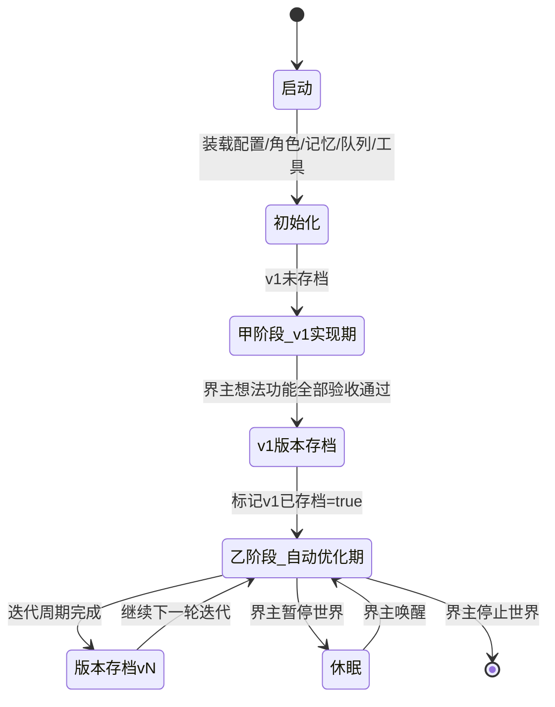
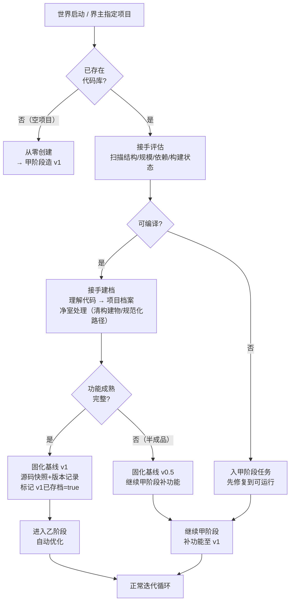
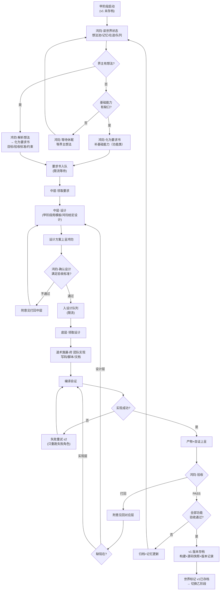
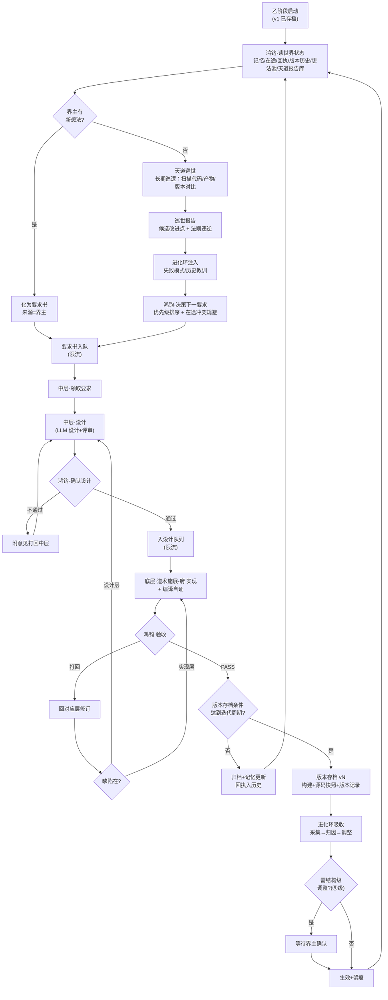
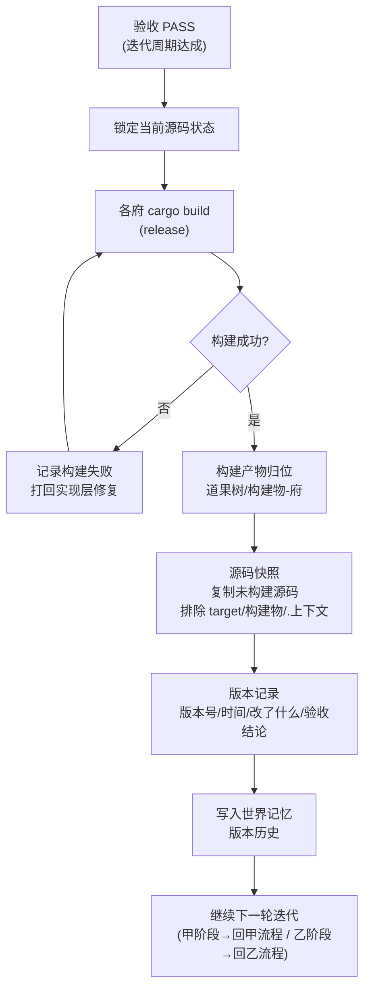
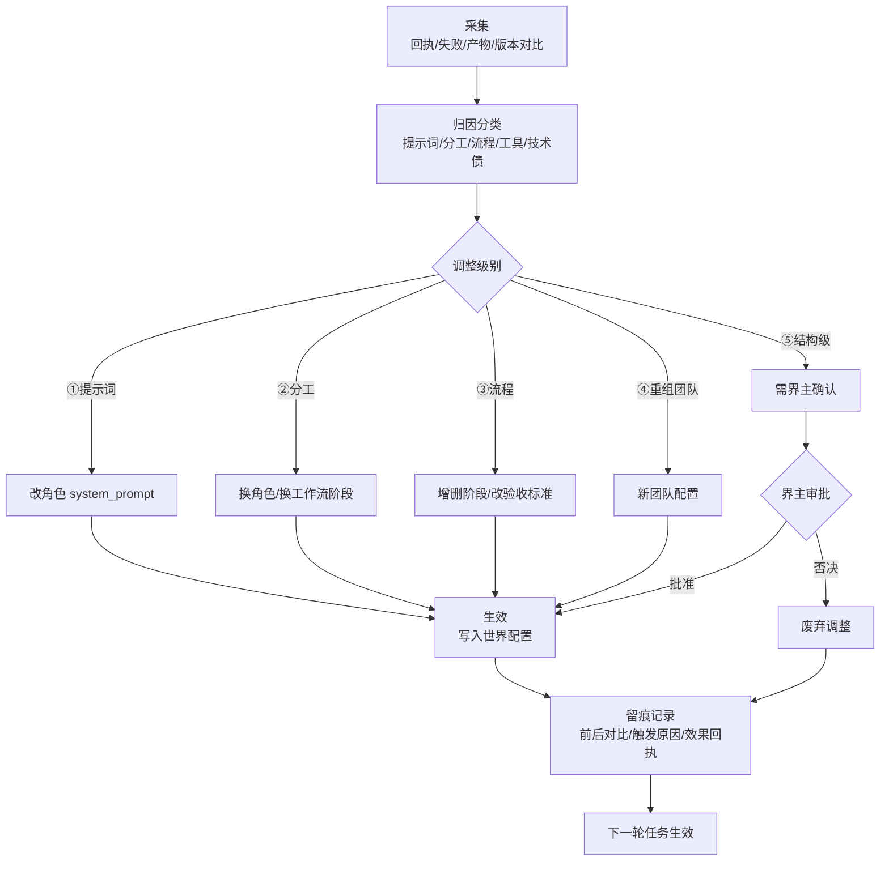

# 多智能体架构设计 — 恒观世界（v0.9）

> 本项目是作为「世界」培养的，不是玩具。世界自己进化、内部自己调整。
> 派遣像真实世界：**界主发布想法 → 鸿钧提要求与验收 → 中层设计 → 底层实现**。
> 迭代像真实世界：**每完成一版 → 构建 → 版本存档（产物+源码快照）→ 继续迭代**。
> **两阶段制：自动优化在 v1 完成后才启动——初期实现功能最重要。**
> 优先级：流程通畅 > 质量 > 体验感 > 功能丰富。

***

## 0. 两阶段制（全局纲领）

| 阶段    | 名称     | 起点         | 目标                | 自动优化（巡世/进化环） |
| ----- | ------ | ---------- | ----------------- | ------------ |
| **甲** | v1 实现期 | 世界创建       | **把第一版功能完整做出来**   | **关闭**       |
| **乙** | 自动优化期  | v1 验收通过并存档 | 持续进化：性能/美观/优化/新能力 | **开启**       |

**切换点唯一**：v1 版本存档完成 → 世界状态标记 `v1已存档=true` → 永久进入乙阶段。

**世界三种进入路径（回答"半路接手"）**：

| 路径       | 场景                      | 动作            | 进入阶段             |
| -------- | ----------------------- | ------------- | ---------------- |
| **从零创建** | 空项目                     | 世界从空白造 v1     | 甲                |
| **半路接手** | 已有代码库（旧项目/他人项目/上一代世界遗产） | 评估→建档→净室→固化基线 | 成熟→直接乙；半成品→先甲补功能 |
| **版本回退** | 世界自己的历史                 | 恢复某版本源码快照     | 按回退目标            |

> 半路接手是真实世界常态：世界不是只能从零养大，它也能**入主一个已有世界**——
> 先读懂它（建档）、先立稳它（净室/修复）、再定基线（固化版本），然后按基线成熟度决定从甲或乙继续。

**甲阶段铁律**：

* 天层不巡世、不自主找优化点；一切力量集中实现界主想法的功能。

* 若界主暂无想法，鸿钧只做两件事：评估基础能力缺口（补基础）、等待界主想法。**绝不提前进入"优化"动作**。

**乙阶段铁律**：

* 天道巡世 + 进化环全开；界主不提需求也持续产出要求流。

* 界主想法 > 天道巡世发现 > 鸿钧自主，同级内按优先级（高/中/低）排序。

***

## 1. 核心理念：世界 = 四层组织 + 两阶段生长

| 层级     | 角色     | 职责                              | 产出                            |
| ------ | ------ | ------------------------------- | ----------------------------- |
| **顶层** | 界主（天意） | 发布需求想法（不干预实现；不提也行）              | 想法                            |
| **天层** | 双神平级   | 天道巡世（发现）/ 鸿钧主政（化要求/派遣/商讨/验收/定档） | 巡世报告 / 要求书 / 确认结论 / 验收结论 / 档案 |
| **中层** | 智慧层    | 把要求翻译成方案                        | 设计方案                          |
| **底层** | 手脚层    | 把方案翻译成产物                        | 代码 / 脚本 / 文档                  |

**铁律**：

* 界主只管"想"；天层不越级做设计/实现；中层不越级实现；底层不越级设计。

* 要求逐层翻译，产物逐层上呈。

* **自动优化只属于乙阶段**（v1 后），甲阶段一切为功能让路。

* **先入稿、再落码**：后续想到的新设计，先并入本稿对应章节再实现；实现须能在本稿溯源。

**版本存档**：每完成一个迭代周期 → 构建 → 版本存档（构建产物 + 未构建源码快照）→ 继续下一轮迭代。世界有可回溯的历史。

***

## 1.5 洪荒角色体系（四层 × 世界观）

世界四层不是抽象概念，而是洪荒诸神的职司。角色即神仙，职司即职责。

```
顶层·界主（天意·人类）—— 发布想法，不干预实现
        │ 想法
        ▼
天层（双神平级）
  ├─ 天道（巡世之神）—— 长期巡逻世界：扫描/观测/发现 → 巡世报告交鸿钧（乙阶段）
  └─ 鸿钧（道祖·主政之神）—— 接收想法/化为要求/派遣/定档案/召集圣人商讨
        │ 要求书               ▲ 审验报告
        ▼                     │
中层·智慧层（设计）
  ├─ 女娲（圣人·造化）        初稿设计
  └─ 四圣（老子/元始/通天/后土） 评审设计（核心逻辑/异常/接口性能/数据流）
        │ 设计方案
        ▼
底层·手脚层（执行 + 审验）
  ├─ 多宝/白泽/龟灵/玄天（大罗金仙）  实现：代码/前端/数据库/监控
  └─ 六准圣（红云/镇元子/鲲鹏/神农/冥河/轩辕） 审验：六维验收，回呈鸿钧
```

> **天层双神平级**：天道与鸿钧平级，同时出现、互不冲突，各司其职——
> **天道巡世**（看见：长期巡逻世界，发现改进点与法则违逆）；
> **鸿钧主政**（落实：接收想法、化为要求、派遣、定档案、召集圣人商讨）。
> 一个管"看见"，一个管"落实"。圣人/准圣/大罗金仙臣属鸿钧调度；天道不指挥，只发现。

### 1.5.0 洪荒位阶·职责铁律（对照洪荒流）

洪荒的实力与职责分层，决定"谁做什么、谁不做什么"：

| 位阶        | 特征                 | 大道        | 在世界的职责                 | 铁律             |
| --------- | ------------------ | --------- | ---------------------- | -------------- |
| 天道（巡世之神）  | 世界之眼               | 观世全道      | **长期巡逻世界**：观测/发现/守护法则  | 与鸿钧平级，不指挥      |
| 鸿钧（道祖）    | 主政之神               | 统御全道      | 接收想法/化要求/派遣/定档案/召集圣人商讨 | 不亲执行           |
| 圣人（女娲+四圣） | 大道既成：**专精而全能**     | 各掌一道，其余亦通 | 设计/评审（定道）              | **不担任执行者**     |
| 准圣（六准圣）   | 半步圣人：道已立未全         | 各精一维      | 审验（回呈鸿钧）               | 只审验不终裁         |
| 大罗金仙（四大罗） | 大道未全：**一道精通、他道逊色** | 各精一道      | 实现（术）                  | **按道分工，不跨道执行** |

**天道与鸿钧平级，同时出现不冲突**：

* **天道** = 巡世之神——长期巡逻世界，观测万物（扫描代码/产物/版本对比），
  发现改进点（性能/美观/优化/新能力）、守护世界法则（违规即报）。巡世所见，交鸿钧落实。

* **鸿钧** = 主政之神——接收界主想法与天道巡世报告，化为要求派遣；
  定档案（版本存档/记忆/历史归档）；召集圣人商讨（设计确认/重大决策/验收）。

* 关系：**平级分工，互不隶属**——天道巡世（看见），鸿钧主政（落实）。
  圣人/准圣/大罗金仙臣属鸿钧调度；天道不指挥，只发现。

**铁律展开**：

1. **圣人不执行**：圣人实力强、有维护世界的职责（定法则/护世界），大道既成而专精全能——
   正因全能，适合"定道"（设计、评审），而不适合亲自下场做"术"（写代码/改文件）。
2. **大罗金仙分道执行**：大罗金仙对自己大道足够精通、其他大道稍微逊色——
   所以只执行自己那条道：多宝炼代码、白泽塑前端、龟灵治数据库、玄天守监控。
   **跨道的事不硬扛**：回呈圣人定夺，或请同门（对应大道的大罗金仙）出马。
3. **准圣审验**：半步圣人，道已立——足以审验"术"的成色，但终裁权在天道（鸿钧）。
4. **天道终裁**：一切决定权在鸿钧。

> 一句话：**圣人定道，大罗行术，准圣验术，鸿钧终裁。**

### 1.5.1 角色总表

| 层级 | 角色    | 道/职司      | 职责                                           | LLM池        | 阶段    |
| -- | ----- | --------- | -------------------------------------------- | ----------- | ----- |
| 顶层 | 界主（人） | 天意        | 发布想法                                         | —           | 全     |
| 天层 | 天道    | 巡世之神·世界之眼 | **长期巡逻世界**：扫描代码/产物/版本对比→巡世报告（发现改进点/法则违逆，交鸿钧） | sage        | **乙** |
| 天层 | 鸿钧    | 道祖·主政之神   | 接收想法/化为要求/派遣/定档案/召集圣人商讨                      | default     | 全     |
| 中层 | 女娲    | 圣人·造化     | 初稿设计                                         | sage        | 全     |
| 中层 | 老子    | 圣人·道德     | 评审核心逻辑/边界/抽象                                 | sage        | 全     |
| 中层 | 元始    | 圣人·秩序     | 评审异常路径/错误处理                                  | sage        | 全     |
| 中层 | 通天    | 圣人·杀伐     | 评审接口/性能/并发                                   | sage        | 全     |
| 中层 | 后土    | 圣人·轮回     | 评审数据流/状态/持久化                                 | sage        | 全     |
| 底层 | 多宝    | 大罗金仙·代码炼化 | 实现：写代码                                       | executor    | 全     |
| 底层 | 白泽    | 大罗金仙·前端   | 实现：前端                                        | executor    | 全     |
| 底层 | 龟灵    | 大罗金仙·数据库  | 实现：数据库                                       | executor    | 全     |
| 底层 | 玄天    | 大罗金仙·监控   | 实现：监控                                        | executor    | 全     |
| 底层 | 红云    | 准圣·业务正确性  | 审验业务正确性（回呈鸿钧）                                | quasi\_sage | 全     |
| 底层 | 镇元子   | 准圣·数据完整性  | 审验数据完整性（回呈鸿钧）                                | quasi\_sage | 全     |
| 底层 | 鲲鹏    | 准圣·性能并发   | 审验性能/并发（回呈鸿钧）                                | quasi\_sage | 全     |
| 底层 | 神农    | 准圣·安全副作用  | 审验安全/副作用（回呈鸿钧）                               | quasi\_sage | 全     |
| 底层 | 冥河    | 准圣·异常兼容   | 审验异常/兼容（回呈鸿钧）                                | quasi\_sage | 全     |
| 底层 | 轩辕    | 准圣·用户体验   | 审验用户体验（回呈鸿钧）                                 | quasi\_sage | 全     |

### 1.5.2 角色与机制对应

| 机制          | 主角色                | 辅助              |
| ----------- | ------------------ | --------------- |
| 想法接收（界主→要求） | 鸿钧                 | —               |
| 巡世（乙阶段）     | **天道（长期巡逻）**       | 巡世报告交鸿钧化为要求     |
| 提要求/派遣      | 鸿钧                 | 接收界主想法 + 天道巡世报告 |
| 设计          | 女娲                 | —               |
| 评审设计        | 老子/元始/通天/后土        | —               |
| 确认设计/召集商讨   | 鸿钧                 | 召圣人商讨后定夺        |
| 实现          | 多宝/白泽/龟灵/玄天        | —               |
| 验收审验        | 红云/镇元子/鲲鹏/神农/冥河/轩辕 | —               |
| 验收终裁        | 鸿钧                 | 依据六准圣报告         |
| 定档案/版本存档    | 鸿钧                 | 验收通过后定档归档       |
| 进化归因/调整     | 鸿钧（决策）             | 女娲（调整设计）        |
| 记忆存取        | 机制（无 LLM 角色）       | —               |

### 1.5.3 天层双神说明（天道 / 鸿钧）

**天道（巡世之神·世界之眼）** —— 乙阶段专职 · 与鸿钧平级

* 定位：世界之眼，**长期巡逻**。持续扫描代码/产物/相邻版本对比，发现候选改进点（性能/美观/优化/新能力）与法则违逆（结构违规/契约不符），产出巡世报告交鸿钧。

* 对应"自主找性能、找美观、找优化点、找新能力"——**发现归天道，落实归鸿钧**。

* 铁律：只发现、不指挥——不做设计、不写代码、不派遣。

* 契约：输出 `巡世报告`（每条：候选目标 + 依据 + 建议类别 + 优先级），不做设计、不写代码。

**鸿钧（道祖·主政之神）** —— 与天道平级

* 接收：界主想法 + 天道巡世报告 → 化为要求书。

* 派遣：要求书/设计书入队，发往中层/底层。

* 定档案：版本存档、验收结论、记忆归档——凡定档，鸿钧落笔。

* 召集圣人商讨：设计确认、重大决策、验收时召圣人评审，商讨后定夺。

* 契约：`要求书` / `派遣令` / `档案条目` / `商讨纪要`。

### 1.5.4 界主可扩展角色（按需新增）

世界是活的——界主可随时增补角色：写一"角色卡"（身份/道/职司/LLM池/契约），录入角色配置表即可生效。新增/废弃角色属结构级进化，需界主确认（见进化环 ⑤级）。

### 1.5.5 鸿钧主控化（界主对话模型）

> 定位：鸿钧从"流程函数"升级为**界主的对话伙伴 + 任务总控**——界主只跟鸿钧说话，圣人大罗准圣是它的后台团队。
> 状态：已入稿 · 2026-08-17 · 界主拍板七条。
> 交互一句话：界主 ◄━ 闲聊/发任务/澄清/追问/并发发新任务 ━► 鸿钧 ─ 召集 ─► 圣人商讨 ─ 上呈 ─► 鸿钧观看 ─ 拆解 ─► 大罗实现 ─ 验收 ─► 准圣 ─ 汇报 ─► 界主。

**界主拍板七条**：

| #  | 拍板     | 内容                                                                             |
| :- | :----- | :----------------------------------------------------------------------------- |
| 1  | 鸿钧定位   | 界主的对话伙伴 + 任务总控；闲聊/发布/澄清/追问/干预都在对话中发生                                           |
| 2  | 圣人商讨分级 | 简单任务单轮（女娲初稿+四圣一次评审）；复杂任务多轮（意见回女娲改稿，最多 2 轮）。复杂判定机械化：涉及路径 ≥3 或跨府 ≥2 或类别=新能力 → 多轮 |
| 3  | 汇报方式   | 关键节点自动汇报一句（澄清完成/商讨开始/设计上呈/开始实现/验收通过/打回/定档）；界主追问可展开详情                           |
| 4  | 任务并发   | 不限制；对话中随时发新任务，每条独立任务线；现有预算/回滚垫/构建锁兜底                                           |
| 5  | 闲聊范围   | 完全自由；鸿钧人格稳定，值得记的进「理解·记忆」格位；闲聊只占对话预算                                            |
| 6  | 消息可见性  | 角色发言全员可见（世界内部透明）；界主发言非@仅鸿钧可见，@点名才直达该角色                                         |
| 7  | 顺手修    | 要求 id 全局递增（现永远"要求-1"，并发后无法追溯）                                                  |

**消息模型**：

```
消息 { 发送者, 文本, @提及: Vec<角色>, 可见: Vec<角色>, 时间戳 }
```

* 界主发言：可见 = {鸿钧} ∪ @提及角色（非@不广播；天意只对主政之神说，点名才让别人听见）

* 角色发言：可见 = 全体角色（世界内部透明工作群，圣人商讨/大罗汇报/准圣回呈全员可追溯）

* 实现：识海承载-府 权限-过滤-阁（角色-过滤-园）扩展消息可见性过滤

**鸿钧对话循环（意图判别）**：每条界主消息经意图判别分流——闲聊（直接回应，可进记忆）/ 发布任务（澄清缺项 → 召集圣人商讨）/ 追问进度详情（从任务线实时状态汇总，真实回执不编造）/ 中途干预（打回/加急/中止任务线）/ 点名@（消息直达该角色）。意图判别实现：LLM 一次调用判意图+提取关键字段，解析失败回退"闲聊"兜底，不阻塞对话。

**任务线生命周期**（每条独立）：

```
澄清完成 → 圣人商讨(分级) → 设计上呈 → 鸿钧观看(通过/打回，打回附意见回圣人)
  → 通过 → 圣人拆解 → 大罗金仙实现 → 准圣六维验收 → 鸿钧终裁
  → 关键节点鸿钧自动汇报 → 定档
```

每条任务线独立预算（分级轮数：问答 32 / 脚本 64 / 程序 128 / 复杂 256，90 万 token；详见 §1.5.5 轮数预算与重试放宽）、独立回滚垫分组、构建锁全局串行（现成）、要求 id 全局递增。

**任务线机制与守护模式**（2026-08-17 补，阶段 3）：

* 任务线 = 一次对话发布的任务单元，落盘 `.上下文/状态/任务线.jsonl`：`{id, 要求id, 想法, 状态: 待执行|执行中|已完成|已中止, 结论, 汇报, 时间}`。

* 发布任务：登记任务线（待执行）→ 进程内立即后台执行（spawn 线程）；CLI 进程退出后未消费的任务线仍留盘。

* **「世界 守护」常驻命令**：轮询消费待执行任务线（间隔 2 秒），防 CLI 退出丢任务——界主开一个终端跑守护，世界的"心脏"就跳起来了，对话发布的任务全部异步执行，完成后鸿钧写汇报进对话记录。

* 状态推进原子化：待执行 → 执行中（先到先得，防并发双跑同一任务线）。

* 追问进度显示任务线状态（待执行/执行中/已完成）。

**落位**（不加新府）：

| 新能力      | 落位                                                                               | 复用                  |
| :------- | :------------------------------------------------------------------------------- | :------------------ |
| 鸿钧对话循环   | 天庭治理-府/天层-主控-殿/**鸿钧-对话-阁**（对话-循环-园 + 意图-判别-园 + 汇报-拼装-园）                          | 会话记录/格位、事件流、模型连接    |
| 圣人商讨（分级） | 天庭治理-府/智慧-主控-殿/设计-落笔-阁/**模板-生成-园**（分级设计：简单单轮 = 初稿+四圣一次评审；复杂多轮 = 圣人工作群评审-改稿 ≤2 轮） | 现有 圣人工作群设计、JSON 提取器 |
| 多任务线调度   | 天庭治理-府/驱动-入口-殿/世界-运行-阁（世界运行.rs 改造）                                               | 队列、回滚垫、派发落单         |
| 界主对话入口   | 乾坤/命令操作-府：新增「对话 发言」命令（读命令区，免令牌）                                                  | 现有 CLI 解析/分发        |
| 消息可见性    | 识海承载-府/回想-殿/权限-过滤-阁（角色-过滤-园 扩展）                                                  | 现有角色白名单             |

**新增接口**（详见 §11.8）：`界主发言` / `追问详情` / `任务线_状态` / `中止任务线` / `圣人_商讨`。

**实施阶段**（每阶段可验收）：① 对话层（对话 发言 入口 + 鸿钧对话循环 + 意图判别）→ ② 圣人商讨分级 + 节点汇报 + 追问详情 → ③ 多任务线（不限制并发 + 任务线状态/中止）。

> 先决地基：要求 id 递增（拍板 7，追溯前提）、验收改造（机械事实优先，现在准圣"凭字节猜谜"还烧钱）、项目档案建档（`项目档案=null`，世界不认识自己）。

**轮数预算与重试放宽（M3 长线程试错，2026-08-20 入稿）**

背景：MiniMax-M3 能力调研——官方数据 ICLR 论文复现 12 小时 18 次 commit、CUDA 算子优化 24 小时 1959 次工具调用、PostTrainBench 得分 37.1。M3 在标准工具脚手架（Claude Code、Cursor 等）上表现极好，洪荒·世界的轮数预算（问答 8 / 脚本 16 / 程序 24 / 复杂 32）与重试次数（2）太低，限制 M3 长线程试错迭代——模型还没收敛就预算耗尽触发回滚。

决策：
- 分级轮数提高 4 倍：问答 32 / 脚本 64 / 程序 128 / 复杂 256。可用环境变量 `WORLD_ROUNDS_QA` / `WORLD_ROUNDS_SCRIPT` / `WORLD_ROUNDS_PROGRAM` / `WORLD_ROUNDS_COMPLEX` 覆盖。
- 最大重试 2 → 6。可用 `WORLD_MAX_RETRY` 覆盖。
- 重试时不回滚（已有逻辑：构建失败续跑只追加报错，模型基于轨迹继续修正）；重试耗尽才回滚清理盘面。提高重试次数让模型有足够迭代空间，不轻易触发回滚。

成本：token 预算 90 万自然限制（轮数耗尽与 token 耗尽任一即终止）；模型收敛后远低于预算。环境变量覆盖供界主按需调参。

落位：道术施展-府/任务-调度-殿/任务-派遣-阁/派发-落单-园/派发落单.rs `分级轮数` 与 `最大重试`。

**提示词压缩加激（M3 长线程试错续，2026-08-20 入稿）**

背景：轮数预算放宽后实测——发布「世界 任务线」命令，子任务 0（园内实现）39 轮构建通过，子任务 2（测试）20 轮构建通过，但子任务 1（接线）128 轮 token 耗尽（921215/900000）。根因：M3 反复读同一文件（兜底分发.rs 读多次），历史累积到 90 万字符，提示词膨胀赶不上增长——`历史_摘要_字符阈值=15000` 触发太晚，`摘要_保留_最新_消息数=4` 保留最新 4 条全文，而最新 4 条都是大文件结果（单条 7115 字符 × 4 = 28460），微压缩只修剪旧轮、最新 4 条不动，压缩速率低于增长速率。

决策（会话内压缩三件套参数加激）：
- 历史摘要阈值 15000 → 10000：更早触发中间段摘要占位替换，防历史线性膨胀。
- 摘要保留最早消息数 4 → 3：初提示 + 至少一轮工具往返不被压缩即可，不必留 4 条。
- 摘要保留最新消息数 4 → 2：当前上下文留 2 条够用（上一轮工具结果 + 本轮模型回复），砍掉 2 条大文件全文占位；3+2=5 条保留，比原 4+4=8 条激进压缩。

成本：摘要更频繁触发，摘要调用本身有开销，但远低于 token 耗尽熔断整任务回滚的代价；保留条数减少可能丢一点早期上下文，模型可按 spill 落盘路径用 读文件 回读，不丢信。

落位：道术施展-府/任务-调度-殿/任务-派遣-阁/工具-循环-园/工具循环.rs `历史_摘要_字符阈值` / `摘要_保留_最早_消息数` / `摘要_保留_最新_消息数`；执行-提示-模板/执行提示.rs 提示词第 7 条同步更新阈值数字。

**渐进式催写（M3 探索空转治理，2026-08-20 入稿）**

背景：提示词压缩加激后重测——要求-87 入池成功，3 子任务并行执行，历史摘要压缩触发多次、spill 落盘工作正常。但 M3 跑了 42 轮（3 子任务各约 14 轮）全在探索（列举目录、读文件、搜索内容），没写文件。根因：工具循环已有"探索预算"（轮数上限/3≈10）和催写机制（第 10 轮插入系统消息"必须收敛"），但催写是软提示——只触发一次（`!已催写`），M3 可忽略继续探索；催写后没写入文件，催结逻辑不触发（催结要求已写入）。M3 从第 10 轮收到催写后继续探索到 42 轮被超时终止，无人拦截。

决策（渐进式催写，不设硬上限）：
- 超过探索预算后每 3 轮催写一次，措辞逐渐加严，逼模型注意力往收敛方向。
- 四阶段：阶段0 温和建议→阶段1 明确要求→阶段2 警告→阶段3 最后通牒。
- 不设工具调用硬上限（不拒绝工具执行），渐进施压让模型自然收敛。
- 经四阶段（共12轮）仍不落笔 → 判定探索空转强制终止（兜底防永远不收敛）。
- 与现有催结（已写入后催结）互补：催写管"探索阶段不写码"，催结管"写入后空转打磨"。

成本：渐进催写消息占少量轮次（4条系统消息），远低于探索空转烧光预算的代价；不拒绝工具保留模型探索能力，温和但有效。

落位：道术施展-府/任务-调度-殿/任务-派遣-阁/工具-循环-园/工具循环.rs `执行工具循环` 催写逻辑改渐进式（`已催写阶段` 替代 `已催写`）。

**涉及路径归一化（M3 探索空转根因修复，2026-08-20 入稿）**

背景：渐进式催写入稿后重测——要求-88 入池成功，M3 跑到第 21 轮仍在探索（反复读相同文件），没写文件。深入调查提示词构造全链路发现根因：`世界运行.rs` 现状构造中 `是涉及` 判断比较 `文件`（依赖图存反斜杠 `乾坤\\呈现-域\\...`）与 `路径`（LLM 填的涉及路径用正斜杠 `乾坤/呈现-域/...`），三条比较全 false → `是涉及` 永远 false。后果：不标"禁止再读"（M3 不知道不该读）、不给测试区摘录（M3 必须读文件看测试模式）、定义受 8000 字符预算限制（可能只给签名不给完整定义）。`查相关文件` 已做归一化能查到文件，但 `是涉及` 判断没做归一化——同一套路径两套分隔符。

决策（归一化 `是涉及` 判断）：比较前把 `文件` 和 `路径` 都 `replace('\\', "/")` 归一为正斜杠再比。去掉原第三条 `starts_with("{路径}\\")`（归一后不需要）。

落位：天庭治理-府/驱动-入口-殿/世界-运行-阁/循环-驱动-园/世界运行.rs `是涉及` 判断加路径归一化。

**任务间现状刷新（子任务并行冲突修复，2026-08-20 入稿）**

背景：涉及路径归一化修复后重测要求-89——M3 写了 119 行代码（子任务 0：定义 `构建退出分类` 枚举 + `判定构建退出` 函数 + 6 个测试），但 3 个子任务只完成 1 个，终裁 2 次打回"编译失败，产物不可信"。根因：要求-89 的 3 个子任务都修改同一文件（派发落单.rs）且有依赖关系——子任务 1（改造主流程为五分支 match）依赖子任务 0（定义 `构建退出分类` 枚举）的产物。但 `世界运行.rs` 第 686-732 行用 `std::thread::scope` 并行执行 3 个子任务，假设"任务相互独立"。并行执行时 3 个子任务都拿到相同现状（原始派发落单.rs，没有 `构建退出分类` 枚举），子任务 1 无法引用子任务 0 的新定义，要么写了引用不存在类型的代码（编译失败），要么探索空转耗尽预算。

决策（同涉及路径任务串行 + 任务间现状刷新）：把 `std::thread::scope` 并行块改为串行循环。每个任务执行前，如果不是第一个任务，先刷新依赖图（`shihai_fu::扫描`）再重新构造现状（重新 `查相关文件` + `查文件` + 现状装配），让后执行的任务能看到先执行任务的产物。现状构造逻辑（原第 519-644 行）提取为函数 `构造现状`，供串行循环中调用。不同涉及路径的任务仍可并行（未来扩展，当前所有子任务共享同一涉及路径，故皆串行）。

落位：天庭治理-府/驱动-入口-殿/世界-运行-阁/循环-驱动-园/世界运行.rs 第 519-644 行提取为 `构造现状` 函数；第 686-732 行 `std::thread::scope` 并行块改为串行循环 + 任务间 `shihai_fu::扫描` + `构造现状` 刷新。

**新建文件场景现状提示（M3 探索空转修复，2026-08-20 入稿）**

背景：要求-90（为道果树-构建域引入独立可单测的环境故障判定能力）重测发现 M3 探索空转——设计阶段把涉及路径设为 `道果树/构建-调度-殿/构建-判定-阁/环境故障判定-园/环境故障判定.rs`，道果树是构建产物目录不在 workspace members 里，文件不存在（要新建）。M3 轮 1-35 反复读文件/列举目录/寻找文件（目标文件不存在），消耗大量 token；轮 36 写文件成功，轮 37 运行 cargo build，但 token 预算耗尽（903158/900000）终止。终裁判定"编译失败，产物不可信"。

根因三连：①构造现状对"涉及路径里文件不存在"无特殊处理——现状里没有目标文件信息，M3 不知道应该新建文件；②项目背景无 workspace members 信息——M3 无法自己分辨道果树是构建产物目录（不在 workspace members 里，文件不会被 cargo 编译）；③渐进式催写措辞说"相关文件现状已给出目标文件完整定义"——对新建文件场景现状里没有目标文件，催写无效。

决策（让 M3 从项目结构自己分辨，不硬编码）：
1. 构造现状加新建文件提示：对涉及路径里不存在的文件，在现状里标注"目标文件不存在，需要新建"，并从 Cargo.toml 检查目标目录是否在 workspace members 里，如果不在追加提示"不在 workspace members 里，文件不会被 cargo 编译"。
2. 项目背景注入 workspace members：从 Cargo.toml 动态读取 workspace members，注入项目背景。M3 看到道果树不在 members 里，自己分辨出道果树不是源码目录——不硬编码"道果树不能探索"。
3. 渐进式催写适配新建文件：对新建文件场景（涉及路径里文件不存在），催写措辞改为"目标文件不存在，请用 写文件 工具直接创建新文件"。

落位：天庭治理-府/驱动-入口-殿/世界-运行-阁/循环-驱动-园/世界运行.rs `构造现状` 函数加新建文件提示 + workspace members 读取；识海承载-府/识海-回想-殿/投影-拼装-阁/三档-拼装-园/三档拼装.rs `元数据层化` 函数注入 workspace members；道术施展-府/任务-调度-殿/任务-派遣-阁/工具-循环-园/工具循环.rs 渐进式催写适配新建文件。

***

## 2. 完整过程流程图

### 2.0 世界生命周期总状态机



### 2.1 半路接手流程（世界入主已有项目）



### 2.2 甲阶段：v1 实现期完整流程



### 2.3 乙阶段：自动优化期完整流程



### 2.4 版本存档流程（两阶段共用）



### 2.5 进化环流程（仅乙阶段）



### 2.6 ASCII 总览（兜底，防渲染失效）

```
┌───────────────────────────────────────────── 恒观·世界 ─────────────────────────────────────────────┐
│                                                                                                     │
│  顶层·界主 ──► 想法池 ─┐                                                                            │
│                       ▼                                                                            │
│  天层·双神(天道巡世/鸿钧主政) ◄── 记忆/回执/版本历史 ── 进化环(仅乙)                                 │
│    │ 要求书                ▲                                                                        │
│    ▼                       │ 产物上呈                                                              │
│  要求队列(限流) ─► 中层·设计 ──► 设计方案 ──► 鸿钧·确认设计 ──► 设计队列 ──► 底层·道术施展-府 团队       │
│                                                                    │         │                     │
│                                                                    ▼         ▼                     │
│                                                             实现+自证 ──► 鸿钧·验收 ──► 版本存档    │
│                                                                                  │                 │
│                                                            ┌──── 打回 ◄── 缺陷分层 ──┘                 │
│                                                            ▼                                         │
│                                                    甲阶段: 回 v1 流程 / 乙阶段: 回巡世循环             │
└─────────────────────────────────────────────────────────────────────────────────────────────────────┘
```

***

## 3. 天层双神（循环细化）

> 天层两条独立常驻回路，**互不阻塞**：
>
> * **天道回路**（乙阶段才启用）：长期巡逻世界 → 巡世报告。
>
> * **鸿钧回路**（始终运行）：接收/化要求/派遣/商讨/验收/定档。
>   天道只产报告，鸿钧决策落实——天道发现，鸿钧主政。

### 3.1 甲阶段循环（功能优先，无自动优化 · 鸿钧回路）

```
循环（鸿钧）：
  ① 读世界状态（想法池/记忆/在途/队列水位）
  ② 若界主有想法 → 解析 → 化为要求书（功能类）
  ③ 若界主无想法 → 评估基础能力缺口
     · 有缺口 → 化为"补基础"要求书（功能类）
     · 无缺口 → 休眠等待（不巡世、不找优化点）
  ④ 要求书入队（非阻塞）
  ⑤ 确认中层设计（通过才派遣底层）
  ⑥ 验收产物（PASS→归档；打回→回对应层）
  ⑦ 全部功能 PASS → 触发 v1 版本存档 → 切换乙阶段
  ⑧ 落盘 → 回 ①
```

### 3.2 乙阶段循环（自动优化全开 · 天道回路 + 鸿钧回路）

```
循环（天道·独立长期线程）：
  ① 扫描世界（代码/产物/相邻版本对比/法则合规）
  ② 产出巡世报告（候选改进点 + 法则违逆清单）→ 写入天道报告库
  ③ 休眠片刻 → 回 ①（长期巡逻，昼夜不停）

循环（鸿钧·主政）：
  ① 读世界状态（记忆/在途/回执/版本历史/想法池/天道报告库）
  ② 决策下一要求：
     · 界主想法 → 化为要求书（最高优先）
     · 天道巡世报告 + 失败模式 → 化为要求书（性能/美观/优化/新能力/维护）
     · 按 优先级 + 在途冲突规避 排序
  ③ 要求书入队（非阻塞）
  ④ 确认设计/召集圣人商讨（高风险才重点确认，低风险快速放行）
  ⑤ 验收产物（PASS→归档；打回→回对应层）
  ⑥ 迭代周期达成 → 版本存档 vN → 进化环吸收
  ⑦ 落盘 → 回 ①
```

***

## 4. 任务生命周期（两阶段共用主干）

```
界主想法 / 天道巡世(仅乙)
   │
   ▼
要求书（目标/验收标准/约束/类别/优先级）
   │ 派遣（非阻塞）
   ▼
要求队列（限流） → 中层设计 → 设计方案上呈
   │                            │
   │        ◄── 鸿钧确认设计 ────┘
   │         通过？─不通过→ 打回中层重设计
   │         通过
   ▼
设计队列（限流） → 底层实现（道术施展-府）→ 编译自证 → 产物上呈
   │                                                        │
   ▼                                                        │
鸿钧·验收 ◄──────────────────────────────────────────────────┘
   │
   ├── PASS ──► （迭代周期达成?）─是→ 版本存档 → 归档 → 进化环吸收 → 继续
   │                  │
   │                  └否→ 归档+记忆更新 → 继续
   └── 打回 ──► 附意见 → 回 设计层 / 实现层
```

状态机：

```
要求书: 待领 → 设计中 → 待确认 → 已确认 → 待实现 → 实现中 → 已验收(通过/打回) → 版本存档 → 归档
              ▲          │                    ▲                               │
              └─打回─────┘                    └────────── 打回 ────────────────┘
```

### 4.1 模型调用健壮性护栏（MiniMax-M3 thinking 模式）

**背景**：模型连接-府走 OpenAI 兼容接口，MiniMax-M3 的 `thinking` 省略默认开启，回复 content 带 `<think>` 思维链；多轮 function call 必须保留完整 assistant 消息（含 think），否则 HTTP 400。实测曾出现：超长上下文 + 丢 think → 工具参数输出空 → 工具循环空转耗尽 32 轮。

**护栏三层**（模型连接-府 落回-解析-园 / 道术施展-府 工具-循环-园）：

1. **工具参数兜底**：`arguments` 为空串、`{}` 或非法 JSON 的调用不执行，回 `模型回复::参数缺失`，工具循环回传系统反馈引导模型补全参数重发（不破坏历史结构）。
2. **assistant 消息保留 think**：`助手_带工具调用` 携带模型原回复 content（含 `<think>`），多轮循环逐轮带回，防 400 断流。
3. **空输出兜底**：纯文本调用 content 为空/纯空白视为失败返回错误（防静默写空记忆 / 空 JSON 报错）；工具循环收到空文本不算收敛，回传系统消息引导重发，直至真正结论文本或轮数耗尽。
4. **请求体显式配置**：工具请求体显式声明 `temperature=0.2` 与 `thinking={"type":"adaptive"}`（MiniMax-M3 仅接受 adaptive/disabled，enabled 会报 400；adaptive 语义等同默认开启思维链但显式固定），防服务端默认值漂移致工具参数退化（arguments={} 缺必填字段）——源自工具循环对比实验：沙箱 Python 请求体（temperature=0.2）同模型同中文 schema 收敛成功，而真实 Rust 请求体（省略 temperature）首轮即空参。
5. **模型调用请求超时（2026-08-17 实锤）**：`调用模型` / `调用模型带工具` 的 HTTP 请求显式 `.timeout(120s)`——ureq 默认无超时，网络挂起（连接建立无响应）会无限卡死整轮任务。实测：任务线驱动在模型设计阶段挂起 5 分钟无进展、进程 CPU 0.08 静止、事件流停滞；修复后挂起请求 120 秒内报错返回（进入失败重试/打回路径，不再拖尸）。

### 4.2 现状装配机制（执行层读事实，防验收误判）

执行层读现状 = 结构下探（府→殿→阁→园）+ 相关文件的符号摘要（`pub` 符号 + 解释）+ 文件全文，来源为依赖图（`.上下文/依赖图.json`）。两条防线保证「涉及路径 → 现状装配 → 验收裁决」不因依赖图滞后/缺档误判：

1. **依赖图滞后防御**：解析想法后，先用「查涉及文件」（精确匹配涉及路径，无兜底）判空；若涉及路径非空且无匹配，先触发一次代码扫描重建依赖图再继续执行——覆盖「涉及文件是本轮新建、旧依赖图档案不含」的场景，防「产物路径偏离涉及范围」误判打回。

2. **文件级占位档案**：依赖图扫描对无 `pub` 符号的文件（如纯测试文件，`#[test] fn` 不带 `pub`）补一条文件级占位档案（符号名 = 文件名，代码 = 全文）。否则涉及路径按文件查必然落空、回退兜底接线文件，导致产物在真实文件却被判「路径偏离」。

3. **背景渐次披露（元数据层 + 按需读格位）**：抄业界渐进式披露（实测 17 个 Skill 从 30K 降到 1.7K token，省 94%）+ 本地 Python 模拟验证（临时文件夹/机制叠加验证，基线复现真实：22 轮 / 141 万输入 / 现付当量 26.8 万 / 延迟代理 775s）：

   * 初始消息不再全量拼装全部格位投影（旧背景约 9 万字符），改为**元数据层**：每格位仅一行「格位名 + 一句摘要」，首屏上限 **3000 字符**（按字符计数，全局兜底与格位独立上限同口径，含中间档注脚；正文由执行层按需用「读格位」工具拉取）。

   * 会话内微压缩（**已实现**，2026-08-16）：历史旧轮工具结果修剪为前 200 字符前缀（含「按需回读」提示），保留最新段不动，`tool_call_id` 配对不破（MiniMax 校验 tool id 配对，与内容无关）；零 LLM 成本，防旧轮工具结果全文撑爆上下文。

   * 溢出全文落盘（**spill**，2026-08-17）：单条非读文件工具结果超 6000 字符上限时，不再只截断——全文落盘 `.上下文/spill/{轮次}_{序号}_{工具}.txt`，内联保留截断头段 + 「共 N 字符、全文已存 spill、按需 读文件/搜索内容 检索（如定位编译错误 'error'）」定位符。模型需要错误细节时按定位符回读，既省 token 又保真，治「编译日志截断 → 盲改」。

   * 摘要压缩（**每轮可触发**，2026-08-16 修复）：历史超过 15000 字符后，最旧区间折叠为一页摘要（保留尾部 4 轮细粒度）。修复前「本轮回已摘要」全程只触发一次，首次摘要后历史再度膨胀不再压缩，后期每轮 prompt 无限增大、任务 token 预算提前耗尽——投递轮 32 轮烧 94.5 万 token 的根因之一。

   * 预算终止：单任务累计输入 token 封顶 90 万，用尽强制收敛（防 32 轮拖尸）。

   * **参数修正（v3 后实测校准，2026-08-16）**：单轮 token 熔断由 60 万改为 **90 万**（与总预算对齐）。实测中型任务（跨府多文件 + 构建反馈）常态 30+ 轮、累计 60\~63 万 token（P0-1 产物变更判定连投三次均 62 万+ 被 60 万熔断误杀后回滚）——60 万低一档阈值对合法中型任务确定性误杀；熔断仅保留「超总预算」单一语义。另注：熔断后重试无意义（剩余预算为 0 即失败），后续迭代改为「熔断即失败、不重试」，省白烧的教训归因轮。

   * **现状装配总量上限（2026-08-16 校准）**：现状装配总字符封顶 8000（含结构下探）。涉及路径内文件（执行者必须落盘改动、禁止再读）完整定义永远给；其余文件（同阁兄弟等）在预算内给定义，超限只给符号清单 + 「用 读文件 按路径读取」提示。防初提示过大致每轮 prompt token 恒定高企——投递轮实测每轮约 3 万 token 的根因之一。
   * **去架构硬绑定（2026-08-17）**：`补全同阁` 由「按 `-阁` 后缀取目录」泛化为「按目标文件**父目录**取前缀，同目录源码一并纳入」——通用分组启发，任何 Rust 项目分层均成立，不再依赖本项目「阁/园」专名（`提取阁目录` 重构为 `父目录`）。命令接线文件可为从依赖图动态解析的待改项（命令入口文件语义匹配），涉及路径净化里的已知维度清单同理可动态化——均属机制通用化方向，随依赖图/工作区数据驱动，不写死维度名。

   * 收益（同 22 轮任务模拟）：累计输入 141.0 万 → 12.0 万（省 91.5%）；现付当量降 90%+（命中率 0.3\~0.95 全区间稳健）；预填充延迟代理 775s → 66s。

   * 注意：该块只压会话内与背景，不破「36/72 格位」层间记忆与地道增量精炼的既有用途。

   * spill 三连修复（2026-08-20 增）：
     - 文件名加任务id：`spill_落盘` 文件名从 `{轮次}_{序号}_{工具}.txt` 改为 `{任务id}_{轮次}_{序号}_{工具}.txt`，消除跨任务/跨重试覆盖。
     - 清理机制：`spill_落盘` 时按总大小阈值清理最旧 spill 文件，防磁盘膨胀。
     - 定位符压缩保护：`摘要历史` 跳过含 spill 定位符的消息不压缩，防关键信息丢失。
     - 微压缩附路径：微压缩结果附工具调用路径参数，防模型不知读哪个路径。
     - 读文件上限提高：60000 → 120000，防大文件尾部漏看。

4. **命令类任务联动补全**：提审（`要求化.rs::解析想法`）净化涉及路径后按任务形态联动补全——方向含「命令」时自动并入 `依赖图::命令接线文件`（兜底分发.rs / 缓存读取.rs / 入口执行.rs，去重），使命令表/入口进涉及范围与现状装配，防「LLM 只捕 1 个涉及文件 → 现状装配缺命令表 → 验收误判『产物路径偏离涉及范围』」（源自历法命令第一次实测，设计稿 §12 P0-2）。接线文件清单提为 `依赖图` 关联常量，与 `查相关文件` 匹配空兜底共用，避免两处清单漂移。


## 19. 本质驱动调度 v2 — 预防+补救双轨 12 档（2026-08-24 入稿）

> 动机：原调度器（§12 P2-7 第七项）按「优先级 高>中>低 + FIFO」选候选，导致 36 条「补测试」候选淹没唯一高价值任务（如要求-40 性能优化）。改造为「**按本质档位插队**」+「**智能接单门**」+「**润色候选注入**」三层。
> 定位：v1 已完成、v2 落地、乙阶段自转的「选什么做+该不该做+没事做啥」三合一机制。

### 19.1 双轨 12 档定义

**核心约束（界主 2026-08-24 拍板）**：
1. 事故开始前要预防（事前防火）≠ 事故开始后要补救（事后灭火）——两轨并存
2. 不能导致全项目崩溃——补救永远优先于预防，S0 兜底
3. 预防类不挡补救类——S6~S10 不允许阻塞 S0~S5 的执行

|档 | 性质 | 触发示例 | 不做的后果 |
|:--|:--|:--|:--|
| S0 | 补救·崩溃 | 启动挂、编译挂、栈溢出 | 项目不可用 |
| S1 | 补救·数据损坏 | 序列化失败、持久化错误、回滚失效 | 记忆错乱 |
| S2 | 补救·死锁 | 互斥锁反向、守护卡死 | 世界停滞 |
| S3 | 补救·安全漏洞 | 已利用的越权/注入/泄漏 | 数据/隐私损坏 |
| S4 | 补救·资源耗尽 | OOM、磁盘满、句柄泄漏 | 系统崩溃 |
| S5 | 补救·契约破坏 | 接口签名破坏且已传染 | 调用方全挂 |
| S6 | 预防·崩溃 | 单点故障/无超时/无降级路径 | 放大 S0 风险 |
| S7 | 预防·数据损坏 | 无备份/无校验和/无回滚垫 | 放大 S1 风险 |
| S8 | 预防·死锁 | 锁粒度大/嵌套深/无超时 | 放大 S2 风险 |
| S9 | 预防·安全漏洞 | 路径无校验/明文密钥/无审计 | 放大 S3 风险 |
| S10 | 预防·资源耗尽 | 队列无界/无监控/无清理 | 放大 S4 风险 |
| S11 | 改进 | 测试覆盖/命名/依赖图/规模 | 长期演化质量 |

### 19.2 18 类本质 → 12 档映射

| 本质类别 | 档位 | 备注 |
|:--|:--|:--|
| 崩溃级 | S0 | 启动级失败 |
| 数据完整性违逆 | S1 | 序列化/回滚失效 |
| 运行死锁 | S2 | 锁/卡死 |
| 安全漏洞 | S3 | 已利用的漏洞 |
| 资源耗尽 | S4 | OOM/磁盘 |
| 契约破坏 | S5 | 传染性破坏 |
| 崩溃预防 / 单点故障 | S6 | 风险信号 |
| 数据损坏预防 / 无备份 | S7 | 风险信号 |
| 死锁预防 / 锁粒度大 | S8 | 风险信号 |
| 安全漏洞预防 / 路径无校验 | S9 | 风险信号 |
| 资源耗尽预防 / 队列无界 | S10 | 风险信号 |
| 性能瓶颈 | S11 | 真实 O(n²)/锁竞争 |
| 新能力缺口 | S11 | 想法池真需求未实现 |
| 失败模式反复 | S11 | 教训 ≥3 次同类 |
| 占位骨架 | S11 | 带占位的入口 |
| 覆盖率不足 | S11 | 园无测试 |
| 规则违逆 | S11 | 命名/层级违逆 |
| 配置漂移 | S11 | .env 未读项 |
| 质量改进 | S11 | 一般性润色 |

> 本质打分是稳态映射（18 类→12 档，纯函数），不让 LLM 运行时判定——那是不可靠的。

### 19.3 调度算法

伪代码：先按 S0 → S1~S5 升序 → S6~S10 → S11 顺序筛，每档取第一个（详见 §19.6 实现回填）。

### 19.4 智能接单门（5 维评估）

动机（界主 2026-08-24 拍板）：哪些可以、哪些不行需根据现实判断，不能预先编码。框架而非规则。

| 维度 | 拒绝条件 | 依据 |
|:--|:--|:--|
| 1 候选池 | 不空时拒绝本候选 | 优先做更高优先 |
| 2 世界状态 | 有未救火失败 | 先救火 |
| 3 影响范围 | 跨 ≥2 府 | 须界主确认 |
| 4 可逆性 | 不可逆改动 | 改核心算法/历史 |
| 5 可验证性 | 无 #[test] 覆盖 | 无法验证=无法做 |

红线 12 条（永远拒绝）：
- .git/ 下任何东西
- 任何 .md 设计稿（除非 当前架构现状.md）
- AGENTS.md 铁律
- Cargo.toml 的 members/dependencies
- .env 密钥/地址
- 核心算法逻辑（未经界主确认）
- .上下文/状态/*.jsonl 历史记录
- 已存档版本快照
- LLM 调用凭据
- .github/workflows
- Cargo.lock 手写修改
- 甲阶段做美化
- **红线 13（2026-08-25 界主拍板）：工具链约定目录不可改名**——`.git/`、`.github/`、`.vscode/`、`.idea/`、`.codegraph/` 等是 Git/GitHub/IDE/工具链硬约定的目录与文件名。**禁止改成中文或其他语言**——改了之后 GitHub 不认、IDE 找不到、工具不工作。即便是「顶层目录未用中文命名」的道韵违逆，对这些工具链目录应**自动豁免**。

### 19.5 润色候选注入（候选池空时）

动机：天道没事做时不应永久休眠——应主动接润色类工作（性能、命名、复用、文档）。

优先级：所有润色候选打 质量改进 本质类别 → 档位 S11 → 永远队尾 → 不打扰 S0~S10。

注入器扫描：
- clippy 警告（→ S10 契约破坏预防）
- 代码重复（粗粒度 string match，后期可换更智能）
- 性能热点（文件大小/函数行数粗筛）
- 命名违逆兜底（道韵扫描 fallback）

接单：注入的润色候选必须过 5 维接单门 → 跨府/无测试 = 拒绝。

### 19.6 实现回填（本轮落码，可溯源）

| 成果 | 代码落点 | 机制 |
|:--|:--|:--|
| 本质档位枚举 | 声明集中.rs `本质档位` | 12 档稳态定义 |
| 本质类别枚举 | 声明集中.rs `本质类别` | 18 类穷举 |
| 本质打分函数 | 巡世扫描.rs `本质打分` | 类→档纯函数映射 |
| 调度算法重写 | 巡世驱动.rs `调度驱动` | 档位优先取代 sort by priority |
| 智能接单门 | 接单.rs `评估接单`/`触碰红线` | 5 维 + 12 红线 |
| 润色注入器 | 润色注入.rs `润色候选注入` | 候选池空时主动产 S11 |
| AGENTS 第16 条 | AGENTS.md | 智能接单门约束 |

依据：§4.4 白箱可观测性 / §11.2 鸿钧调度接口 / §12 P2-7 巡世环 / AGENTS 第 13/14/15 条 + 第 16 条（智能接单门）。

---

*本质驱动调度 v2 · 入稿 2026-08-24 · 依据 §11.2 + 界主拍板「预防+补救+不能崩溃」*

## 20. 反馈回路与进化天道_（设计草图，留待 Step 2/3，本轮不做）_

> 动机：本质驱动调度 v2（§19）是基于训练知识 + 真实数据的初版——它不够「进化」。让天道能自我校准需要两步前置工作，本轮不做，只记下设计。
> 状态：设计草图，**不写代码**；界主拍板「记录以后做」后记入。

### 20.1 Step 2：调度反馈回路（候选做完 → 沉淀）

目标：让 `调度驱动` 在投递想法后，把「候选做完/打回/超时」的结果**回写到一个新格位**。

新格位：`调度反馈.jsonl`（位置 `.上下文/格位/调度反馈.jsonl`，append-only）。

每条记录字段：
- `候选id`（从想法id映射）
- `本质类别`（18 类）
- `本质档位`（12 档）
- `结果`（通过 / 打回 / 超时）
- `耗时秒`
- `打回原因`（若打回，LLM 归因）

价值：跑几周后有几百条数据，**基于真实而非猜测**反向校验档位映射。

### 20.2 Step 3：进化天道（档位自适应）

目标：让 12 档分类**自适应**——基于 Step 2 数据重新校准档位。

机制：
- 新发现的本质类别 → 创档
- 长期不产出的扫描 → 降档
- 长期高打回率的候选类型 → 升档（预防改补救）
- 调度算法本身按真实效果迭代

前置条件：**Step 2 跑满 1 个月**，有足够数据样本。

风险：
- LLM 不可靠判定 → 必须基于历史数据机械规则
- 失控可能（LLM 自己注册扫描维度）→ 必须有人类审批

不做理由：**用猜测驱动猜测**。当前 12 档是基于训练知识 + 你的拍板，未经真实事故验证。等数据说话。

### 20.3 触发条件

- Step 2:本轮会话已记录，下次会话做
- Step 3:Step 2 跑满 1 个月后启动

**依据**：§19 结尾 + 界主 2026-08-24 拍板「记录以后做」

## 21. 格位设计原则（2026-08-25 界主拍板）

> 动机：避免格位无限膨胀/碎片化，强制所有格位变更走「合并→腾位置」路径。
> 定位：与 §6「36 格位约束」同级别，永久生效，所有未来格位决策必须先过本节。

### 21.1 四条硬约束

1. **不另立新格位**：新增信息必须**先尝试合并**进现有 36 格位之一，找不到归属才考虑扩展。设计阶段先穷举 36 格位清单，证伪后才允许新立。
2. **细粒度只能合并为粗粒度**：想把信息拆细？先**合并**已有的低频格位腾出位置，**进退守恒**。**增加粒度 = 减少其他格位**。
3. **不超出**：36 格位是上限，任何时刻总数 ≤ 36。新格位加入必须伴随等量旧格位合并或下线。
4. **不弃高换低**：高频使用的格位不能被低频格位替换。「高 = 有人/有事在用」= 受众存在 = 价值在场。弃高换低 = 损害现有读者。

### 21.2 决策流程（强制）

新增任何信息时，按以下顺序判断：
1. **列出 36 格位清单**（§6），逐项检查是否能合并。
2. **若全部不合适**，检查是否有低频格位可以**降级合并**（如 3 个格位合 1）。
3. **若 1+2 都不行**，可以新立，但必须伴随等量下线。
4. **禁止**：直接新立格位而不先穷举合并可能性。

### 21.3 例外条款

- **临时数据**（运行态、缓存态、计算中间产物）不受 36 约束——这些本来就**不入格位**，落 `.上下文/状态/` 或 `.上下文/缓存/`。
- **格位重组**（合并/下线/重命名）允许——这正是 §21.1.3 的设计目的。
- **§21 自身不占 36 之一**——它是**元约束**（关于格位的设计原则），不存任何业务数据。

### 21.4 与 §6 36 格位的关系

- §6 定义 36 格位**是哪些**。
- §21 定义 36 格位**怎么演进**。
- 两者必须**同时满足**：36 上限 + 演进守恒。

### 21.5 触发条件

- 任何新格位提案必须先引用 §21.2 决策流程的判断结果。
- AGENTS.md 同步加铁律（与本节配套），让所有 AI 助手都能看到。

**依据**：界主 2026-08-25 拍板「格位是稀缺资源，只能合并腾位置，不能弃高换低」+ 文档收割门原则（§6 + §8）。

## 22. AI 协作原则（2026-08-25 入稿，配套 §21 格位设计原则）

> 动机：本项目核心驱动是 DSH 架构师 AI + 界主人机协作。AI 不是「工具」而是「会犯错的合作者」，必须把风格 + 边界明确化，避免每次会话重新发现。
> 定位：AI 协作层宪法。所有 AI 助手（含跨会话的新会话）首次进入项目时必读。
> 配套：AI 详细工具经验与待办见 临时文件夹/AI身份-工具经验.md（本节是宪法概要，临时文件是细节）。

### 22.1 风格（6 条必守）

1. **不预设立场** — 不假定"是 bug 还是 feature"，看真实数据再判
2. **诚实比完成重要** — 工具坏了停、文件坏了说、看错了认，不假装能做
3. **机械判定 > 主观判断** — 优先用 test/clippy/grep/edit 探针/git show 验证，不靠感觉
4. **痕迹 > 记忆** — 写进文件，不靠会话记忆
5. **简化 > 复杂** — 一次改 1-2 个文件，不批量；commit message 简洁（< 200 字符）
6. **入稿 > 落地** — AGENTS §8：先写设计稿，再落码

### 22.2 边界（5 条不可越）

1. **不擅自动用户数据** — .上下文/状态/*.jsonl、要求库快照、版本库等
2. **不擅自 commit "世界自转产物"** — gewei-格位、sessionref、迁移稿等
3. **不擅自 commit "任务结束才算定档"的内容** — 这是界主拍板
4. **不擅自动 AGENTS §12 + §16 红线** — .env / Cargo.lock 手写 / 凭据 / 核心算法逻辑 / 甲阶段美化
5. **不替界主拍板** — 重大决策（清理、UI 权重、12 档分类档位、§21 演进等）必须问过才做

### 22.3 工具红线（与 §13 文档收割门并列）

工具 read: 显示 [object Object] 占位 + 错误行数，**不可信**。用 git show + git log + grep 替代。
工具 write: 大文件被截断。用 edit + 唯一锚点替代。
工具 pwsh: 间歇 invalid arguments。必填 description 字段。
工具 glob: 路径含中文/空格可能挂。用 edit 探针替代。
工具 web_search: 鉴权失败。不联网（用训练知识）。

### 22.4 跨会话续命

- AI 首次进入项目必读：临时文件夹/AI身份-工具经验.md（5 步恢复：git log → status → 读 AGENTS 末 20 行 → 读 AI 身份文件 → 报告）
- AGENTS.md 第 1-17 条铁律永久生效
- 设计稿章节 §1-§22 是真相源

**依据**：界主 2026-08-25 拍板「维护你自己看的文档」+ 跨会话续命需求

---


---

