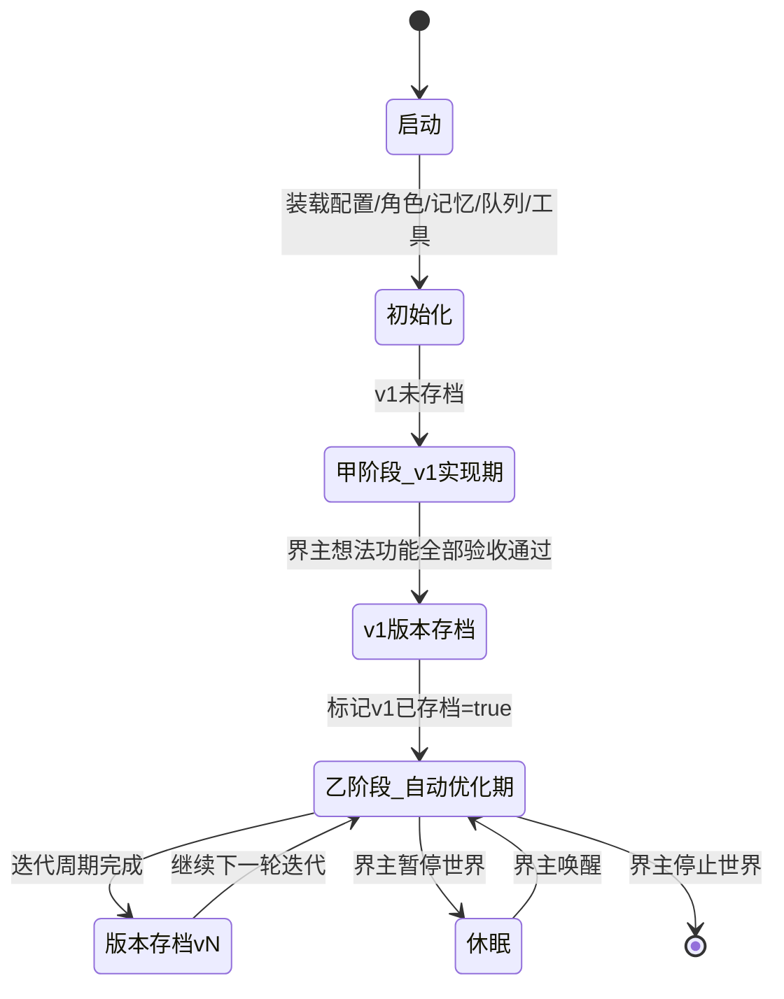
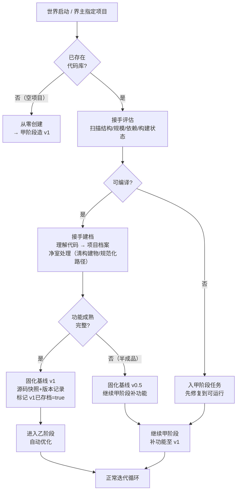
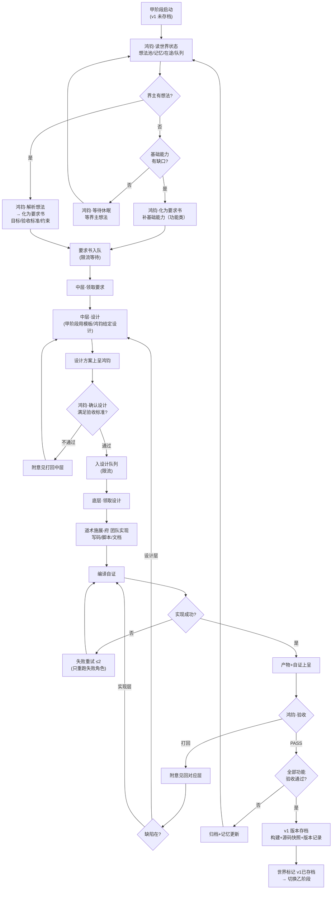
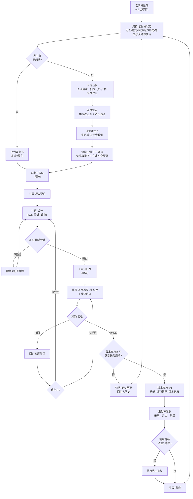
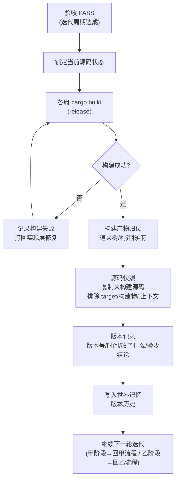
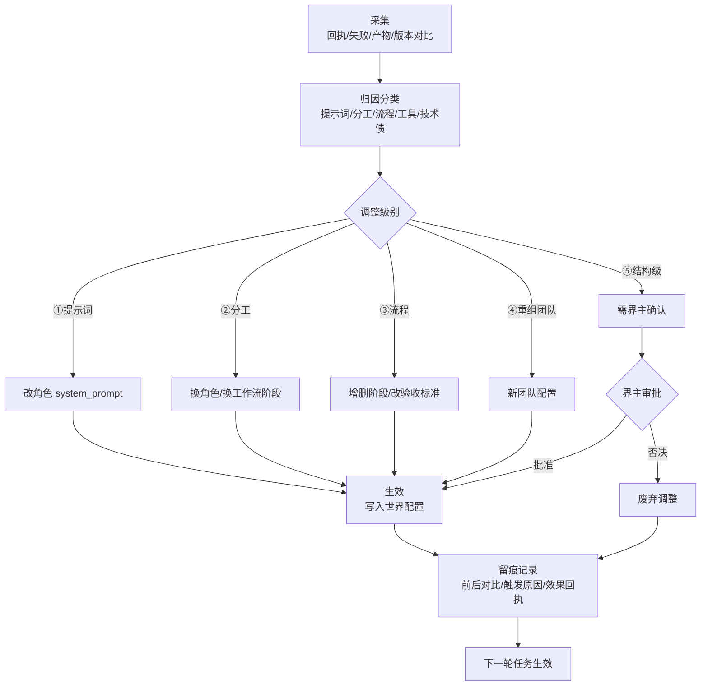

# 多智能体架构设计 — 恒观世界（v0.9）

> 本项目是作为「世界」培养的，不是玩具。世界自己进化、内部自己调整。
> 派遣像真实世界：**界主发布想法 → 鸿钧提要求与验收 → 中层设计 → 底层实现**。
> 迭代像真实世界：**每完成一版 → 构建 → 版本存档（产物+源码快照）→ 继续迭代**。
> **两阶段制：自动优化在 v1 完成后才启动——初期实现功能最重要。**
> 优先级：流程通畅 > 质量 > 体验感 > 功能丰富。

---

## 0. 两阶段制（全局纲领）

| 阶段 | 名称 | 起点 | 目标 | 自动优化（巡世/进化环） |
|---|---|---|---|---|
| **甲** | v1 实现期 | 世界创建 | **把第一版功能完整做出来** | **关闭** |
| **乙** | 自动优化期 | v1 验收通过并存档 | 持续进化：性能/美观/优化/新能力 | **开启** |

**切换点唯一**：v1 版本存档完成 → 世界状态标记 `v1已存档=true` → 永久进入乙阶段。

**世界三种进入路径（回答"半路接手"）**：

| 路径 | 场景 | 动作 | 进入阶段 |
|---|---|---|---|
| **从零创建** | 空项目 | 世界从空白造 v1 | 甲 |
| **半路接手** | 已有代码库（旧项目/他人项目/上一代世界遗产） | 评估→建档→净室→固化基线 | 成熟→直接乙；半成品→先甲补功能 |
| **版本回退** | 世界自己的历史 | 恢复某版本源码快照 | 按回退目标 |

> 半路接手是真实世界常态：世界不是只能从零养大，它也能**入主一个已有世界**——
> 先读懂它（建档）、先立稳它（净室/修复）、再定基线（固化版本），然后按基线成熟度决定从甲或乙继续。

**甲阶段铁律**：
- 天层不巡世、不自主找优化点；一切力量集中实现界主想法的功能。
- 若界主暂无想法，鸿钧只做两件事：评估基础能力缺口（补基础）、等待界主想法。**绝不提前进入"优化"动作**。

**乙阶段铁律**：
- 天道巡世 + 进化环全开；界主不提需求也持续产出要求流。
- 界主想法 > 天道巡世发现 > 鸿钧自主，同级内按优先级（高/中/低）排序。

---

## 1. 核心理念：世界 = 四层组织 + 两阶段生长

| 层级 | 角色 | 职责 | 产出 |
|---|---|---|---|
| **顶层** | 界主（天意） | 发布需求想法（不干预实现；不提也行） | 想法 |
| **天层** | 双神平级 | 天道巡世（发现）/ 鸿钧主政（化要求/派遣/商讨/验收/定档） | 巡世报告 / 要求书 / 确认结论 / 验收结论 / 档案 |
| **中层** | 智慧层 | 把要求翻译成方案 | 设计方案 |
| **底层** | 手脚层 | 把方案翻译成产物 | 代码 / 脚本 / 文档 |

**铁律**：
- 界主只管"想"；天层不越级做设计/实现；中层不越级实现；底层不越级设计。
- 要求逐层翻译，产物逐层上呈。
- **自动优化只属于乙阶段**（v1 后），甲阶段一切为功能让路。

**版本存档**：每完成一个迭代周期 → 构建 → 版本存档（构建产物 + 未构建源码快照）→ 继续下一轮迭代。世界有可回溯的历史。

---

## 1.5 洪荒角色体系（四层 × 世界观）

世界四层不是抽象概念，而是洪荒诸神的职司。角色即神仙，职司即职责。

```
顶层·界主（天意·人类）—— 发布想法，不干预实现
        │ 想法
        ▼
天层（双神平级）
  ├─ 天道（巡世之神）—— 长期巡逻世界：扫描/观测/发现 → 巡世报告交鸿钧（乙阶段）
  └─ 鸿钧（道祖·主政之神）—— 接收想法/化为要求/派遣/定档案/召集圣人商讨
        │ 要求书               ▲ 审验报告
        ▼                     │
中层·智慧层（设计）
  ├─ 女娲（圣人·造化）        初稿设计
  └─ 四圣（老子/元始/通天/后土） 评审设计（核心逻辑/异常/接口性能/数据流）
        │ 设计方案
        ▼
底层·手脚层（执行 + 审验）
  ├─ 多宝/白泽/龟灵/玄天（大罗金仙）  实现：代码/前端/数据库/监控
  └─ 六准圣（红云/镇元子/鲲鹏/神农/冥河/轩辕） 审验：六维验收，回呈鸿钧
```

> **天层双神平级**：天道与鸿钧平级，同时出现、互不冲突，各司其职——
> **天道巡世**（看见：长期巡逻世界，发现改进点与法则违逆）；
> **鸿钧主政**（落实：接收想法、化为要求、派遣、定档案、召集圣人商讨）。
> 一个管"看见"，一个管"落实"。圣人/准圣/大罗金仙臣属鸿钧调度；天道不指挥，只发现。

### 1.5.0 洪荒位阶·职责铁律（对照洪荒流）

洪荒的实力与职责分层，决定"谁做什么、谁不做什么"：

| 位阶 | 特征 | 大道 | 在世界的职责 | 铁律 |
|---|---|---|---|---|
| 天道（巡世之神） | 世界之眼 | 观世全道 | **长期巡逻世界**：观测/发现/守护法则 | 与鸿钧平级，不指挥 |
| 鸿钧（道祖） | 主政之神 | 统御全道 | 接收想法/化要求/派遣/定档案/召集圣人商讨 | 不亲执行 |
| 圣人（女娲+四圣） | 大道既成：**专精而全能** | 各掌一道，其余亦通 | 设计/评审（定道） | **不担任执行者** |
| 准圣（六准圣） | 半步圣人：道已立未全 | 各精一维 | 审验（回呈鸿钧） | 只审验不终裁 |
| 大罗金仙（四大罗） | 大道未全：**一道精通、他道逊色** | 各精一道 | 实现（术） | **按道分工，不跨道执行** |

**天道与鸿钧平级，同时出现不冲突**：
- **天道** = 巡世之神——长期巡逻世界，观测万物（扫描代码/产物/版本对比），
  发现改进点（性能/美观/优化/新能力）、守护世界法则（违规即报）。巡世所见，交鸿钧落实。
- **鸿钧** = 主政之神——接收界主想法与天道巡世报告，化为要求派遣；
  定档案（版本存档/记忆/历史归档）；召集圣人商讨（设计确认/重大决策/验收）。
- 关系：**平级分工，互不隶属**——天道巡世（看见），鸿钧主政（落实）。
  圣人/准圣/大罗金仙臣属鸿钧调度；天道不指挥，只发现。

**铁律展开**：

1. **圣人不执行**：圣人实力强、有维护世界的职责（定法则/护世界），大道既成而专精全能——
   正因全能，适合"定道"（设计、评审），而不适合亲自下场做"术"（写代码/改文件）。
2. **大罗金仙分道执行**：大罗金仙对自己大道足够精通、其他大道稍微逊色——
   所以只执行自己那条道：多宝炼代码、白泽塑前端、龟灵治数据库、玄天守监控。
   **跨道的事不硬扛**：回呈圣人定夺，或请同门（对应大道的大罗金仙）出马。
3. **准圣审验**：半步圣人，道已立——足以审验"术"的成色，但终裁权在天道（鸿钧）。
4. **天道终裁**：一切决定权在鸿钧。

> 一句话：**圣人定道，大罗行术，准圣验术，鸿钧终裁。**

### 1.5.1 角色总表

| 层级 | 角色 | 道/职司 | 职责 | LLM池 | 阶段 |
|---|---|---|---|---|---|
| 顶层 | 界主（人） | 天意 | 发布想法 | — | 全 |
| 天层 | 天道 | 巡世之神·世界之眼 | **长期巡逻世界**：扫描代码/产物/版本对比→巡世报告（发现改进点/法则违逆，交鸿钧） | sage | **乙** |
| 天层 | 鸿钧 | 道祖·主政之神 | 接收想法/化为要求/派遣/定档案/召集圣人商讨 | default | 全 |
| 中层 | 女娲 | 圣人·造化 | 初稿设计 | sage | 全 |
| 中层 | 老子 | 圣人·道德 | 评审核心逻辑/边界/抽象 | sage | 全 |
| 中层 | 元始 | 圣人·秩序 | 评审异常路径/错误处理 | sage | 全 |
| 中层 | 通天 | 圣人·杀伐 | 评审接口/性能/并发 | sage | 全 |
| 中层 | 后土 | 圣人·轮回 | 评审数据流/状态/持久化 | sage | 全 |
| 底层 | 多宝 | 大罗金仙·代码炼化 | 实现：写代码 | executor | 全 |
| 底层 | 白泽 | 大罗金仙·前端 | 实现：前端 | executor | 全 |
| 底层 | 龟灵 | 大罗金仙·数据库 | 实现：数据库 | executor | 全 |
| 底层 | 玄天 | 大罗金仙·监控 | 实现：监控 | executor | 全 |
| 底层 | 红云 | 准圣·业务正确性 | 审验业务正确性（回呈鸿钧） | quasi_sage | 全 |
| 底层 | 镇元子 | 准圣·数据完整性 | 审验数据完整性（回呈鸿钧） | quasi_sage | 全 |
| 底层 | 鲲鹏 | 准圣·性能并发 | 审验性能/并发（回呈鸿钧） | quasi_sage | 全 |
| 底层 | 神农 | 准圣·安全副作用 | 审验安全/副作用（回呈鸿钧） | quasi_sage | 全 |
| 底层 | 冥河 | 准圣·异常兼容 | 审验异常/兼容（回呈鸿钧） | quasi_sage | 全 |
| 底层 | 轩辕 | 准圣·用户体验 | 审验用户体验（回呈鸿钧） | quasi_sage | 全 |

### 1.5.2 角色与机制对应

| 机制 | 主角色 | 辅助 |
|---|---|---|
| 想法接收（界主→要求） | 鸿钧 | — |
| 巡世（乙阶段） | **天道（长期巡逻）** | 巡世报告交鸿钧化为要求 |
| 提要求/派遣 | 鸿钧 | 接收界主想法 + 天道巡世报告 |
| 设计 | 女娲 | — |
| 评审设计 | 老子/元始/通天/后土 | — |
| 确认设计/召集商讨 | 鸿钧 | 召圣人商讨后定夺 |
| 实现 | 多宝/白泽/龟灵/玄天 | — |
| 验收审验 | 红云/镇元子/鲲鹏/神农/冥河/轩辕 | — |
| 验收终裁 | 鸿钧 | 依据六准圣报告 |
| 定档案/版本存档 | 鸿钧 | 验收通过后定档归档 |
| 进化归因/调整 | 鸿钧（决策） | 女娲（调整设计） |
| 记忆存取 | 机制（无 LLM 角色） | — |

### 1.5.3 天层双神说明（天道 / 鸿钧）

**天道（巡世之神·世界之眼）** —— 乙阶段专职 · 与鸿钧平级
- 定位：世界之眼，**长期巡逻**。持续扫描代码/产物/相邻版本对比，发现候选改进点（性能/美观/优化/新能力）与法则违逆（结构违规/契约不符），产出巡世报告交鸿钧。
- 对应"自主找性能、找美观、找优化点、找新能力"——**发现归天道，落实归鸿钧**。
- 铁律：只发现、不指挥——不做设计、不写代码、不派遣。
- 契约：输出 `巡世报告`（每条：候选目标 + 依据 + 建议类别 + 优先级），不做设计、不写代码。

**鸿钧（道祖·主政之神）** —— 与天道平级
- 接收：界主想法 + 天道巡世报告 → 化为要求书。
- 派遣：要求书/设计书入队，发往中层/底层。
- 定档案：版本存档、验收结论、记忆归档——凡定档，鸿钧落笔。
- 召集圣人商讨：设计确认、重大决策、验收时召圣人评审，商讨后定夺。
- 契约：`要求书` / `派遣令` / `档案条目` / `商讨纪要`。

### 1.5.4 界主可扩展角色（按需新增）

世界是活的——界主可随时增补角色：写一"角色卡"（身份/道/职司/LLM池/契约），录入角色配置表即可生效。新增/废弃角色属结构级进化，需界主确认（见进化环 ⑤级）。

---

## 2. 完整过程流程图

### 2.0 世界生命周期总状态机



### 2.1 半路接手流程（世界入主已有项目）



### 2.2 甲阶段：v1 实现期完整流程



### 2.3 乙阶段：自动优化期完整流程



### 2.4 版本存档流程（两阶段共用）



### 2.5 进化环流程（仅乙阶段）



### 2.6 ASCII 总览（兜底，防渲染失效）

```
┌───────────────────────────────────────────── 恒观·世界 ─────────────────────────────────────────────┐
│                                                                                                     │
│  顶层·界主 ──► 想法池 ─┐                                                                            │
│                       ▼                                                                            │
│  天层·双神(天道巡世/鸿钧主政) ◄── 记忆/回执/版本历史 ── 进化环(仅乙)                                 │
│    │ 要求书                ▲                                                                        │
│    ▼                       │ 产物上呈                                                              │
│  要求队列(限流) ─► 中层·设计 ──► 设计方案 ──► 鸿钧·确认设计 ──► 设计队列 ──► 底层·道术施展-府 团队       │
│                                                                    │         │                     │
│                                                                    ▼         ▼                     │
│                                                             实现+自证 ──► 鸿钧·验收 ──► 版本存档    │
│                                                                                  │                 │
│                                                            ┌──── 打回 ◄── 缺陷分层 ──┘                 │
│                                                            ▼                                         │
│                                                    甲阶段: 回 v1 流程 / 乙阶段: 回巡世循环             │
└─────────────────────────────────────────────────────────────────────────────────────────────────────┘
```

---

## 3. 天层双神（循环细化）

> 天层两条独立常驻回路，**互不阻塞**：
> - **天道回路**（乙阶段才启用）：长期巡逻世界 → 巡世报告。
> - **鸿钧回路**（始终运行）：接收/化要求/派遣/商讨/验收/定档。
> 天道只产报告，鸿钧决策落实——天道发现，鸿钧主政。

### 3.1 甲阶段循环（功能优先，无自动优化 · 鸿钧回路）

```
循环（鸿钧）：
  ① 读世界状态（想法池/记忆/在途/队列水位）
  ② 若界主有想法 → 解析 → 化为要求书（功能类）
  ③ 若界主无想法 → 评估基础能力缺口
     · 有缺口 → 化为"补基础"要求书（功能类）
     · 无缺口 → 休眠等待（不巡世、不找优化点）
  ④ 要求书入队（非阻塞）
  ⑤ 确认中层设计（通过才派遣底层）
  ⑥ 验收产物（PASS→归档；打回→回对应层）
  ⑦ 全部功能 PASS → 触发 v1 版本存档 → 切换乙阶段
  ⑧ 落盘 → 回 ①
```

### 3.2 乙阶段循环（自动优化全开 · 天道回路 + 鸿钧回路）

```
循环（天道·独立长期线程）：
  ① 扫描世界（代码/产物/相邻版本对比/法则合规）
  ② 产出巡世报告（候选改进点 + 法则违逆清单）→ 写入天道报告库
  ③ 休眠片刻 → 回 ①（长期巡逻，昼夜不停）

循环（鸿钧·主政）：
  ① 读世界状态（记忆/在途/回执/版本历史/想法池/天道报告库）
  ② 决策下一要求：
     · 界主想法 → 化为要求书（最高优先）
     · 天道巡世报告 + 失败模式 → 化为要求书（性能/美观/优化/新能力/维护）
     · 按 优先级 + 在途冲突规避 排序
  ③ 要求书入队（非阻塞）
  ④ 确认设计/召集圣人商讨（高风险才重点确认，低风险快速放行）
  ⑤ 验收产物（PASS→归档；打回→回对应层）
  ⑥ 迭代周期达成 → 版本存档 vN → 进化环吸收
  ⑦ 落盘 → 回 ①
```

---

## 4. 任务生命周期（两阶段共用主干）

```
界主想法 / 天道巡世(仅乙)
   │
   ▼
要求书（目标/验收标准/约束/类别/优先级）
   │ 派遣（非阻塞）
   ▼
要求队列（限流） → 中层设计 → 设计方案上呈
   │                            │
   │        ◄── 鸿钧确认设计 ────┘
   │         通过？─不通过→ 打回中层重设计
   │         通过
   ▼
设计队列（限流） → 底层实现（道术施展-府）→ 编译自证 → 产物上呈
   │                                                        │
   ▼                                                        │
鸿钧·验收 ◄──────────────────────────────────────────────────┘
   │
   ├── PASS ──► （迭代周期达成?）─是→ 版本存档 → 归档 → 进化环吸收 → 继续
   │                  │
   │                  └否→ 归档+记忆更新 → 继续
   └── 打回 ──► 附意见 → 回 设计层 / 实现层
```

状态机：
```
要求书: 待领 → 设计中 → 待确认 → 已确认 → 待实现 → 实现中 → 已验收(通过/打回) → 版本存档 → 归档
              ▲          │                    ▲                               │
              └─打回─────┘                    └────────── 打回 ────────────────┘
```

---

## 5. 版本存档机制

**触发**：
- 甲阶段：全部功能验收通过 → 存 **v1**。
- 乙阶段：迭代周期达成（累积 N 条已验收要求 或 达到时间/周期）→ 存 **vN**。
- 半路接手：固化基线（成熟项目→v1；半成品→v0.5），写入版本历史。

```
验收 PASS（周期达成）
   │
   ▼
版本-存档-殿
   ├─ ① 锁定源码状态
   ├─ ② 各府 cargo build（release）→ 产物归位 道果树/构建物-府
   ├─ ③ 源码快照：复制「未构建源码」（排除 target/构建物/.上下文）
   │    └─ 版本-库/版本-vN/源码-快照/
   ├─ ④ 版本记录：版本号/时间/改了什么/验收结论/产物清单
   │    └─ 写入世界记忆「版本历史」
   └─ ⑤ 继续下一轮迭代
```

**快照规则**：
- 快照 = 未构建源码（.rs/.toml/.json/.md），排除构建物与运行时数据。
- 版本号自动递增，可回溯、可对比、可回退。
- 构建失败 → 打回实现层修复，**不产生版本**。

---

## 6. 数据模型

### 6.1 想法（界主产出）
```json
{
  "id": "想法-<时间戳>-<序号>",
  "内容": "界主原话",
  "时间": 0,
  "状态": "未处理|已化为要求"
}
```

### 6.2 要求书（鸿钧产出）
```json
{
  "id": "要求-<时间戳>-<序号>",
  "来源": "界主|天道巡世|鸿钧自主",
  "想法id": "想法-...（若来自界主）",
  "阶段": "甲|乙",
  "方向": "一句话宏观目标",
  "类别": "功能|性能|美观|优化|维护|新能力|补基础",
  "验收标准": "做到什么程度算通过（可核对）",
  "约束": {"涉及路径": [], "不允许": [], "优先级": "高|中|低"},
  "状态": "待领|设计中|待确认|已确认|待实现|实现中|已验收|已存档",
  "确认意见": null,
  "验收": null,
  "版本": null
}
```

### 6.3 设计方案（中层产出）
```json
{
  "要求id": "要求-...",
  "设计": "架构/模块/数据流/接口/边界",
  "拆解": [{"目标": "...", "执行层角色": ["duobao"], "工作流": "L2_script"}],
  "自评": "本设计如何满足验收标准"
}
```

### 6.4 验收回执（鸿钧产出）
```json
{
  "要求id": "要求-...",
  "结论": "通过|打回",
  "验收意见": "（打回必填：缺陷在设计层还是实现层）",
  "产物": [{"路径": "...", "类别": "代码", "字节数": 1234}],
  "耗时秒": 123.4
}
```

### 6.5 版本记录（版本-存档产出）
```json
{
  "版本号": "v3",
  "时间": 0,
  "阶段": "乙",
  "改了什么": "本迭代周期已验收要求摘要",
  "源码快照路径": "版本-库/版本-v3/源码-快照",
  "构建产物路径": "道果树/...",
  "验收结论": ["要求-...: 通过"],
  "对比上一版": "关键差异（供巡世）"
}
```

### 6.6 世界状态（全局）
```json
{
  "阶段": "甲|乙",
  "v1已存档": false,
  "进入路径": "从零创建|半路接手|版本回退",
  "长期记忆": "...",
  "界主想法池": [],
  "在途要求": [],
  "验收历史": [],
  "失败模式": [],
  "版本历史": [],
  "巡世候选池": [],
  "项目档案": "（半路接手时生成）"
}
```

### 6.7 项目档案（半路接手产出）
```json
{
  "来源": "已有代码库路径",
  "接手时间": 0,
  "规模": {"rs文件数": 333, "总行数": 123456, "crate数": 5},
  "结构地图": "维度/域/府/殿/阁/园 概览",
  "关键接口": ["跨府引用清单"],
  "构建状态": "可编译|不可编译（原因）",
  "风格约定": "中文标识符/六层规范等",
  "已知坑": ["路径歧义/双空格副本/历史遗留"],
  "成熟度判定": "成熟完整|半成品|损坏需修复",
  "基线版本": "v1|v0.5（固化时写入版本历史）"
}
```

---

## 7. 并发与限流

| 机制 | 设计 |
|---|---|
| 天层 | 鸿钧单线程常驻（意志一致）+ 天道独立线程（乙阶段启用） |
| 中层设计 | ≤M 并发（默认 1-2） |
| 底层实现 | ≤N 并发（默认 2-3） |
| 队列 | 要求队列 + 设计队列，磁盘持久化（jsonl），重启不丢 |
| 派遣 | 只写队列，绝不阻塞上层 |
| 冲突规避 | 在途要求含"涉及路径"→ 提新要求自动避开重叠路径 |
| 版本存档 | 串行执行（同一时刻仅一个版本存档） |

---

## 8. 世界自进化（进化环，仅乙阶段）

```
采集（每任务/每轮/每版本）
  ├─ 回执：通过/打回/耗时
  ├─ 失败：原因/所在层/次数
  ├─ 产物：路径/类别/体积
  └─ 版本：构建结果/源码快照/对比差异
        │
        ▼
归因（分类）
  ├─ 提示词问题（角色不懂要求）
  ├─ 分工问题（层级配比失衡）
  ├─ 流程问题（缺环节/环节顺序错）
  ├─ 工具问题（缺能力/超时）
  └─ 技术债问题（版本对比发现膨胀/退化）
        │
        ▼
调整（分级，从轻到重）
  ① 调提示词（最常见）  ② 调分工  ③ 调流程  ④ 重组团队  ⑤ 结构级（需界主确认）
        │
        ▼
生效 + 留痕（前后对比/触发原因/效果回执）
```

原则：
- 自进化是常态，但**结构级变化需界主确认**——世界有意志，界主是天意。
- 所有调整留痕，形成世界的"历史书"。

---

## 9. 三府分工（agent_fu 升级）

| 组件 | 职责 | 关系 |
|---|---|---|
| `识海承载-府`（shihai_fu） | 记忆：编码/存储/检索 + 会话记录 + 三级缓存 | 一切角色读投影 / 回填记忆 |
| `天庭治理-府`（tianting_fu） | 组织编排：天层/中层/队列/版本存档/进化环 | 调度道术施展-府跑实现 |
| `道术施展-府`（daoshu_fu） | 任务执行：角色工作流引擎（agent_fu 升级） | 每个层级角色按道术执行 L1-L4 |

**解耦**：道术施展-府 不知道组织层存在，只负责"把一个设计方案实现成产物"。

---

## 10. 六层落位

```
鸿蒙（维度 · 地基）
└── 基础设施-域
    ├── 识海承载-府（shihai_fu）    脑 · 记忆（上下文）
    │   ├── 铭记-殿     编码：代码扫描 / LLM 播种 / 人类录入
    │   ├── 纳藏-殿     存储：36 格位 / 坐标网格 / 索引 / 会话记录
    │   └── 回想-殿     检索：三档投影 / 角色权限 / 预算 / 三级缓存
    │
    ├── 天庭治理-府（tianting_fu）   组织编排（管组织）
    │   ├── 天层-主控-殿     天层双神
    │   │    ├── 巡世-发现-阁   （天道·仅乙阶段启用）
    │   │    ├── 想法-接收-阁   （鸿钧）
    │   │    ├── 要求-提审-阁   （鸿钧）
    │   │    ├── 设计-确认-阁   （鸿钧·召集圣人商讨）
    │   │    ├── 验收-裁决-阁   （鸿钧）
    │   │    └── 档案-定档-阁   （鸿钧·版本定档/记忆归档）
    │   ├── 智慧-主控-殿     中层：设计-落笔-阁
    │   ├── 队列-调度-殿     要求/设计队列
    │   ├── 团队-调度-殿     调度道术施展-府执行
    │   ├── 版本-存档-殿     版本：构建+快照+记录
    │   └── 进化-主控-殿     进化环（仅乙阶段启用）
    │
    └── 道术施展-府（daoshu_fu）     任务执行（管角色如何执行）
        └── 角色工作流引擎：天层 / 智慧 / 手脚 各角色 L1-L4 工作流（agent_fu 升级）
```

---

## 11. 接口清单（字段级契约）

> 接口即「天道法则」的落点：凡调用必须遵守字段契约。所有接口为 Rust 中文标识符，
> 落位到 天庭治理-府（tianting_fu）/ 识海承载-府（shihai_fu）对应殿/阁/园。跨府引用止步 lib 根（六层纪律）。

### 11.1 世界记忆接口（识海承载-府 · 纳藏-殿）

| 接口 | 入参 | 出参 | 说明 |
|---|---|---|---|
| `读世界状态` | — | `世界状态`(6.6) | 全量状态快照 |
| `写世界状态` | `世界状态` | `bool` | 原子覆盖，串行化 |
| `想法池_投递` | `想法`(6.1) | `bool` | 界主想法入池 |
| `想法池_取未处理` | — | `Vec<想法>` | 鸿钧取未处理想法 |
| `在途要求_增` | `要求书` | `bool` | 派遣时登记在途 |
| `在途要求_清` | `要求id` | `bool` | 验收/废弃时清除 |
| `失败模式_记` | `失败条目` | `bool` | 供进化环归因 |
| `版本历史_记` | `版本记录`(6.5) | `bool` | 版本存档落笔 |

### 11.2 鸿钧回路接口（天层-主控-殿）

| 接口 | 入参 | 出参 | 说明 |
|---|---|---|---|
| `解析想法` | `想法` | `要求书`(6.2) | 目标/验收标准/约束 结构化 |
| `化为要求` | 来源(界主/天道/自主) + 内容 | `要求书` | 统一化为要求书 |
| `要求书_入队` | `要求书` | `bool` | 非阻塞投递队列 |
| `确认设计` | `设计方案`(6.3) | `确认结论(通过/打回+意见)` | 高风险召圣人商讨 |
| `验收裁决` | `产物清单` + `自证` | `验收回执`(6.4) | 先六准圣审验，再终裁 |
| `定档` | `验收回执` | `档案条目` | 版本/验收/记忆落档 |

### 11.3 天道回路接口（巡世-发现-阁，仅乙）

| 接口 | 入参 | 出参 | 说明 |
|---|---|---|---|
| `扫描世界` | 扫描范围(代码/产物/版本) | `扫描结果` | 机械扫描（快） |
| `深度巡世` | 扫描结果 + 版本对比差异 | `巡世报告` | LLM 分析（慢，版后触发） |
| `法则合规检查` | 扫描结果 | `违逆清单` | 六层/命名/契约检查 |
| `巡世报告_写` | `巡世报告` | `bool` | 写入天道报告库，供鸿钧读取 |

### 11.4 队列接口（队列-调度-殿）

| 接口 | 入参 | 出参 | 说明 |
|---|---|---|---|
| `要求队列_入队` | `要求书` | `bool` | 非阻塞 |
| `要求队列_取队` | — | `Option<要求书>` | 中层领取，限流 ≤M |
| `要求队列_水位` | — | `usize` | 供鸿钧决策 |
| `设计队列_入队` | `设计方案` | `bool` | 确认通过后入队 |
| `设计队列_取队` | — | `Option<设计方案>` | 底层领取，限流 ≤N |
| `状态推进` | `要求id` + 新状态 | `bool` | 待领→设计中→…→已存档 |

### 11.5 团队调度接口（团队-调度-殿）

| 接口 | 入参 | 出参 | 说明 |
|---|---|---|---|
| `派遣实现` | `设计方案`(6.3) | `任务id` | 非阻塞，交给道术施展-府 |
| `查实现状态` | `任务id` | `运行中/成功/失败+回执` | 轮询 |
| `收产物` | `任务id` | `产物清单` | 产物登记，供验收 |
| `失败重试` | `任务id` | `bool` | ≤2 次，只重跑失败角色 |

### 11.6 版本存档接口（版本-存档-殿）

| 接口 | 入参 | 出参 | 说明 |
|---|---|---|---|
| `锁定源码` | — | `快照点` | 冻结当前源码状态 |
| `构建` | `快照点` | `构建结果(成功+产物路径/失败+原因)` | 各府 cargo build |
| `源码快照` | `快照点` | `快照路径` | 排除 target/构建物/.上下文 |
| `版本记录` | 构建产物 + 快照 + 验收结论 | `版本记录`(6.5) | 写入版本历史 |
| `回退版本` | `版本号` | `恢复结果` | 从版本-库恢复快照 |

### 11.7 进化环接口（进化-主控-殿，仅乙）

| 接口 | 入参 | 出参 | 说明 |
|---|---|---|---|
| `采集` | 回执/失败/产物/版本 | `原始样本` | 每任务/每版本 |
| `归因` | `原始样本` | `归因分类` | 提示词/分工/流程/工具/技术债 |
| `调整` | `归因分类` | `调整级别 ①-⑤` | ⑤级需界主确认 |
| `留痕` | 前后配置 + 触发原因 | `进化记录` | 写入世界历史书 |

---

## 12. 落地路径（实现顺序细化）

### 路径选择
- **从零创建**：按下方阶段一执行。
- **半路接手**：先执行「接手流程」（评估→建档→净室→固化基线）；
  成熟项目直接进阶段二（乙）；半成品先补功能（阶段一）再切乙。
- **版本回退**：从版本-库恢复目标版本源码快照，按目标版本阶段继续。

### 阶段一 · 甲阶段实现（功能优先）

> 每步完成即有验证标准——**流程通畅优先**：先让主干能跑，再谈质量/体验/丰富。

| # | 建设内容 | 落位（天庭治理-府） | 验证标准 |
|---|---|---|---|
| 1 | 天庭治理-府骨架：世界状态/记忆存取 | 识海承载-府·纳藏-殿 | `读/写世界状态` 往返一致，重启不丢 |
| 2 | 想法池 + 要求/设计队列（磁盘 jsonl） | 队列-调度-殿 | 投递/取队/水位/状态推进 单测通过 |
| 3 | 鸿钧（甲版）：解析想法→要求书→入队 | 天层-主控-殿 | 界主想法→要求书→队列，事件留痕 |
| 4 | 中层（甲版）：模板设计（先不接 LLM） | 智慧-主控-殿 | 模板拆解→设计方案→上呈鸿钧 |
| 5 | 鸿钧·确认设计（甲版：机械校验） | 设计-确认-阁 | 满足验收标准→放行；不满足→打回 |
| 6 | 团队调度：复用道术施展-府 L1/L2/L3 | 团队-调度-殿 | 设计方案→实现→产物+自证→上呈 |
| 7 | 鸿钧·验收（甲版：六准圣审验回呈） | 验收-裁决-阁 | PASS/打回 判定正确，回执落档 |
| 8 | 版本-存档：构建+源码快照+版本记录 | 版本-存档-殿 | v1 存档完整（产物+快照+记录） |
| 9 | 朝堂 Web：恒观页（六层流水视图） | 呈现侧 | 想法/要求/设计/实现/验收/版本 可见 |
| 10 | **里程碑验收** | — | 界主发想法→无人干预走完全链路→v1 存档→世界标记 `v1已存档` |

### 阶段二 · 乙阶段启动（自动优化）
1. 巡世-发现-阁（天道）：长期巡逻扫描代码/产物/版本对比 → 巡世报告
2. 进化环：采集→归因→分级调整（①-④级自动，⑤级等界主）
3. 中层升级：LLM 设计（女娲设计 + 四圣评审）
4. **验收**：界主零输入，世界自主完成 ≥1 条"天道巡世→要求→设计→实现→验收→版本"闭环

### 阶段三 · 规模化
- 多方向并行（多个意志线，共享记忆）；结构级进化流程化；可观测增强（六层可视化/token 计量/进化留痕书）。

---

## 13. Rust 类型定义（可实现级）

> 本节代码可**原样复制**为 `天庭治理-府` 的 `类型-定义-园/类型.rs`。
> 命名遵循项目规范：中文标识符 + snake_case；枚举用 `#[derive(Clone, Debug, PartialEq)]` + `serde`。
> 持久化统一用 JSON（世界状态/要求书等落盘 .json，队列落盘 .jsonl）。

### 14.1 基础枚举

```rust
/// 世界生长阶段
#[derive(Clone, Debug, PartialEq, Serialize, Deserialize)]
pub enum 阶段 { 甲, 乙 }

/// 世界进入路径
#[derive(Clone, Debug, PartialEq, Serialize, Deserialize)]
pub enum 进入路径 { 从零创建, 半路接手, 版本回退 }

/// 要求来源
#[derive(Clone, Debug, PartialEq, Serialize, Deserialize)]
pub enum 要求来源 { 界主, 天道巡世, 鸿钧自主 }

/// 要求类别
#[derive(Clone, Debug, PartialEq, Serialize, Deserialize)]
pub enum 要求类别 { 功能, 性能, 美观, 优化, 维护, 新能力, 补基础 }

/// 要求书状态机（8 态）
#[derive(Clone, Debug, PartialEq, Serialize, Deserialize)]
pub enum 要求状态 {
    待领, 设计中, 待确认, 已确认, 待实现, 实现中, 已验收, 已存档,
}

/// 验收结论
#[derive(Clone, Debug, PartialEq, Serialize, Deserialize)]
pub enum 验收结论 { 通过, 打回 }

/// 缺陷归属层（验收打回时必填）
#[derive(Clone, Debug, PartialEq, Serialize, Deserialize)]
pub enum 缺陷层 { 设计层, 实现层 }

/// 进化调整级别（①-⑤）
#[derive(Clone, Debug, PartialEq, Serialize, Deserialize)]
pub enum 调整级别 { 调提示词, 调分工, 调流程, 重组团队, 结构级 }

/// 优先级
#[derive(Clone, Debug, PartialEq, Serialize, Deserialize, PartialOrd, Ord)]
pub enum 优先级 { 低, 中, 高 }

/// 项目成熟度（半路接手判定）
#[derive(Clone, Debug, PartialEq, Serialize, Deserialize)]
pub enum 成熟度 { 成熟完整, 半成品, 损坏需修复 }
```

### 14.2 核心结构

```rust
/// 想法（界主产出）
#[derive(Clone, Debug, PartialEq, Serialize, Deserialize)]
pub struct 想法 {
    pub id: String,          // "想法-<时间戳>-<序号>"
    pub 内容: String,        // 界主原话
    pub 时间: u64,           // unix 毫秒
    pub 状态: 想法状态,       // 未处理 | 已化为要求
}

/// 想法状态
#[derive(Clone, Debug, PartialEq, Serialize, Deserialize)]
pub enum 想法状态 { 未处理, 已化为要求 }

/// 要求书（鸿钧产出）
#[derive(Clone, Debug, PartialEq, Serialize, Deserialize)]
pub struct 要求书 {
    pub id: String,          // "要求-<时间戳>-<序号>"
    pub 来源: 要求来源,
    pub 想法id: Option<String>,
    pub 阶段: 阶段,
    pub 方向: String,        // 一句话宏观目标
    pub 类别: 要求类别,
    pub 验收标准: String,     // 做到什么程度算通过（可核对）
    pub 约束: 约束,
    pub 状态: 要求状态,
    pub 确认意见: Option<String>,
    pub 验收: Option<验收回执>,
    pub 版本: Option<String>, // 验收后所属版本号
}

/// 约束（含路径避让，用于在途冲突规避）
#[derive(Clone, Debug, Default, PartialEq, Serialize, Deserialize)]
pub struct 约束 {
    pub 涉及路径: Vec<String>,
    pub 不允许: Vec<String>,
    pub 优先级: 优先级,
}

/// 设计方案（中层产出）
#[derive(Clone, Debug, PartialEq, Serialize, Deserialize)]
pub struct 设计方案 {
    pub 要求id: String,
    pub 设计: String,                 // 架构/模块/数据流/接口/边界
    pub 拆解: Vec<拆解项>,
    pub 自评: String,                 // 本设计如何满足验收标准
}

/// 拆解项（底层任务的输入）
#[derive(Clone, Debug, PartialEq, Serialize, Deserialize)]
pub struct 拆解项 {
    pub 目标: String,
    pub 执行层角色: Vec<String>,       // ["duobao"] 等，对应道术施展-府 角色
    pub 工作流: String,               // "L1_qa" | "L2_script" | "L3_program" | "L4_complex"
}

/// 验收回执（鸿钧产出）
#[derive(Clone, Debug, PartialEq, Serialize, Deserialize)]
pub struct 验收回执 {
    pub 要求id: String,
    pub 结论: 验收结论,
    pub 验收意见: Option<String>,      // 打回必填：缺陷在设计层还是实现层
    pub 产物: Vec<产物条目>,
    pub 耗时秒: f64,
}

/// 产物条目
#[derive(Clone, Debug, PartialEq, Serialize, Deserialize)]
pub struct 产物条目 {
    pub 路径: String,
    pub 类别: String,                 // 代码 | 脚本 | 文档 | 配置
    pub 字节数: u64,
}

/// 版本记录
#[derive(Clone, Debug, PartialEq, Serialize, Deserialize)]
pub struct 版本记录 {
    pub 版本号: String,               // "v1"
    pub 时间: u64,
    pub 阶段: 阶段,
    pub 改了什么: String,
    pub 源码快照路径: String,
    pub 构建产物路径: String,
    pub 验收结论: Vec<String>,         // "要求-...: 通过"
    pub 对比上一版: String,            // 关键差异（供巡世）
}

/// 巡世报告（天道产出）
#[derive(Clone, Debug, PartialEq, Serialize, Deserialize)]
pub struct 巡世报告 {
    pub id: String,                  // "巡世-<时间戳>-<序号>"
    pub 时间: u64,
    pub 候选: Vec<巡世候选>,
    pub 违逆: Vec<法则违逆>,
}

/// 巡世候选（改进点）
#[derive(Clone, Debug, PartialEq, Serialize, Deserialize)]
pub struct 巡世候选 {
    pub 目标: String,
    pub 依据: String,
    pub 建议类别: 要求类别,            // 性能/美观/优化/新能力/维护
    pub 优先级: 优先级,
}

/// 法则违逆（六层/命名/契约违规）
#[derive(Clone, Debug, PartialEq, Serialize, Deserialize)]
pub struct 法则违逆 {
    pub 路径: String,
    pub 违逆内容: String,              // 描述
    pub 依据规则: String,              // 引用层级结构-设计.md 条款
}

/// 失败条目（供进化环归因）
#[derive(Clone, Debug, PartialEq, Serialize, Deserialize)]
pub struct 失败条目 {
    pub 要求id: String,
    pub 阶段: String,                 // 设计 | 实现 | 验收
    pub 原因: String,
    pub 所在层: 缺陷层,
    pub 次数: u32,
    pub 时间: u64,
}

/// 进化记录（世界历史书）
#[derive(Clone, Debug, PartialEq, Serialize, Deserialize)]
pub struct 进化记录 {
    pub id: String,                  // "进化-<时间戳>-<序号>"
    pub 级别: 调整级别,
    pub 触发原因: String,
    pub 前后对比: String,              // 配置变更摘要
    pub 效果回执: Option<String>,      // 调整后任务结果
    pub 时间: u64,
}

/// 项目档案（半路接手产出）
#[derive(Clone, Debug, PartialEq, Serialize, Deserialize)]
pub struct 项目档案 {
    pub 来源: String,                 // 已有代码库路径
    pub 接手时间: u64,
    pub 规模: 规模统计,
    pub 结构地图: String,             // 维度/域/府/殿/阁/园 概览
    pub 关键接口: Vec<String>,        // 跨府引用清单
    pub 构建状态: 构建状态,
    pub 风格约定: String,
    pub 已知坑: Vec<String>,
    pub 成熟度: 成熟度,
    pub 基线版本: String,             // "v1" | "v0.5"
}

/// 规模统计
#[derive(Clone, Debug, PartialEq, Serialize, Deserialize)]
pub struct 规模统计 {
    pub rs文件数: u32,
    pub 总行数: u64,
    pub crate数: u32,
}

/// 构建状态
#[derive(Clone, Debug, PartialEq, Serialize, Deserialize)]
pub enum 构建状态 { 可编译, 不可编译(String) }

/// 世界状态（全局唯一，原子落盘）
#[derive(Clone, Debug, PartialEq, Serialize, Deserialize)]
pub struct 世界状态 {
    pub 阶段: 阶段,
    pub v1已存档: bool,
    pub 进入路径: 进入路径,
    pub 长期记忆: String,
    pub 界主想法池: Vec<想法>,
    pub 在途要求: Vec<要求书>,
    pub 验收历史: Vec<验收回执>,
    pub 失败模式: Vec<失败条目>,
    pub 版本历史: Vec<版本记录>,
    pub 巡世候选池: Vec<巡世候选>,
    pub 项目档案: Option<项目档案>,
    pub 天道报告库: Vec<巡世报告>,
}
```

### 14.3 队列定义（磁盘 jsonl）

```rust
/// 要求队列 / 设计队列 共用。磁盘 jsonl，重启不丢。
#[derive(Clone, Debug)]
pub struct Jsonl队列<T: Serialize + DeserializeOwned> {
    路径: PathBuf,
    _标记: std::marker::PhantomData<T>,
}

impl<T: Serialize + DeserializeOwned> Jsonl队列<T> {
    /// 打开（不存在则创建）队列文件
    pub fn 打开(路径: impl AsRef<Path>) -> 结果<Self> { todo!() }
    /// 入队（追加一行 JSON，非阻塞）
    pub fn 入队(&self, 项: &T) -> 结果<()> { todo!() }
    /// 取队（读首行并删除，限流取用）
    pub fn 取队(&self) -> 结果<Option<T>> { todo!() }
    /// 水位（当前行数）
    pub fn 水位(&self) -> 结果<usize> { todo!() }
}
```

### 14.4 错误类型

```rust
/// 世界统一错误
#[derive(Debug, thiserror::Error)]
pub enum 世界错误 {
    #[error("读取失败: {0}")]
    读取(#[from] std::io::Error),
    #[error("序列化失败: {0}")]
    序列化(#[from] serde_json::Error),
    #[error("状态推进非法: 从 {from} 到 {to}")]
    非法状态推进 { from: 要求状态, to: 要求状态 },
    #[error("构建失败: {0}")]
    构建失败(String),
    #[error("任务失败: {0}")]
    任务失败(String),
}

pub type 结果<T> = std::result::Result<T, 世界错误>;
```

---

## 14. 三府工程结构（文件级）

> 落位路径：`鸿蒙/基础设施-域/`（三个府：识海承载-府 + 天庭治理-府 + 道术施展-府）。
> 六层纪律：府 = lib crate 编译单位；殿/阁/园 只放 `模块.rs`（仅 `pub mod`）；能力只在园落地。
> 跨府引用止步 lib 根（入口.rs）。

### 15.1 目录树

```
鸿蒙/基础设施-域/
├── 识海承载-府/                        # lib = shihai_fu · 脑 · 记忆
│   ├── Cargo.toml
│   ├── 入口.rs                          # lib 根：pub mod + pub use
│   ├── 类型-定义-殿/类型-定义-阁/类型-定义-园/类型.rs   # 格位/记录/坐标/索引/会话记录 类型
│   ├── 铭记-殿/                         # 编码：代码扫描 / LLM 播种 / 人类录入
│   │   ├── 代码-扫描-阁/代码-扫描-园/代码扫描.rs
│   │   ├── 种子-播种-阁/种子-播种-园/种子播种.rs
│   │   └── 人类-录入-阁/人类-录入-园/人类录入.rs
│   ├── 纳藏-殿/                         # 存储：36 格位 / 坐标网格 / 索引 / 会话记录
│   │   ├── 格位-存储-阁/格位-存储-园/格位存储.rs
│   │   ├── 坐标-网格-阁/坐标-网格-园/坐标网格.rs
│   │   ├── 索引-定位-阁/索引-定位-园/索引定位.rs
│   │   └── 会话-记录-阁/会话-记录-园/会话记录.rs
│   └── 回想-殿/                         # 检索：三档投影 / 角色权限 / 预算 / 三级缓存
│       ├── 三档-投影-阁/三档-投影-园/三档投影.rs
│       ├── 角色-权限-阁/角色-权限-园/角色权限.rs
│       └── 预算-裁剪-阁/预算-裁剪-园/预算裁剪.rs
│
├── 天庭治理-府/                        # lib = tianting_fu · 身 · 组织编排
│   ├── Cargo.toml
│   ├── 入口.rs
│   ├── 类型-定义-殿/类型-定义-阁/类型-定义-园/类型.rs   # 第 13 节全部类型（原样复制）
│   ├── 天层-主控-殿/
│   │   ├── 巡世-发现-阁/巡世-发现-园/巡世发现.rs      # 天道：扫描/深度巡世/法则合规/报告入库
│   │   ├── 想法-接收-阁/想法-接收-园/想法接收.rs      # 鸿钧：想法池_取未处理 → 解析想法
│   │   ├── 要求-提审-阁/要求-提审-园/要求提审.rs      # 鸿钧：化为要求 → 要求书_入队
│   │   ├── 设计-确认-阁/设计-确认-园/设计确认.rs      # 鸿钧：确认设计（高风险召圣人商讨）
│   │   ├── 验收-裁决-阁/验收-裁决-园/验收裁决.rs      # 鸿钧：六准圣审验 → 验收裁决 → 回执
│   │   └── 档案-定档-阁/档案-定档-园/档案定档.rs      # 鸿钧：验收结论/版本/记忆 落档
│   ├── 智慧-主控-殿/设计-落笔-阁/设计-落笔-园/设计落笔.rs   # 中层设计
│   ├── 队列-调度-殿/
│   │   ├── 队列-通用-阁/队列-通用-园/队列通用.rs      # Jsonl队列<T>
│   │   ├── 要求-队列-阁/要求-队列-园/要求队列.rs
│   │   ├── 设计-队列-阁/设计-队列-园/设计队列.rs
│   │   └── 状态-推进-阁/状态-推进-园/状态推进.rs      # 8 态合法迁移表
│   ├── 团队-调度-殿/派遣-执行-阁/派遣-执行-园/派遣执行.rs   # 调度道术施展-府执行
│   ├── 版本-存档-殿/存档-执行-阁/存档-执行-园/存档执行.rs   # 锁定/构建/快照/记录/回退
│   ├── 进化-主控-殿/进化-执行-阁/进化-执行-园/进化执行.rs   # 采集/归因/调整/留痕（仅乙）
│   └── 驱动-入口-殿/世界-运行-阁/世界-运行-园/世界运行.rs   # 主循环：鸿钧回路 + 天道回路
│
└── 道术施展-府/                        # lib = daoshu_fu · 任务执行
    ├── Cargo.toml
    ├── 入口.rs
    └── 角色-工作流-殿/                  # 每个层级角色 L1-L4 工作流引擎（agent_fu 升级）
        ├── 天层-执行-阁/天层-执行-园/天层执行.rs
        ├── 智慧-执行-阁/智慧-执行-园/智慧执行.rs
        └── 手脚-执行-阁/手脚-执行-园/手脚执行.rs
```

### 15.2 Cargo.toml

```toml
# 天庭治理-府（组织编排）
[package]
name = "tianting_fu"
version = "0.1.0"
edition = "2021"

[lib]
name = "tianting_fu"
path = "入口.rs"

[dependencies]
serde = { version = "1", features = ["derive"] }
serde_json = "1"
thiserror = "2"
shihai_fu = { path = "../识海承载-府" }    # 记忆：读投影 / 回填
daoshu_fu = { path = "../道术施展-府" }    # 执行：调度角色干活
```

```toml
# 识海承载-府（记忆）
[package]
name = "shihai_fu"
version = "0.1.0"
edition = "2021"

[lib]
name = "shihai_fu"
path = "入口.rs"

[dependencies]
serde = { version = "1", features = ["derive"] }
serde_json = "1"
thiserror = "2"
```

```toml
# 道术施展-府（任务执行）
[package]
name = "daoshu_fu"
version = "0.1.0"
edition = "2021"

[lib]
name = "daoshu_fu"
path = "入口.rs"

[dependencies]
serde = { version = "1", features = ["derive"] }
serde_json = "1"
thiserror = "2"
shihai_fu = { path = "../识海承载-府" }    # 角色执行读投影
```

> 共享构建目录：项目根 `.cargo/config.toml` 配置 `target-dir = "道果树/构建物"`（与现有一致）。

### 15.3 入口.rs 骨架

```rust
//! 天庭治理-府（tianting_fu）—— 组织编排：天层双神 + 中层设计 + 队列 + 版本存档 + 进化环
#![allow(non_snake_case)]

pub mod 类型_定义_殿 { pub mod 类型_定义_阁 { pub mod 类型_定义_园 { pub mod 类型; } } }
pub mod 天层_主控_殿 { pub mod 巡世_发现_阁 { pub mod 巡世_发现_园 { pub mod 巡世发现; } } }
pub mod 队列_调度_殿 { pub mod 队列_通用_阁 { pub mod 队列_通用_园 { pub mod 队列通用; } } }
// …（其余殿/阁/园同理，全部为 pub mod 桥接）
// 跨府引用：use shihai_fu::…、use daoshu_fu::…（止步 lib 根）
```

### 15.4 模块依赖（写码顺序）

```
识海承载-府（先建，底座）：类型 ← 铭记/纳藏/回想
天庭治理-府（再建）：类型(13节) ← 队列通用 ← 状态推进 ← 要求/设计队列
    ← 想法接收/要求提审 ← 设计落笔/设计确认 ← 派遣执行(道术施展) ← 验收裁决 ← 档案定档
    ← 版本存档 ← 巡世发现 ← 进化执行 ← 世界运行(主循环)
道术施展-府（后接）：角色工作流引擎（agent_fu 升级）
```

---

## 15. 分步实现指南（照此敲码）

> 每步：新建文件 → 实现 → `cargo build` → `cargo test`（每园自带测试）。
> 遵循用户优先级：**流程通畅 > 质量 > 体验感 > 功能丰富**——先让主干跑通。

### 步骤 0 · 工程初始化

| 动作 | 文件 | 验证 |
|---|---|---|
| 建目录树（15.1） | 全空骨架 | 目录齐 |
| 写 Cargo.toml + 入口.rs | 入口.rs | `cargo build` 空库通过 |

### 步骤 1 · 类型层

| 动作 | 文件 | 验证 |
|---|---|---|
| 复制 13 节全部类型 | 类型.rs | `cargo build` + 类型 serde 往返测试 |
| 补 `Default`（世界状态/想法/要求书） | 类型.rs | 构造默认实例测试 |

### 步骤 2 · 记忆层（识海承载-府 · 纳藏-殿）

| 动作 | 文件 | 验证 |
|---|---|---|
| `Jsonl队列<T>`（打开/入队/取队/水位） | 队列通用.rs | 单测：入队 3 取 1 水位 2 |
| `读/写世界状态`（原子写 .json + 临时文件替换） | 状态存取.rs | 单测：写入→读回一致；损坏文件回退默认 |
| `想法池_投递/取未处理`、`在途_增/清`、`失败_记`、`版本历史_记` | 各园.rs | 单测：增删查一致 |

### 步骤 3 · 队列层（队列-调度-殿）

| 动作 | 文件 | 验证 |
|---|---|---|
| `要求队列`/`设计队列` 薄封装（类型化） | 要求队列.rs / 设计队列.rs | 单测：入队→取队→水位 |
| `状态推进`（8 态合法迁移表） | 状态推进.rs | 单测：合法迁移/非法迁移报错（含打回路径） |

### 步骤 4 · 鸿钧回路-甲版（天层-主控-殿）

| 动作 | 文件 | 验证 |
|---|---|---|
| `解析想法`（LLM 一次调用：想法→要求书 JSON） | 想法接收.rs | 集成：给想法→出结构化要求书 |
| `化为要求` + `要求书_入队` | 要求提审.rs | 集成：要求入队→水位 +1 |
| **里程碑①**：界主想法 → 要求书 → 队列 全链路通 | — | `cargo test` 全绿 |

### 步骤 5 · 中层-甲版（智慧-主控-殿）

| 动作 | 文件 | 验证 |
|---|---|---|
| `模板设计`：按要求类别套模板 → 设计方案+拆解项 | 设计落笔.rs | 单测：7 类别模板各出合法方案 |
| `上呈鸿钧`（设计方案入 设计-确认 待办） | 设计落笔.rs | 集成：上呈→鸿钧可见 |

### 步骤 6 · 设计确认-甲版（设计-确认-阁）

| 动作 | 文件 | 验证 |
|---|---|---|
| `确认设计`：机械校验（拆解项非空/工作流合法/自评含验收标准） | 设计确认.rs | 单测：合法放行/非法打回 |
| 打回 → 状态推进 `待确认→设计中` | 设计确认.rs | 集成：打回路径状态正确 |

### 步骤 7 · 团队调度（团队-调度-殿）

| 动作 | 文件 | 验证 |
|---|---|---|
| `派遣实现`：拆解项 → 道术施展-府 发布任务（复用号令发布逻辑） | 派遣执行.rs | 集成：拆解项→任务id |
| `查实现状态`/`收产物`/`失败重试`（≤2） | 派遣执行.rs | 集成：轮询→产物清单 |
| **里程碑②**：要求书 → 设计 → 实现 → 产物 全链路通 | — | `cargo test` 全绿 |

### 步骤 8 · 验收-甲版（验收-裁决-阁 + 档案-定档-阁）

| 动作 | 文件 | 验证 |
|---|---|---|
| `验收裁决`：产物清单 → 机械校验（产物存在/自证通过/对照验收标准） | 验收裁决.rs | 单测：PASS/打回 判定正确 |
| 打回附缺陷层（设计层/实现层）→ 回对应队列 | 验收裁决.rs | 集成：打回→状态正确 |
| `定档`：验收回执→验收历史；要求状态→已验收 | 档案定档.rs | 单测：落档一致 |

### 步骤 9 · 版本存档（版本-存档-殿）

| 动作 | 文件 | 验证 |
|---|---|---|
| `锁定源码`/`构建`（各府 cargo build，失败打回）/`源码快照`（排除 target/构建物/.上下文）/`版本记录` | 存档执行.rs | 集成：v1 存档完整 |
| `回退版本`（从版本-库恢复快照） | 存档执行.rs | 集成：回退→构建恢复 |

### 步骤 10 · 世界运行（驱动-入口-殿）+ 里程碑验收

| 动作 | 文件 | 验证 |
|---|---|---|
| `世界运行`主循环：鸿钧回路（读状态→想法→要求→确认→验收→定档→存档）+ 启动控制 | 世界运行.rs | 集成：无人干预跑完一轮 |
| **里程碑③（v1 里程碑）**：界主发想法 → 无人干预走完全链路 → v1 存档 → `v1已存档=true` | — | 端到端验证 |

### 步骤 11 · 朝堂 Web（呈现侧，体验感）

| 动作 | 文件 | 验证 |
|---|---|---|
| 恒观页：想法/要求/设计/实现/验收/版本 六层流水 + 在途/队列水位 | 呈现侧（复用朝堂） | 浏览器可见全链路 |

### 步骤 12 · 乙阶段启动（自动优化）

| 动作 | 文件 | 验证 |
|---|---|---|
| `扫描世界`/`法则合规检查`（机械，快） | 巡世发现.rs | 单测：扫描真实目录→结果正确 |
| `深度巡世`（LLM：扫描结果+版本对比→巡世报告） | 巡世发现.rs | 集成：报告入库 |
| 天道回路线程（常驻循环，休眠间隔可配） | 世界运行.rs | 集成：报告库持续更新 |
| `进化环`：采集→归因→调整(①-④自动/⑤界主)→留痕 | 进化执行.rs | 集成：失败模式→自动调提示词→留痕 |
| 中层升级：LLM 设计（女娲设计+四圣评审，复用道术施展-府 L3/L4） | 设计落笔.rs | 集成：设计质量提升 |
| **里程碑④（乙阶段验收）**：界主零输入，世界自主完成 ≥1 条"天道巡世→要求→设计→实现→验收→版本"闭环 | — | 端到端验证 |

---

## 16. 里程碑一览

| 里程碑 | 内容 | 判定 |
|---|---|---|
| ① | 想法→要求书→队列 | 无人干预出结构化要求书 |
| ② | 要求书→设计→实现→产物 | 道术施展-府 产出产物+自证 |
| ③ | **v1 存档** | 全链路 + 版本存档 + 切换乙 |
| ④ | **乙阶段闭环** | 天道巡世自主驱动 ≥1 条全链路 |

---

## 17. 关键决策点（待界主定夺）

1. **落地载体**：D 盘新项目从零建 / F 盘旧架构上改？（接口清单已就绪，选定即可开工）
2. **甲阶段功能范围**：v1 包含哪些功能？（需界主先给第一批想法，或定"最小世界=能自驱动开发"）
3. **中层起步形态**：甲阶段模板设计（快），乙阶段 LLM 设计？（推荐）
4. **设计确认粒度**：低风险快速放行，高风险重点确认？（推荐）
5. **版本粒度**：累积 N 条要求存一版（推荐），避免碎片化
6. **巡世频率**：天道线程长期巡逻（昼夜不停），版本存档后触发一轮深度巡世（推荐）
7. **结构级进化**：必须界主确认（推荐）

---

*设计稿 v1.0 — 概念层（0-12 节）+ 接口层（11 节，字段级契约）+ 类型层（13 节，可复制）+ 工程层（14 节，文件级）+ 执行层（15 节，13 步照敲）+ 里程碑（16 节）+ 决策点（17 节）。照此可直接开工实现。*
