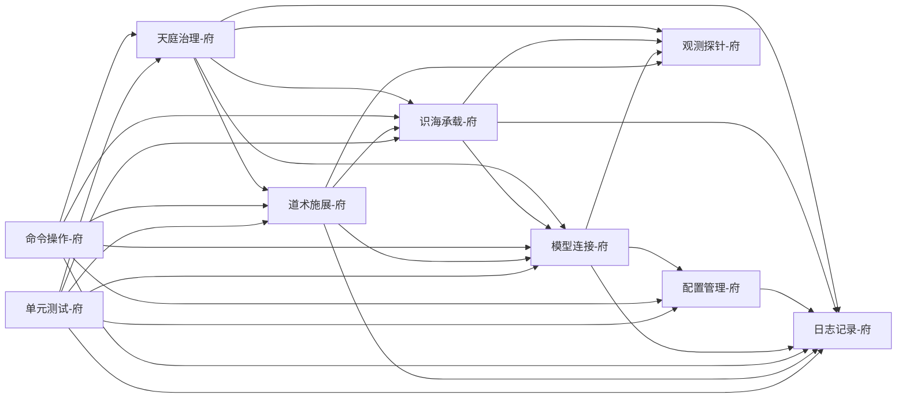

```mermaid
flowchart LR
  单元测试-府[单元测试-府] --> 道术施展-府[道术施展-府]
  单元测试-府[单元测试-府] --> 模型连接-府[模型连接-府]
  单元测试-府[单元测试-府] --> 配置管理-府[配置管理-府]
  单元测试-府[单元测试-府] --> 日志记录-府[日志记录-府]
  单元测试-府[单元测试-府] --> 识海承载-府[识海承载-府]
  单元测试-府[单元测试-府] --> 天庭治理-府[天庭治理-府]
  道术施展-府[道术施展-府] --> 观测探针-府[观测探针-府]
  道术施展-府[道术施展-府] --> 模型连接-府[模型连接-府]
  道术施展-府[道术施展-府] --> 日志记录-府[日志记录-府]
  道术施展-府[道术施展-府] --> 识海承载-府[识海承载-府]
  命令操作-府[命令操作-府] --> 道术施展-府[道术施展-府]
  命令操作-府[命令操作-府] --> 模型连接-府[模型连接-府]
  命令操作-府[命令操作-府] --> 配置管理-府[配置管理-府]
  命令操作-府[命令操作-府] --> 日志记录-府[日志记录-府]
  命令操作-府[命令操作-府] --> 识海承载-府[识海承载-府]
  命令操作-府[命令操作-府] --> 天庭治理-府[天庭治理-府]
  模型连接-府[模型连接-府] --> 观测探针-府[观测探针-府]
  模型连接-府[模型连接-府] --> 配置管理-府[配置管理-府]
  模型连接-府[模型连接-府] --> 日志记录-府[日志记录-府]
  配置管理-府[配置管理-府] --> 日志记录-府[日志记录-府]
  识海承载-府[识海承载-府] --> 观测探针-府[观测探针-府]
  识海承载-府[识海承载-府] --> 模型连接-府[模型连接-府]
  识海承载-府[识海承载-府] --> 日志记录-府[日志记录-府]
  天庭治理-府[天庭治理-府] --> 道术施展-府[道术施展-府]
  天庭治理-府[天庭治理-府] --> 观测探针-府[观测探针-府]
  天庭治理-府[天庭治理-府] --> 模型连接-府[模型连接-府]
  天庭治理-府[天庭治理-府] --> 日志记录-府[日志记录-府]
  天庭治理-府[天庭治理-府] --> 识海承载-府[识海承载-府]
```
